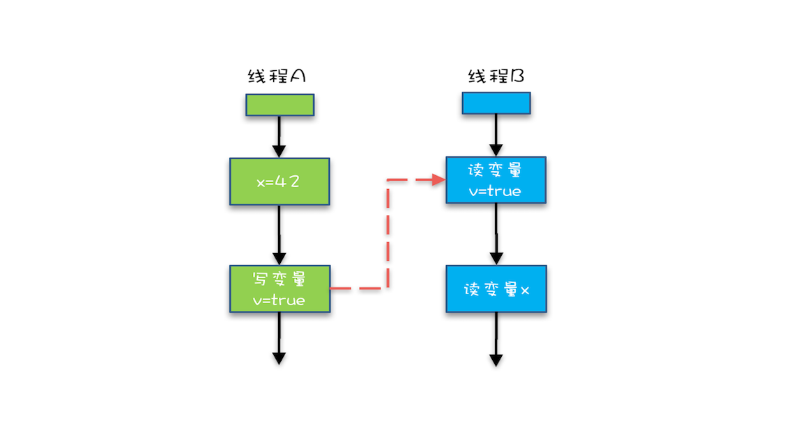

#  Java并发编程

## 可见性、原子性和有序性问题：并发编程Bug的源头

### 为什么需要并发编程？

CPU、内存、I/O 设备都在不断迭代，不断朝着更快的方向努力。但是，在这个快速发展的过程中，`有一个核心矛盾一直存在，就是这三者的速度差异`。

##### 速度差异的解决办法：

为了合理利用 CPU 的高性能，平衡这三者的速度差异，计算机体系结构、操作系统、编译程序都做出了贡献，主要体现为

1. CPU 增加了缓存，以均衡与内存的速度差异；
2. 操作系统增加了进程、线程，以分时复用 CPU，进而均衡 CPU 与 I/O 设备的速度差异；
3. 编译程序优化指令执行次序，使得缓存能够得到更加合理地利用。

这些方法也造成了并发编程的困难

### 并发编程Bug的原因

#### 1. 缓存导致的`可见性`问题

在多核场景下，如果不同CPU上执行的并发线程在对同一个内存变量进行操作。因为一个CPU上的线程对变量的变更，在另一个CPU中不可见，导致一致性问题。

#### 2. 线程切换带来的`原子性`问题

分时复用造成的原子性问题。

**我们把一个或者多个操作在 CPU 执行的过程中不被中断的特性称为原子性**。CPU 能保证的原子操作是 CPU 指令级别的，而不是高级语言的操作符，这是违背我们直觉的地方。因此，很多时候我们需要在高级语言层面保证操作的原子性。


#### 3. 编译优化带来的`有序性`问题

```java

public class Singleton {
  static Singleton instance;
  static Singleton getInstance(){
    if (instance == null) {
      synchronized(Singleton.class) {
        if (instance == null)
          instance = new Singleton();
        }
    }
    return instance;
  }
}
```

##### 编译器会优化new的操作

我们以为的 new 操作应该是：

1. 分配一块内存 M；
2. 在内存 M 上初始化 Singleton 对象；
3. 然后 M 的地址赋值给 instance 变量。

但是实际上优化后的执行路径却是这样的：

1. 分配一块内存 M；
2. 将 M 的地址赋值给 instance 变量；
3. 最后在内存 M 上初始化 Singleton 对象。

###### 这会导致:

线程A进入第二个判空条件，进行初始化时，发生了时间片切换，即使没有释放锁，线程B刚要进入第一个判空条件时，发现条件不成立，直接返回instance引用，不用去获取锁。如果对instance进行volatile语义声明，就可以禁止指令重排序，避免该情况发生。

## Java线程

### 守护线程(Deamon)

- 类似于JVM 垃圾回收的线程，为被守护的线程提供服务。
- 当被守护的线程全部都退出时，守护线程就会退出。

### 操作系统线程的几种状态


这“五态模型”的详细情况如下所示。

1. `初始状态`，指的是线程已经被创建，但是还不允许分配 CPU 执行。这个状态属于编程语言特有的，不过这里所谓的被创建，仅仅是在编程语言层面被创建，而在操作系统层面，真正的线程还没有创建。
2. `可运行状态`，指的是线程可以分配 CPU 执行。在这种状态下，真正的操作系统线程已经被成功创建了，所以可以分配 CPU 执行。
3. 当有空闲的 CPU 时，操作系统会将其分配给一个处于可运行状态的线程，被分配到 CPU 的线程的状态就转换成了`运行状态`。
4. 运行状态的线程如果调用一个阻塞的 API（例如以阻塞方式读文件）或者等待某个事件（例如条件变量），那么线程的状态就会转换到`休眠状态`，同时释放 CPU 使用权，休眠状态的线程永远没有机会获得 CPU 使用权。当等待的事件出现了，线程就会从休眠状态转换到可运行状态。
5. 线程执行完或者出现异常就会进入`终止状态`，终止状态的线程不会切换到其他任何状态，进入终止状态也就意味着线程的生命周期结束了。

### Java线程的状态


Java 语言中线程共有六种状态，分别是：

1. NEW（初始化状态）
2. RUNNABLE（可运行 / 运行状态）
3. BLOCKED（阻塞状态）
   - 当一个线程尝试获取一个被占用的锁，就会进入**阻塞状态**。
4. WAITING（无时限等待）
   - 当一个线程的条件变量不被满足时，就会进入**等待状态**。
5. TIMED_WAITING（有时限等待）
6. TERMINATED（终止状态）

其中BLOCKED、WAITING、TIMED_WAITING 在OS中，对应休眠状态。也就是说只要 Java 线程处于这三种状态之一，那么这个线程就永远没有 CPU 的使用权。

#### Java线程状态的转换`TODO`


### Java如何中断线程

在早期Java版本中，有stop和suspended等方法修改线程的状态。但由于这些方法可能会造成事务运行中中断，或者锁没有被释放，现在已经废弃。

#### Interrupt机制

当前Java版本采用interrupt机制去中断线程，运行中的程序可以通过设置Interrupt值去中断线程。

Thread包含以下4种方法：

1. void interrupt()
   - 设置interrupt为true，interrupted将返回true。若线程中包含Sleep，则当线程调用sleep，会抛出InterruptException。
2. static boolean interrupted()
   - Interrupted会清除interrupt状态
3. boolean isInterrupted()
   - Java线程可以通过使用while loop的条件中检查进程是否被中断，如果中断则安全退出程序。
4. static Thread currentThread()

#### 一个无限循环的场景

```java
Thread th = Thread.currentThread();
while(true) {
  if(th.isInterrupted()) {
    break;
  }
  // 省略业务代码无数
  try {
    Thread.sleep(100);
  }catch (InterruptedException e){
    e.printStackTrace();
  }
}
```

#### 如何避免无限循环

try catch捕捉此异常，应该重置一下中断标示，因为抛出异常后，中断标示会自动清除掉！

```java
  try {
    Thread.sleep(100);
  }catch (InterruptedException e){
    Thread.currentThread().interrupt();
    e.printStackTrace();
  }
}
```

### 线程池应该设置为多少？`TODO`

多线程的本质就是提升CPU和IO的利用率

### 线程间通信

#### 1. 使用Volatile或者Synchronized关键字

对被锁定变量的修改，所有线程都可见

#### 2. 使用通知-等待机制

1. Wait对象和Notify对象执行时，使用同一个锁。
2. 当Notify对象需要Wait对象执行时，就使用notifyAll()，激活Wait对象，然后释放锁。然后在尝试获取锁进入等待队列。
3. Wait对象被Notify唤醒后，执行任务。等到任务结束后，再调用wait()，释放锁。

##### 通知-等待机制的范式

```java
//消费者
synchronized (🔒) {
	while(条件不满足) {
    //任务执行
    对象.wait();
  }
}

//生产者
while(true) {
  synchronized (🔒) {
    	//任务生产
      对象.notifyAll();
  }
}

```

#### 3. 管道输入/输出流

将输出管道绑定到输入管道。当输入管道写入时，输出管道将接收到任务信息。

#### 4. Thread.join()的使用

当前线程在调用某个线程的join方法时，当前线程会等待被调用线程结束后，继续运行。

```java
public class Father extends Thread {
    public void run() {
        Son s = new Son();
        s.start();
        s.join();
        ...
    }
}
// 子线程
public class Son extends Thread {
    public void run() {
        ...
    }
}
```

join的内部实现和等待-通知模型类似，当线程终止时，会调用notifyAll()通知所有等待该线程的线程。

#### 5. ThreadLocal的使用

##### 场景1：

ThreadLocal 用作保存每个线程独享的对象，为每个线程都创建一个副本，这样每个线程都可以修改自己所拥有的副本, 而不会影响其他线程的副本，确保了线程安全。

##### 场景2：

ThreadLocal 用作每个线程内需要独立保存信息，以便供其他方法更方便地获取该信息的场景。每个线程获取到的信息可能都是不一样的，前面执行的方法保存了信息后，后续方法可以通过ThreadLocal 直接获取到，避免了传参，类似于全局变量的概念。

## Java 内存模型（可见性）

> http://www.cs.umd.edu/~pugh/java/memoryModel/jsr-133-faq.html#finalWrong
>
> https://blog.csdn.net/qq_36951116/article/details/103803338
>
> https://www.oschina.net/question/4178666_2317157

### 为什么定义Java内存模型？

现代计算机体系大部是采用的对称多处理器的体系架构。每个处理器均有独立的寄存器组和缓存，多个处理器可同时执行同一进程中的不同线程，这里称为处理器的乱序执行。在Java中，不同的线程可能访问同一个共享或共享变量。如果任由编译器或处理器对这些访问进行优化的话，很有可能出现无法想象的问题，这里称为编译器的重排序。除了处理器的乱序执行、编译器的重排序，还有内存系统的重排序。因此Java语言规范引入了Java内存模型，通过定义多项规则对编译器和处理器进行限制，主要是针对可见性和有序性。

##### 三个基本原则：原子性、可见性、有序性。

##### Java如何实现原子性

在Java中，可以使用CAS和锁实现原子操作。

### Java内存模型涉及的几个关键词：锁、volatile字段、final修饰符与对象的安全发布。

1. 第一是**锁**，**锁提供了原子性和可见性。**
   - 锁操作是具备happens-before关系的，解锁操作happens-before之后对同一把锁的加锁操作。实际上，在解锁的时候，JVM需要强制刷新缓存，使得当前线程所修改的内存对其他线程可见。
2. 第二是**volatile**字段，**volatile**提供了**可见性**。
   - volatile字段可以看成是一种不保证原子性的同步但保证可见性的特性，其性能往往是优于锁操作的。但是，频繁地访问 volatile字段也会出现因为不断地强制刷新缓存而影响程序的性能的问题。
3. 第三是**final**修饰符，final修饰的实例字段则是涉及到新建对象的发布问题。当一个对象包含final修饰的实例字段时，其他线程能够看到已经初始化的final实例字段，这是安全的。

### Happens-Before的7个规则：

#### 什么是Happends-Before规则？

   JMM(Java Memoey Model)可以通过happens-before关系向程序员提供跨线程的内存可见性保证（**如果A线程的写操作a与B线程的读操作b之间存在happens-before关系，尽管a操作和b操作在不同的线程中执行，但JMM向程序员保证a操作将对b操作可见**）。

##### Happends-Before规则解决了什么的问题？

`可见性`问题

#### Happends-Before规则有哪些？

1. **程序次序规则**：在一个线程内，按照程序代码顺序，书写在前面的操作先行发生于书写在后面的操作。准确地说，应该是控制流顺序而不是程序代码顺序，因为要考虑分支、循环等结构。
2. **管程锁定规则**：一个unlock操作先行发生于后面对同一个锁的lock操作。这里必须强调的是同一个锁，而"后面"是指时间上的先后顺序。
3. **volatile变量规则**：对一个volatile变量的写操作先行发生于后面对这个变量的读操作，这里的"后面"同样是指时间上的先后顺序。
   -   volatile 具备两种特性，第一就是保证共享变量对所有线程的可见性。将一个共享变量声明为volatile后，会有以下效应：
     1. 当写一个volatile变量时，JMM会把该线程对应的本地内存中的变量(所在的缓存行)强制刷新到主内存中去；
     2. 这个写会操作会导致其他线程中的缓存无效。
   - volatile的读写前后会插入内存屏障，保证一些操作是无法没**重排序**的，其中就有对于volatile的写操作之前的动作不会被重排序到之后。
     - StoreStore屏障可以保证在volatile写之前，其前面所有普通写操作已经对任意处理器可见了。
4. **线程启动规则**：Thread对象的start()方法先行发生于此线程的每一个动作。
5. **线程终止规则**：线程中的所有操作都先行发生于对此线程的终止检测，我们可以通过Thread.join（）方法结束、Thread.isAlive（）的返回值等手段检测到线程已经终止执行。
6. **线程中断规则**：对线程interrupt()方法的调用先行发生于被中断线程的代码检测到中断事件的发生，可以通过Thread.interrupted()方法检测到是否有中断发生。
7. **对象终结规则**：一个对象的初始化完成(构造函数执行结束)先行发生于它的finalize()方法的开始。

#### Happens-Before的1个特性：传递性。

这条规则是指如果 A Happens-Before B，且 B Happens-Before C，那么 A Happens-Before C。



### Java内存模型底层怎么实现的？

主要是通过内存屏障(memory barrier)禁止重排序的，即时编译器根据具体的底层体系架构，将这些内存屏障替换成具体的 CPU 指令。对于编译器而言，内存屏障将限制它所能做的重排序优化。而对于处理器而言，内存屏障将会导致缓存的刷新操作。比如，对于volatile，编译器将在volatile字段的读写操作前后各插入一些内存屏障。

### 示例

##### volatile禁止重排序的示例

```java
int a = 1;//代码1
int b = 2;//代码2
volatile int c = 3;//代码3
int d = 4;//代码4
int e = 5;//代码5
```


编译器解释这5行代码的时候，会保证代码1和代码2会在代码3之前执行，而代码1和代码2的执行顺序则不一定（这就是重排序，在不影响执行结果的情况下，虚拟机可能会对命令重排。当然所谓的不影响执行结果，java只保证在单线程中不影响执行结果）。代码4和代码5也一定会在代码3之后执行，同理代码4和代码5的执行顺序也是不一定的。


## 互斥锁

### 什么是锁？`锁保护的`又是什么？

##### 什么是锁？

在多用户场景下，锁是用来限制有限的用户访问临界区内的资源，保证用户对资源的独占性。

首先，我们要把临界区要保护的资源标注出来，如图中临界区里增加了一个元素：受保护的资源 R；其次，我们要保护资源 R 就得为它创建一把锁 LR；最后，针对这把锁 LR，我们还需在进出临界区时添上加锁操作和解锁操作。另外，在锁 LR 和受保护资源之间，我特地用一条线做了关联，这个关联关系非常重要。很多并发 Bug 的出现都是因为把它忽略了，然后就出现了类似锁自家门来保护他家资产的事情，这样的 Bug 非常不好诊断，因为潜意识里我们认为已经正确加锁了。


##### 锁解决的是什么问题？`todo`


#### 一个synchronized的错误示例

```java
class SafeCalc {
  static long value = 0L;
  synchronized long get() {
    return value;
  }
  synchronized static void addOne() {
    value += 1;
  }
}
```

以上代码对value使用了不同的锁，对象锁和对象类锁。这种情况下在访问受保护的资源时，无法保证线程访问的独占性。


**受保护资源和锁之间的关联关系是 N:1 的关系**，对一个资源使用多个锁是不可行的。

### 如何使用正确的锁来保护资源？

#### 保护没有关联关系的多个资源

**使用细粒度锁对受保护资源进行精细化管理，能够提升性能。**

#### 保护有关联关系的多个资源

- 可以使用一把大锁，对多个资源的的访问进行全局限制。
  - **代价：**所有操作串行化，效率低

- 对多个被访问的资源，使用多个细粒度锁。当进程操作涉及多个资源时，同时获取多个锁，再进行操作。
  - **代价：**可能出现死锁

## 锁扩展`TODO`

> https://juejin.cn/post/6844903759047294983从 synchronized 到 CAS 和 AQS - 彻底弄懂 Java 各种并发锁
>
> https://tech.youzan.com/javasuo-de-na-xie-shi-er/
>
> [不可不说的Java“锁”事](https://tech.meituan.com/2018/11/15/java-lock.html)
>
> [从ReentrantLock的实现看AQS的原理及应用](https://tech.meituan.com/2019/12/05/aqs-theory-and-apply.html)

#### Lock接口

Lock提供而Synchronized不具备的主要特性

1. 尝试非阻塞式的获取锁，获得返回true，没有获得则返回false
2. 能被中断地获取锁

| 特性                 | 描述                              | 接口                                                         |
| -------------------- | --------------------------------- | ------------------------------------------------------------ |
| 尝试非阻塞式的获取锁 | 获得返回true，没有获得则返回false | tryLock()                                                    |
| 能被中断地获取锁     | 获取锁被阻塞时，可以被中断        | lockInterruptibly()                                          |
| 超时获取锁           | 超时后还未获取锁，则返回false     | tryLock(long time, TimeUnit unit) throw InterruptedException |

#### AQS(AbstractQueuedSynchronizer)：队列同步器

> http://www.cnblogs.com/waterystone/p/4920797.html
>
> https://www.cnblogs.com/chengxiao/archive/2017/07/24/7141160.html

##### AQS是什么？

AQS是Java并发包提供的创建锁或同步器的框架，使用的是**模版**方法模式，面向的是锁的实现者。它简化了锁的实现方式，屏蔽了同步状态，线程的排队，等待与唤醒等底层操作。

##### 如何使用同步器AQS？

在可重写的方法中，使用以下方法修改同步状态

1. getState()
2. getState(int newState)
3. compareAndSetState(int expect, int update)

##### AQL可以重写的方法

1. 独占式同步状态的获取与释放（tryAcqured(), tryRelease()）
2. 共享式同步状态的获取与释放（tryAcquredShared(), tryReleaseShared()）
3. 当前线程是否被独占

##### AQS的内部实现分析

1. 同步队列
2. 独占式同步状态的获取与释放
3. 共享式同步状态的获取与释放
4. 独占式超时获取同步状态


#### 可重入锁(ReentrantLock)

##### 什么是可重入锁？

支持可重入的锁，即支持一个线程多次调用进入同一个锁保护的临界区。

#### 公平锁和非公平锁

- 公平锁：公平锁是指多个线程按照申请锁的顺序来获取锁，线程会直接进入队列中排队，队列的第一个线程才能获得锁。
  - 优点：等待锁的线程不会被饿死
  - 缺点：整体吞吐效率相对非公平锁要低一些，等待队列中除第一个线程以外的所有线程都会阻塞，CPU唤醒阻塞线程的开销比非公平锁大。
- 非公平锁：非公平锁是多个线程加锁时直接尝试获取锁，获取不到才会到等待队列的队尾等待。但如果此时锁刚好可用，那么这个线程可以无需阻塞直接获取到锁，所以非公平锁有可能出现后申请锁的线程先获取锁的场景。
  - 优点是可以减少唤起线程的开销，整体的吞吐效率高，因为线程有几率不阻塞直接获得锁，CPU不必唤醒所有线程。
  - 缺点是处于等待队列中的线程可能会饿死，或者等很久才会获得锁。


##### 公平锁和非公平锁的主要区别

主要区别在于**线程切换**。非公平锁线程切换次数少于公平锁，因此吞吐量较公平锁大很多。

##### 公平锁和非公平锁的实现区别

公平锁在获取锁前，会首先检查同步队列中是否有获取锁的请求，如果有则返回false。

#### 乐观锁和悲观锁


#### 自旋锁和自适应自旋锁

##### CAS(Compare And Swap 比较与交换)

CAS算法涉及到三个操作数：

- 需要读写的内存值 V。
- 进行比较的值 A。
- 要写入的新值 B。

CAS的底层执行一般是由指令集直接进行的。因此，可以保证CAS执行的**原子性**。

##### CAS的问题

###### 1. ABA问题

在A线程第一次查询时，变量的值为x。期间，线程B对变量的值进行多次修改，最后又设为x。

线程A再次查询时，仍然是A，但中间已经进行了很多操作，线程A并不知道。

###### 解决方法：

使用版本号，每次更新值都会更新版本号。

###### 2. 只能保证一个共享变量的原子操作

##### 自旋锁

自选锁是使用CAS的方式，多次尝试修改一个变量。如果修改成功，则直接赋值，如果修改失败，则在while loop中继续尝试。

##### 适应性自旋锁

自适应意味着自旋的时间（次数）不再固定，而是由前一次在同一个锁上的自旋时间及锁的拥有者的状态来决定。

- 如果在同一个锁对象上，自旋等待刚刚成功获得过锁，并且持有锁的线程正在运行中，那么虚拟机就会认为这次自旋也是很有可能再次成功，进而它将允许自旋等待持续相对更长的时间。
- 如果对于某个锁，自旋很少成功获得过，那在以后尝试获取这个锁时将可能省略掉自旋过程，直接阻塞线程，避免浪费处理器资源。

#### 共享锁和独享锁（读写锁）

**共享锁**是指该锁可被多个线程所持有。如果线程T对数据A**加上共享锁后**，则其他线程**只能**对A**再加共享锁**，不能加排它锁。获得共享锁的线程只能读数据，不能修改数据。

**独享锁**也叫排他锁，是指该锁一次只能被一个线程所持有。如果线程T对数据A加上排它锁后，则其他线程不能再对A加任何类型的锁。获得排它锁的线程即能读数据又能修改数据。JDK中的synchronized和JUC中Lock的实现类就是互斥锁。

##### 写锁代码

```java
protected final boolean tryAcquire(int acquires) {
	Thread current = Thread.currentThread();
	int c = getState(); // 取到当前锁的个数
	int w = exclusiveCount(c); // 取写锁的个数w
	if (c != 0) { // 如果已经有线程持有了锁(c!=0)
    // (Note: if c != 0 and w == 0 then shared count != 0)
		if (w == 0 || current != getExclusiveOwnerThread()) // 如果写线程数（w）为0（换言之存在读锁） 或者持有锁的线程不是当前线程就返回失败
			return false;
		if (w + exclusiveCount(acquires) > MAX_COUNT)    // 如果写入锁的数量大于最大数（65535，2的16次方-1）就抛出一个Error。
      throw new Error("Maximum lock count exceeded");
		// Reentrant acquire
    setState(c + acquires);
    return true;
  }
  if (writerShouldBlock() || !compareAndSetState(c, c + acquires)) // 如果当且写线程数为0，并且当前线程需要阻塞那么就返回失败；或者如果通过CAS增加写线程数失败也返回失败。
		return false;
	setExclusiveOwnerThread(current); // 如果c=0，w=0或者c>0，w>0（重入），则设置当前线程或锁的拥有者
	return true;
}
```

##### 读锁代码

```java
protected final int tryAcquireShared(int unused) {
	for(;;) {
    int c = getState();
    int nextC = c + (1 << 16);
    if (nextC < c) {
      throw new Error("Maximum lock count exceeded.");
    }
    if (exclusiveCount(c) != 0 && owner != Thread.currentThread()) {
      return -1;
    }
    if (compareAndSetState(c, nextc)) {
      return 1;
    }
  }
}
```

##### 锁降级


### 死锁问题

>https://my.oschina.net/hunglish/blog/752281 银行家算法
>
>https://blog.csdn.net/qq_33414271/article/details/80245715#:~:text=%E5%81%87%E8%AE%BE%E8%B5%84%E6%BA%90P1%E7%94%B3%E8%AF%B7%E8%B5%84%E6%BA%90,%E7%BB%88%E5%B0%86%E5%A4%84%E4%BA%8E%E6%AD%BB%E9%94%81

### 什么是死锁问题？

#### 如何处理死锁？

1. 重启。
2. 强行关闭进程

因此，解决死锁问题最好的办法还是规避死锁。

### 死锁产生的4个条件是什么？

1. ~~独占排他性~~，**互斥**
2. ~~占有不放弃~~，**占有且等待**
3. **不剥夺**
4. ~~成环~~，**循环等待**

### 如何预防死锁？

##### 可以通过破坏互斥实现预防死锁么？

不可以，互斥是锁的基本特性。

##### 怎样通过破坏占有且等待条件来实现预防死锁？

一次性获取所有锁，否则释放获得的锁

```java

class Allocator {
  private List<Object> als =
    new ArrayList<>();
  // 一次性申请所有资源
  synchronized boolean apply(
    Object from, Object to){
    if(als.contains(from) ||
         als.contains(to)){
      return false;  
    } else {
      als.add(from);
      als.add(to);  
    }
    return true;
  }
  // 归还资源
  synchronized void free(
    Object from, Object to){
    als.remove(from);
    als.remove(to);
  }
}

class Account {
  // actr应该为单例
  private Allocator actr;
  private int balance;
  // 转账
  void transfer(Account target, int amt){
    // 一次性申请转出账户和转入账户，直到成功
    while(!actr.apply(this, target))；
    try{
      // 锁定转出账户
      synchronized(this){              
        // 锁定转入账户
        synchronized(target){           
          if (this.balance > amt){
            this.balance -= amt;
            target.balance += amt;
          }
        }
      }
    } finally {
      actr.free(this, target)
    }
  } 
}
```


使用银行家算法等方式，预先寻找到安全的锁集合

##### 怎样通过破坏不剥夺条件来实现预防死锁？

`TODO`使用java.util.concurrenct下面的lock 解决

```java

class Account {
  private int id;
  private int balance;
  // 转账
  void transfer(Account target, int amt){
    Account left = this        ①
    Account right = target;    ②
    if (this.id > target.id) { ③
      left = target;           ④
      right = this;            ⑤
    }                          ⑥
    // 锁定序号小的账户
    synchronized(left){
      // 锁定序号大的账户
      synchronized(right){ 
        if (this.balance > amt){
          this.balance -= amt;
          target.balance += amt;
        }
      }
    }
  } 
}
```


##### 怎样通过破坏循环等待条件来实现预防死锁？

1. 给资源锁标上顺序，按序号申请锁

### `TODO`丰富死锁问题材料

## 管程(Monitor)：并发编程的万能钥匙`TODO`

### 什么是管程？

管程，指的是管理共享变量以及对共享变量的操作过程，让他们支持并发。翻译为 Java 领域的语言，就是管理类的成员变量和成员方法，让这个类是线程安全的

#### 为什么使用管程？管程解决了什么问题？

在并发编程领域，有两大核心问题：

- 一个是`互斥`，即同一时刻只允许一个线程访问共享资源；
- 另一个是`同步`，即线程之间如何通信、协作。这两大问题，管程都是能够解决的。

### 管程模型：MESA 模型

#### 什么是管程机制？


在Java 的管程模型中，临界区是受锁🔒保护的。

- 只有获取到锁的线程，才可以进入临界区。
- 当锁被占用时，其他线程请求锁，将会进入**阻塞（BLOCKED）状态**
- 每个条件变量维护一个等待队列
  - 当线程任务执行的条件不被满足时，将进入条件等待队列，这些线程会进入**等待（WAITTING）状态**
  - 当线程收到notify的信号，就会从条件等待队列出来，再次尝试获取锁。如果获取不到，则进入入口等待队列。
- 相关任务执行结束时，一定要使用notify去通知WAITTING中的线程，否则他们将进入无限等待状态。

##### 什么是条件变量？

在临界区中，任务执行的条件不被满足时，需要等待条件被满足，再去执行任务。

以消息队列为例，当消息队列为空时，需要等待新消息进入，才能执行推送操作。**注**：当消息入队时，在执行结束，需要使用notifyAll去通知所有等待中的进程，条件变量已满足。

##### 在synchronized中使用条件变量如何声明

```java
while(condition()) {
	wait();
}
```

##### 使用条件变量为什么需要使用while loop？

因为notify只是去通知等待线程，使其唤醒，并不保证被通知的线程会获得临界区的锁，有可能中间有其他线程先进行操作。

如果唤醒的获取到锁，会尝试检查条件，如果通过，则向下继续执行。

##### 在lock中使用条件变量如何声明？

```java
private Condition sufficientFunds = new Condition;
...
...
while(condition()) {
	sufficientFunds.await();
}
```


#### 管程机制解决了什么问题？

### 问题`TODO多提一些问题`

#### 管程提供了可见性？有序性？原子性？

### Synchronzed：一种简单的管程模型`todo`

Synchronzed实现了MESA模型的一部分。Java 内置的管程方案（synchronized）使用简单，synchronized 关键字修饰的代码块，在编译期会自动生成相关加锁和解锁的代码，但是仅支持一个条件变量；而 Java SDK 并发包实现的管程支持多个条件变量，不过并发包里的锁，需要开发人员自己进行加锁和解锁操作。

### Java的等待-通知机制：在Java中使用管程模型`TODO：问一些问题`

> ### 背景知识
>
> #### synchronized 的含义：
>
> - Java中每一个对象都可以成为一个监视器`(Monitor)`, 该Monitor由一个锁`(lock)`, 一个等待队列`(waiting queue)` , 一个入口队列`(entry queue)`组成。
> - 对于一个对象的方法， 如果没有synchronized关键字修饰， 该方法可以被任意数量的线程，在任意时刻调用。
>   对于添加了synchronized关键字的方法，任意时刻只能被**唯一的一个获得了对象实例锁的线程**调用。
> - synchronized用于实现多线程的同步操作
>
> #### wait()功用
>
> wait(), notify(), notifyAll() 和 synchonized 需要搭配使用， 用于线程同步
> wait()总是在一个循环中被调用，挂起当前线程来等待一个条件的成立。 Wait调用会一直等到其他线程调用notifyAll()时才返回。
> 当一个线程在执行synchronized 的方法内部，调用了wait()后， 该线程会释放该对象的锁， 然后该线程会被添加到该对象的等待队列中（waiting queue）, 只要该线程在等待队列中， 就会一直处于闲置状态， 不会被调度执行。 要注意wait()方法会强迫线程先进行释放锁操作，所以在调用wait()时， 该线程必须已经获得锁，否则会抛出异常。由于wait()在synchonized的方法内部被执行， 锁一定已经获得， 就不会抛出异常了。
>
> #### notify()的功用
>
> wait(), notify(), notifyAll() 和 synchonized 需要搭配使用， 用于线程同步
> 当一个线程调用一个对象的notify()方法时， 调度器会从所有处于该对象等待队列（waiting queue）的线程中取出任意一个线程， 将其添加到入口队列( entry queue) 中. 然后在入口队列中的多个线程就会竞争对象的锁， 得到锁的线程就可以继续执行。 如果等待队列中（waiting queue）没有线程， notify()方法不会产生任何作用
> notifyAll() 和notify()工作机制一样， 区别在于notifyAll()会将等待队列（waiting queue）中所有的线程都添加到入口队列中（entry queue）
> 注意, notifyAll()比notify()更加常用， 因为notify()方法只会唤起一个线程， 且无法指定唤醒哪一个线程，所以只有在多个执行相同任务的线程在并发运行时， 我们不关心哪一个线程被唤醒时，才会使用notify()
>
> #### 注：await()和notify只能在锁中使用
>
> Reference：https://blog.csdn.net/lengxiao1993/article/details/52296220

#### 用 synchronized 和wait(), notify(), notifyAll() 来实现等待 - 通知机制


在多线程场景下，有以下几个场景

1. 当一个线程使用synchronized获取锁后，其他线程获取会进入等待队列
2. 当一个线程在执行中，某些条件不满足时，可以使用wait释放锁，并进入等待队列
3. 当线程结束执行结束后，使用notify通知其他线程

#### 那么等待队列在哪里？

等待队列在获取锁的对象中，Java中每一个对象都可以成为一个监视器`(Monitor)`, 该Monitor由一个锁`(lock)`, 一个等待队列`(waiting queue)` , 一个入口队列`(entry queue)`组成。

#### 经典的wait()唤醒机制

```java
class Allocator {
	private List<Object> als;
	// 一次性申请所有资源
	synchronized void apply(Object from, Object to){
    // 经典写法
    while(als.contains(from) || als.contains(to)){
      try{
        wait();
      }catch(Exception e){
      }   
    } 
    als.add(from);
    als.add(to);  
  }
  // 归还资源
  synchronized void free(
    Object from, Object to){
    als.remove(from);
    als.remove(to);
    notifyAll();
  }
}
```

## 关键字

### Volatile关键字

##### 什么是Volatile关键字？

1. Volatile关键字提供了多处理器场景下的对变量**可见性**，但**不具备原子性**。
   - Volatile写入前的所有变量，对另一个读入Volatile变量的线程读，对这些变量也是可见的。
2. volatile的读写前后会插入内存屏障，保证一些操作是无法没**重排序**的，其中就有对于volatile的写操作之前的动作不会被重排序到之后。
   - StoreStore屏障可以保证在volatile写之前，其前面所有普通写操作已经对任意处理器可见了。

##### 和Synchronize相比，Volatile的好处是什么？

Volatile使用和执行成本更低，不会引起线程上下文的切换。（获取锁失败，导致线程阻塞，会引起线程上下文的切换）、

##### Volatile是如何保证变量的内存可见性？

通过添加指令，由硬件级别提供指令支持。

1. 使用Lock前缀指令，保证数据被写入内存，而不是L1或者L2缓存中
2. 使用缓存一致性协议，当处理器通过总线嗅探到缓存对应内存地址的变化，就会将缓存行设为无效。

##### Volatile适用于什么场景？`todo`


### synchronized关键字

> https://blog.csdn.net/javazejian/article/details/72828483 深入理解Java并发之synchronized实现原理

```java
class X {
 // 修饰非静态方法
  synchronized void foo();
  // 等同于
  synchronized(this) void foo();

  // 修饰静态方法
  synchronized static void bar();
  // 等同于
  synchronized(X.class) static void bar();     
}
```

Java 虚拟机中的同步(Synchronization)基于进入和退出**管程(Monitor)对象**实现， 无论是显式同步(有明确的 monitorenter 和 monitorexit 指令,即同步代码块)还是隐式同步都是如此。

#### synchronized的三种应用方式

synchronized关键字最主要有以下3种应用方式，下面分别介绍

1. 修饰实例方法，作用于当前实例加锁，进入同步代码前要获得**当前实例**的锁
2. 修饰静态方法，作用于当前类对象加锁，进入同步代码前要获得**当前类对象**的锁
3. 修饰代码块，指定加锁对象，对给定对象加锁，进入同步代码库前要获得**给定对象**的锁。

#### synchronized的特性

##### synchronized的可重入性

synchronized的锁实现是可重入锁，当一个线程获取到该锁之后，再次获取该锁是会被允许的。

- 为什么需要可重入性？

  子类调用父类的方法，如果两个方法都是Synchronzied，就会出现死锁。

##### Synchronized是非公平锁

##### 线程中断与synchronized `TODO`

##### 中断与synchronized`TODO`

#### Synchronzied实现机制

##### Sycnrozed的实现模型

Synchronzed实现了MESA模型的一部分。Java 内置的管程方案（synchronized）使用简单，synchronized 关键字修饰的代码块，在编译期会自动生成相关加锁和解锁的代码，但是仅支持一个条件变量；而 Java SDK 并发包实现的管程支持多个条件变量，不过并发包里的锁，需要开发人员自己进行加锁和解锁操作。

##### Synchronized的锁储存在哪里？

储存在Java对象头中的Mark Word部分，这部分包括了当前锁的对应等级，还有GC的一些信息。

#### `Synchronzied锁升级`

> https://tech.meituan.com/2018/11/15/java-lock.html

#####  锁的四个等级

无锁

- 无锁是一种状态，一般另一个线程在没有获取到锁时，会在无锁状态下使用CAS修改对象头的Mark Word。
- 无锁没有对资源进行锁定，所有的线程都能访问并修改同一个资源，但同时只有一个线程能修改成功。

偏向锁

- 偏向锁被获取后不会被释放，锁头包含获取到该锁的线程ID。
- 那么每次只需要判断Mark Word头中的ID是否为当前线程，
  - 如果为空，则使用CAS设置锁ID为当前线程
  - 如果是当前线程，就不需要进行获取和释放操作
  - 如果不是当前线程，则尝试使用CAS设置，并升级锁为轻量级锁

轻量级锁状态

- 是指当锁是偏向锁的时候，被另外的线程所访问，偏向锁就会升级为轻量级锁，其他线程会通过自旋的形式尝试获取锁，不会阻塞，从而提高性能。
- 在代码进入同步块的时候，如果同步对象锁状态为无锁状态（锁标志位为“01”状态，是否为偏向锁为“0”），虚拟机首先将在当前线程的栈帧中建立一个名为锁记录（Lock Record）的空间，用于存储锁对象目前的Mark Word的拷贝，然后拷贝对象头中的Mark Word复制到锁记录中。
- 拷贝成功后，虚拟机将使用CAS操作尝试将对象的Mark Word更新为指向Lock Record的指针，并将Lock Record里的owner指针指向对象的Mark Word。
- 如果这个更新动作成功了，那么这个线程就拥有了该对象的锁，并且对象Mark Word的锁标志位设置为“00”，表示此对象处于轻量级锁定状态。
- 如果轻量级锁的更新操作失败了，虚拟机首先会检查对象的Mark Word是否指向当前线程的栈帧，如果是就说明当前线程已经拥有了这个对象的锁，那就可以直接进入同步块继续执行，否则说明多个线程竞争锁。
- 若当前只有一个等待线程，则该线程通过自旋进行等待。但是当自旋超过一定的次数，或者一个线程在持有锁，一个在自旋，又有第三个来访时，轻量级锁升级为重量级锁。

重量级锁状态

锁只能升级，不能降级。

##### 锁升级的场景

- 无锁升级偏向锁
  - 无锁只是一个状态，当线程进入临界区时，就会尝试在无锁状态下修改Mark Word，当成功使用CAS修改Mark word的线程ID后，就会升级为轻量级锁。
- 偏向锁升级轻量级锁
  - 当另一个线程尝试获取偏向锁时，
    1. 首先，将进行偏向锁撤销
    2. 然后，新线程会将锁升级为轻量级锁
- 轻量级锁升级重量级锁
  - 当轻量级锁在使用中被竞争，

##### 锁不升级的场景

##### Synchronzied为什么需要锁升级？

在大多数情况下，Synchronzied锁保护的临界区只有一个线程在使用。

在不存在锁竞争的场景下，使用锁升级可以提高多线程运行的性能，减少获取和释放锁产生的消耗。

## 线程池

> [Java线程池实现原理及其在美团业务中的实践](https://tech.meituan.com/2020/04/02/java-pooling-pratice-in-meituan.html)

##### 线程池有什么好处？

1. 降低资源消耗

   - 通过重复利用以创建的线程来降低线程创建和销毁的消耗。

   - ##### 线程的创建和对象的创建有什么区别？

     - 创建对象，仅仅是在 JVM 的堆里分配一块内存而已；

     - 而创建一个线程，却需要调用操作系统内核的 API，然后操作系统要为线程分配一系列的资源，这个成本就很高了。所以线程是一个重量级的对象，应该避免频繁创建和销毁。

2. 提高响应速度

   - 任务到达时，不需要等待线程创建就能立即执行

3. 提高连接的可管理性

   - 线程是稀缺资源，如果无限制创建，不仅会消耗系统资源，还会因为线程的不合理分布导致资源调度失衡，降低系统的稳定性。使用线程池可以进行统一的分配、调优和监控。

     - ##### 为什么需要监控？

       以美团文章中的例子为例，由于错配置线程池的数目，在并发峰值时，导致大量请求调用失败，最后造成调用降级。

4. 提供更多更强大的功能

   - 线程池具备可拓展性，允许开发人员向其中增加更多的功能。比如延时定时线程池ScheduledThreadPoolExecutor，就允许任务延期执行或定期执行。

##### 为什么使用线程池？线程池解决了什么问题？

线程池解决的核心问题就是**资源管理**问题。在并发环境下，系统不能够确定在任意时刻中，有多少任务需要执行，有多少资源需要投入。这种不确定性将带来以下若干问题：

1. 频繁申请/销毁资源和调度资源，将带来额外的消耗，可能会非常巨大。
2. 对资源无限申请缺少抑制手段，易引发系统资源耗尽的风险。
3. 系统无法合理管理内部的资源分布，会降低系统的稳定性。

为解决资源分配这个问题，线程池采用了“池化”（Pooling）思想。池化，顾名思义，是为了最大化收益并最小化风险，而将资源统一在一起管理的一种思想。

Pooling is the grouping together of resources (assets, equipment, personnel, effort, etc.) for the purposes of maximizing advantage or minimizing risk to the users. The term is used in finance, computing and equipment management.——wikipedia

“池化”思想不仅仅能应用在计算机领域，在金融、设备、人员管理、工作管理等领域也有相关的应用。

在计算机领域中的表现为：统一管理IT资源，包括服务器、存储、和网络资源等等。通过共享资源，使用户在低投入中获益。除去线程池，还有其他比较典型的几种使用策略包括：

1. 内存池(Memory Pooling)：预先申请内存，提升申请内存速度，减少内存碎片。
2. 连接池(Connection Pooling)：预先申请数据库连接，提升申请连接的速度，降低系统的开销。
3. 实例池(Object Pooling)：循环使用对象，减少资源在初始化和释放时的昂贵损耗。

### 线程池的运行机制


线程池在内部实际上构建了一个生产者消费者模型，将线程和任务两者解耦，并不直接关联，从而良好的缓冲任务，复用线程。线程池的运行主要分成两部分：任务管理、线程管理。任务管理部分充当生产者的角色，当任务提交后，线程池会判断该任务后续的流转：

1. 直接申请线程执行该任务；
2. 缓冲到队列中等待线程执行；
3. 拒绝该任务。

线程管理部分是消费者，它们被统一维护在线程池内，根据任务请求进行线程的分配，当线程执行完任务后则会继续获取新的任务去执行，最终当线程获取不到任务的时候，线程就会被回收。

#### 线程池创建的核心参数

1. corePoolSize  		 		 		    核心线程池的大小	

2. runnableTaskQueue                阻塞队列

   - 提供多种类型的阻塞队列，常使用有届数组。

     

3. MaximumPoolSize                   线程池的最大数目

4. ThreadFactory                         线程池的创建工厂

5. RejectedExecutionHandler     饱和策略

   

### 线程池的关闭退出


不论是调用shutdown()还是shutdownNow()都是遍历线程池的所有方法，逐个调用interrupt()。区别在与上图所示：

- shutdown()将所有线程设置为shutdown()，将没有任务的线程Interrupt()，仍然处理堵塞队列的任务，直到所有任务完成后退出。当线程池中的工作线程为0时，线程池关闭。
- shutdownNow()，直接调用所有线程的interrupt()方法，尽可能快速中断所有线程，当线程池中的工作线程为0时，线程池关闭。


## 原子操作类Atomic

##### 什么是原子操作类？

原子操作类对应的变量修改可以保证**原子性**。

### 基本类

1. AtomicBoolean
2. AtomicInteger
3. AtomicLong


## 阻塞队列

### 阻塞队列的实现方式

#### 使用通知模式实现的ArrayBlockQueue

使用两个条件变量notFull，和notEmpty实现阻塞队列。

notFull用来通知生产者，当前有空间可用

notEmpty用来通知消费者，当前队列有元素可用

- 当添加对象到队列时，以while loop检查队列是否已满，如果是，则notFull.await()
- 当获取队列对象是，以while loop检查队列是否为空，如果是，则notEmpty.await()


## Future

> https://zhuanlan.zhihu.com/p/54459770

Future模式的核心思想是能够让主线程将原来需要同步等待的这段时间用来做其他的事情。（因为可以异步获得执行结果，所以不用一直同步等待去获得执行结果）

## 面试问题：

### Synchronized和Lock的区别？

##### 优点：

synchronized是依赖于 JVM 实现的，于是包含了很多优化，比方说锁升级，能够极大的提高synchronized运行效率，降低使用锁需要的唤醒操作和线程切换的时间开销。

##### 缺点：

但synchronized相比之下，又少了lock很多高级的特性。

比方说，Lock包中需要实现的尝试非阻塞的获取锁tryAcquire()， 超时获取锁tryLock（携带超时参数），和能被中断的获取锁 lockInterruptibly()。

比方说：Synchronized wait和notify只支持一个条件，而lock可以绑定多个condition。

