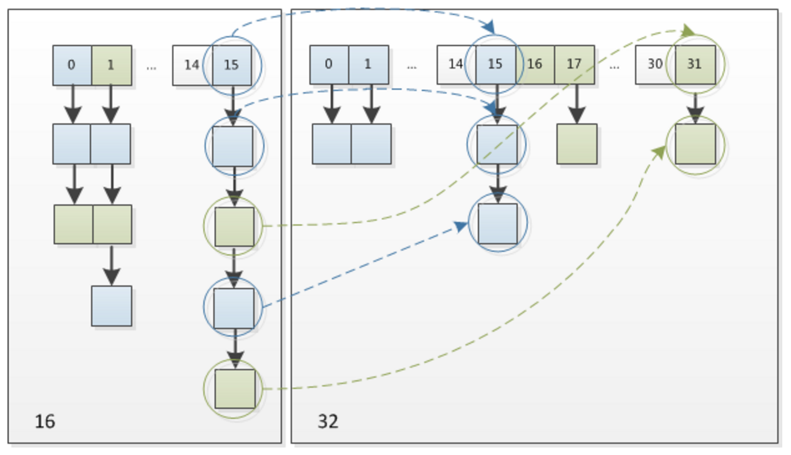

# Java知识点文档

### 接口，抽象类和内部类

#### 内部类

内部类是定义在一个类中的类

- 内部类可以对同一个包中的其他类隐藏
- 内部类可以访问当前类的数据，包括私有数据。

### 泛型擦除`todo`

##### 为什么需要擦除泛型？

###  HashCode和equals方法

> [Java hashCode() 和 equals()的若干问题解答](https://www.cnblogs.com/skywang12345/p/3324958.html)
>
> [你所不知道的HashCode](https://blog.csdn.net/luluyo/article/details/106143997)
>
> 阿里巴巴编程规范：
>
> 1.【强制】关于hashCode和equals的处理，遵循如下规则：
>
> 1） 只要重写equals，就必须重写hashCode。
>
> 2） 因为Set存储的是不重复的对象，依据hashCode和equals进行判断，所以Set存储的对象必须重写这两个方法。
>
> 3） 如果自定义对象作为Map的键，那么必须重写hashCode和equals。
>
> 说明：String重写了hashCode和equals方法，所以我们可以非常愉快地使用String对象作为key来使用。
>
> 当你把对象加入HashSet时，HashSet会先计算对象的hashcode值来判断对象加入的位置，同时也会与该位置其他已经加入的对象的hashcode值作比较，如果没有相符的hashcode，HashSet会假设对象没有重复出现。但是如果发现有相同hashcode值的对象，会调用equals()方法来检查hashcode相等的对象是否真的相同。如果两者相同，HashSet就不会让其加入操作成功。如果不同的话，就会重新散列到其他位置。这样我们就大大减少了equals的次数，相应就大大提高了执行速度。
>
> hashCode与equals：
>
> `**如果两个对象相等，则 hashcode 一定也是相同的**`
>
> 两个对象有相同的hashcode值，它们不一定是相等的
>
> 两个对象相等,对两个对象分别调用equals方法都返回true
>
> 因此，equals方法被覆盖过，则hashCode方法也必须被覆盖
>
> hashCode()的默认行为是对堆上的对象产生独特值。如果没有重写hashCode()，则该class的两个对象无论如何都不会相等（即使这两个对象指向相同的数据）

#### hashcode

##### 什么是hashcode？

###### 2.1 Object.hashCode()注释解读

简单归纳一下JDK团队的注释：

- hashCode表示对象在hash表中的位置,对于同一个对象来说，多次调用，返回相同的hashCode。
- 如果Object.equal()相等，Object.hashCode()也必然相等。重写时也建议保证此特性。
- 如果Object.equal()相等，这并不要求Object.hashCode()也返回不同值。如果真出现这种情况，最好优化代码，充分利用hash表的性能。

#### hashCode与equals：

`如果两个对象相等，则 hashcode 一定也是相同的`

两个对象有相同的hashcode值，它们不一定是相等的

两个对象相等,对两个对象分别调用equals方法都返回true

因此，equals方法被覆盖过，则hashCode方法也必须被覆盖

hashCode()的默认行为是对堆上的对象产生独特值。如果没有重写hashCode()，则该class的两个对象无论如何都不会相等（即使这两个对象指向相同的数据）


### Java中的集合

>  [Java 8系列之重新认识HashMap](https://tech.meituan.com/2016/06/24/java-hashmap.html)

#### HashMap


1. **HashMap**
2. **Hashtable**
3. **LinkedHashMap**
4. **TreeMap**

##### 存储结构-字段

从结构实现来讲，HashMap是数组+链表+红黑树（JDK1.8增加了红黑树部分）实现的，如下如所示。


**负载因子：0.75**，即负载因子 * 长度 = 能容纳的最大值，超过这个值将会实施扩容机制，这个值可以大于1。

##### 功能实现-方法

1. 确定哈希桶数组索引位置

```java
static final int hash(Object key) {   //jdk1.8 & jdk1.7
     int h;
     // h = key.hashCode() 为第一步 取hashCode值
     // h ^ (h >>> 16)  为第二步 高位参与运算
     return (key == null) ? 0 : (h = key.hashCode()) ^ (h >>> 16);
}
```


思路，将hashcode()的结果取高位和低位，求他们的或异值，然后根据长度获取对应下标。

2. 分析HashMap的put方法

   

##### HashMap的链表插入过程


即从头部插入

##### HashMap的扩容过程




##### 线程安全性

在多线程使用场景中，应该尽量避免使用线程不安全的HashMap，而使用线程安全的ConcurrentHashMap，在并发的多线程使用场景中使用HashMap可能造成死循环。

#### ConcurrencyHashMap

##### JDK 1.7 通过分段锁（Segment）解决，最多可以容纳65536个segment。

###### 什么是Segment？

每个Segment是一把可重入锁，对应一个区间的HashEntry

###### 如何定位Segment？

通过对hashCode的散列运算分配

###### ConcurrencyHashMap的get操作

ConcurrencyHashMap的get操作不需要加锁，因为ConcurrencyHashMap的所有数据都被定义为volatile。

###### ConcurrencyHashMap的put操作

1. 判断是否需要扩容，
2. 如何扩容，将原Segment扩容2倍。


##### JDK 1.8通过Node数组+链表/红黑树

Node数组类似于一个HashMap

##### 初始化

自旋+CAS|

##### Get操作

##### Put操作

CAS+synchronized解决

#### LinkedList

#### ArrayList


### Java中的红黑树

> [红黑树深入剖析及Java实现](https://tech.meituan.com/2016/12/02/redblack-tree.html)

## 幂等性

> https://juejin.cn/post/6844903815552958477

##### 什么是幂等性？

对同一个系统，使用同样的条件，一次请求和重复的多次请求对系统资源的影响是一致的。

##### 为什么要保证幂等性？

Token是用于确定交易的唯一属性，也是服务端用于检验当前交易是否合法交易的依据，但是在分布式的复杂环境中，如果没有分布式锁的控制，同一笔交易就可能会被处理多次，因而为了确认交易的**幂等性**。

#### 防重复提交的策略

##### 乐观锁

数据更新的时候需要持有数据的版本号，版本号和数据库中的版本号不一致，则无法执行更新。

##### 防重表

建立唯一索引的表，如果存在要插入的索引，则说明事件已经执行。

##### token令牌

核心思想，每操作一次，生成一个token，这个token只能在下一阶段被使用一次。如果token被消耗掉了，就不能再次执行。

##### Token令牌+分布式锁的方式

1、服务端根据交易前请求生成对应的Token，保存于服务端的Token库中，通常是缓存集群中，并将生成好的Token库下发给客户端；
2、客户端在每次请求的时候，都带上对应的Token；
3、服务端获取该Token对应的锁，如果获取成功，则继续下面的步骤；
4、判断是否该Token是否合法，如果合法则继续下一步；
5、处理真实的业务逻辑；
6、业务处理成功后，从缓存中删除该Token；
7、删除获取的分布式锁；


## Java中的BIO，NIO，AIO

> [Java NIO浅析](https://tech.meituan.com/2016/11/04/nio.html)
>
> https://www.zhihu.com/question/29005375

### 背景知识

##### 什么是连接？

连接是两个Socket点对点的连接。

##### 什么是同步？

##### 同步异步的区别

同步异步指的是，当数据已经ready的时候，读写操作是同步读还是异步读，阶段不同而已。

##### 什么是阻塞？

##### 阻塞和和非阻塞区别

阻塞与非阻塞指的的是当不能进行读写（网卡满时的写/网卡空的时候的读）的时候，I/O 操作立即返回还是阻塞；

##### 什么是Socket？


### BIO，NIO和AIO简析

**BIO:** 传统的BIO里面socket.read()，如果TCP RecvBuffer里没有数据，函数会一直阻塞，直到收到数据，返回读到的数据。

**NIO:** 对于NIO，如果TCP RecvBuffer有数据，就把数据从网卡读到内存，并且返回给用户；反之则直接返回0，永远不会阻塞。

**AIO:** 最新的AIO(Async I/O)里面会更进一步：不但等待就绪是非阻塞的，就连数据从网卡到内存的过程也是异步的。

换句话说，BIO里用户最关心“我要读”，NIO里用户最关心”我可以读了”，在AIO模型里用户更需要关注的是“读完了”。

NIO一个重要的特点是：socket主要的读、写、注册和接收函数，在等待就绪阶段都是非阻塞的，真正的I/O操作是同步阻塞的（消耗CPU但性能非常高）。

### BIO

##### 什么是BIO？

BIO又称同步阻塞I/O处理模型，那么它首先是同步，其次是阻塞。

##### 常见场景

###### BIO+连接池模型

### NIO

#### Java NIO的三个概念

##### Buffer（缓存）

Buffer是一个缓冲对象，相当于对Byte数据进行了封装。

##### Channel（通道）

Channel是一个双向的管道，提供双工读写能力。我理解是对Buffer的操控，能够读取内容，或者将内容写到Buffer中。Channel提供对流的输入和输出功能。**一个SocketChannel就是一个Socket的连接，类似于一个Socket套接字。**

Channel.read(Buffer) 就是将buffer的内容读到Channel中

Channel.write(Buffer)就是将Channel的内容写到Buffer中

##### Selector


在Java中，Selector是由epoll实现的，Selector是使用的是同步非阻塞模型，管理多个Channel。当有数据写入时，Selector会被被提示，寻找到对应IO，然后获取数据。


### Selector的原理select, poll, epoll

##### Socket是如何存储的？

#### select

在用户空间中维护一个1024的fd数组。每当有内容写入时，select模型就会被通知，轮询整个数组区获取被触发的fd。

#### poll

和Select基本一样，不同点在于，fd由链表维护且储存在内核空间中

#### epoll

epoll使用红黑树管理所有连接，使用一个等待队列获取所有被触发的fd。

保留一个等待队列epoll_wait，通过回调函数被触发，并将事件对应的fd添加到epoll_wait上。


# 设计模式

## 单例模式

### 为什么使用单例模式？

1. 为了处理资源冲突
2. 为了保证全局唯一性
   - 例如：ID生成器

### 单例如何实现

#### 饿汉式

在类加载流程中，创建单例

```java
public class IdGenerator { 
  private AtomicLong id = new AtomicLong(0);
  private static final IdGenerator instance = new IdGenerator();
  private IdGenerator() {}
  public static IdGenerator getInstance() {
    return instance;
  }
  public long getId() { 
    return id.incrementAndGet();
  }
}
```

##### 优点

加载时间长的单例，如果在使用前被加载，会影响系统性能，导致响应时间变长。

##### 缺点

1. 造成初始化时间变长
2. 未使用的对象占用很多资源

#### 懒汉式

使用双重检测 + volatile去创建对象

```java
public class IdGenerator { 
  private AtomicLong id = new AtomicLong(0);
  private volatile static IdGenerator instance;
  private IdGenerator() {}
  public static IdGenerator getInstance() {
    if (instance == null) {
      synchronized(IdGenerator.class) { // 此处为类级别的锁
        if (instance == null) {
          instance = new IdGenerator();
        }
      }
    }
    return instance;
  }
  public long getId() { 
    return id.incrementAndGet();
  }
}
```

##### 为什么使用双重检测？

synchronized是保证临界区只有一个对象进入。

- 第一个检测的作用： 保证对象创建后不再需要获取锁的操作。不然，频繁加锁、释放锁及并发度低等问题，会导致性能瓶颈。
- 第二个检测的作用：如果同时有两个线程通过了第一个检测，当第二个线程线程获得锁时，如果没有第二个检测，可能导致多实例被创建。

##### 为什么使用volatile？

因为volatile会在读写前后创建屏障，这样可以保证不使用指令重排序。不然，由于指令重排序，赋值操作还没有完成，并发对象就访问了该instance，会报null问题。

#### 静态内部类

```java

public class IdGenerator { 
  private AtomicLong id = new AtomicLong(0);
  private IdGenerator() {}

  private static class SingletonHolder{
    private static final IdGenerator instance = new IdGenerator();
  }
  
  public static IdGenerator getInstance() {
    return SingletonHolder.instance;
  }
 
  public long getId() { 
    return id.incrementAndGet();
  }
}
```

SingletonHolder 是一个静态内部类，当外部类 IdGenerator 被加载的时候，并不会创建 SingletonHolder 实例对象。只有当调用 getInstance() 方法时，SingletonHolder 才会被加载，这个时候才会创建 instance。instance 的唯一性、创建过程的线程安全性，都由 JVM 来保证。所以，这种实现方法既保证了线程安全，又能做到延迟加载。

### 单例模式哪些问题？

## 工厂模式

### 简单工厂模式/静态工厂模式

简单工厂模式，使用一个工厂返回对应对象的模式。在《设计模式》一书中，它将简单工厂模式看作是工厂方法模式的一种特例。即：省略掉工厂方法的工厂模式。

### 工厂方法模式

使用一个工厂，返回对应的对象生成工厂的模式。

#### 那么，什么时候使用简单工厂，什么时候使用工厂方法？

- 当对象的创建比较简单，比如通过new创建对象，就可以使用**简单工厂模式**。

- 如果对应对象的创建很复杂，需要组装多个其他类对象或者需要复杂的初始化过程，那么应该使用**工厂方法模式**。

### 抽象工厂模式

和它的名字一样，抽象工厂并不是一种实现，而是一种抽象。当对象的创建可以通过多个方式被创建时，则使用抽象工厂模式。

```java
public interface IConfigParserFactory { 
  IRuleConfigParser createRuleParser(); 
  ISystemConfigParser createSystemParser(); //此处可以扩展新的parser类型，比如IBizConfigParser
}
```

### 如何基于工厂模式实现Spring框架的IoC，即Dependency Injection？

1. 创建容器托管的HashMap
2. 读取解析配置类，获取被托管容器的创建参数
   - 配置类需包含容器的类路径，创建参数，是否懒加载等。
3. 通过Java反射机制，将被托管的容器创建，并放入容器Map中。

## 行为型模式

### 模版方法模式

在模板模式（Template Pattern）中，一个抽象类公开定义了执行它的方法的方式/模板。它的子类可以按需要重写方法实现，但调用将以抽象类中定义的方式进行。这种类型的设计模式属于行为型模式。

##### 目的：

定义一个操作中的算法的骨架，而将一些步骤延迟到子类中。模板方法使得子类可以不改变一个算法的结构即可重定义该算法的某些特定步骤。

##### 实现：

```java
public abstract class Game {
   abstract void initialize();
   abstract void startPlay();
   abstract void endPlay();
   //模板
   public final void play(){
       //初始化游戏
      initialize();
       //开始游戏
      startPlay();
       //结束游戏
      endPlay();
   }
}
```

执行游戏所要执行的步骤已经被定义了，子类只需要填充游戏的执行dx细节。