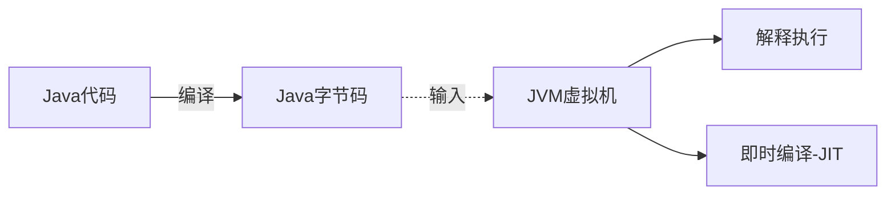
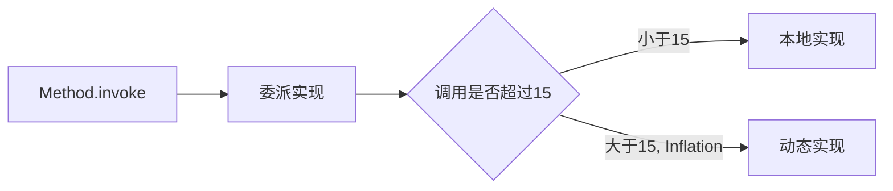

## 面试问题

##### Java是如何创建对象的?具体流程是怎样的？

## Java虚拟机是怎么运行的？

### 什么是Java虚拟机？

虚拟机是一种**抽象化的计算机**，**通过在实际的计算机上仿真模拟各种计算机功能来实现的**。Java虚拟机有自己完善的硬体架构，如处理器、堆栈、寄存器等，还具有相应的指令系统。Java虚拟机屏蔽了与具体操作系统平台相关的信息，使得Java程序只需生成在Java虚拟机上运行的目标代码(字节码)，就可以在多种平台上不加修改地运行。

### 为什么使用Java虚拟机？

1. 允许一次编译，到处运行。
2. 提供托管环境，支持内存管理，垃圾回收，以及数组越界、动态类型、安全权限等等的动态检测。



### Java虚拟机是如何运行Java字节码的？

1. Java代码被编译为Java字节码

2. `TODO`Java虚拟机加载Java字节码，将Java类加载到方法区

3. 每当执行Java方法时，Java虚拟机会对当前方法创建一个栈桢。

   

#### 线程共享

##### 方法区中保存的是什么？为什么放在进程方法区中保存？

##### 堆中保存的是什么？为什么放在堆中保存？

##### Java方法栈中保存的是什么？为什么放在Java方法栈中保存？

##### 本地方法栈中保存的是什么？为什么放在本地方法栈中保存？

####  问题

##### Java在什么场景下会出现栈溢出？`(TODO)面试问题`


## Java代码的基本类型

Java使用8个基本类型，提高程序的执行速度和内存使用。

## Java的内存区域

### 线程共享

#### 堆

- 保存所有实例对象，Class的对象
- 分出一部分内存作为TLAB，以方便对象创建时申请。

#### 方法区

存储被虚拟机加载的类型信息，常量，静态变量，即时编译器编译的代码等。

##### 运行时常量池

运行时常量池也是方法区的一部分，会存放编译时的各种字面量和符号引用。

### 线程私有

#### 虚拟机栈（栈帧）


栈帧(Stack Frame)是用于支持虚拟机进行方法调用和方法执行的数据结构。栈帧存储了方法的局部变量表、操作数栈、动态连接和方法返回地址等信息。每一个方法从调用至执行完成的过程，都对应着一个栈帧在虚拟机栈里从入栈到出栈的过程。

##### 局部变量区

##### 操作数栈

##### 动态连接

##### 方法返回地址

#### 本地方法栈

用于Java调用本地Native方法的栈（JNI方法等）

#### 程序计数器

## Java对象的创建流程

1. 类加载检查
   - 如果对应类没有加载，则先把类加载进来
2. 分配内存
   - 在线程被分配的Eden区中获取，如果内存不够，则使用TLAB获取内存。
3. 初始化内存
   - 将内存初始化为0
4. 设置对象头
   - 将对象头的类信息，锁，和GC分代信息（Mark Word）写入内存中
5. 执行init方法

## Java虚拟机的类加载流程

> #####  未分类部分
>
> JVM是按需加载的JVM 运行并不是一次性加载所需要的全部类的，它是按需加载，也就是延迟加载。程序在运行的过程中会逐渐遇到很多不认识的新类，这时候就会调用 ClassLoader 来加载这些类。加载完成后就会将 Class 对象存在 ClassLoader 里面，下次就不需要重新加载了。
>
> ##### 参考资料：
>
> https://www.cnblogs.com/xrq730/p/4847337.html
>
> https://segmentfault.com/a/1190000012925715
>
> https://blog.csdn.net/qq_27114677/article/details/107845250
>
> https://segmentfault.com/a/1190000015399401


##### Java的类加载流程分为3个步骤

1. 加载
2. 链接（验证，准备和解析）
3. 初始化

##### 什么类型可以被会被加载？

Java的部分引用类型会被加载。

Java的引用类型分为四种：类、接口、数组类和泛型参数。其中，泛型会被擦除，数组类由Java虚拟机直接生成。

只有**类**和**接口**需要从字节流中加载。

### 加载

#### 什么是加载？

> ##### 什么是字节流？
>
> 1. 由 Java 编译器生成的 class 文件。
>
> 2. 除此之外，我们也可以在程序内部直接生成，或者从网络中获取（例如网页中内嵌的小程序 Java applet）字节流。这些不同形式的字节流，都会被加载到 Java 虚拟机中，成为类或接口。

加载，是指查找字节流，并且据此创建类的过程。

1. 对于数组类来说，它并没有对应的字节流，是由 Java 虚拟机直接生成的。
2. 对于其他的类来说，Java 虚拟机则需要借助类加载器来完成查找字节流的过程。

##### 加载要做什么？

1. 通过一个类的全限定名来获取定义此类的字节流。
2. 将这个字节流所代表的静态储存结构转换为方法区的运行时数据结构。
3. 在内存中生成一个代表这个类的Java.lang.Class对象，作为方法区这个类的各种数据的访问入口。

##### 数组类是如何加载的？

动态生成一个数组类型，包含数组类的所有方法，父类为Object。同时，数组类对应的元素类将会被加载，但不会被初始化。

*参考：深入理解Java虚拟机*

#### 类加载器

> ##### 什么是类加载器？
>
> Java虚拟机通过类加载器将字节流加载到虚拟机环境中。即将字节流中的类和类加载器结合，在虚拟机中产生一个对应类。
>
> **`类的唯一性是由类加载器实例以及类的全名一同确定的`**。即便是同一串字节流，经由不同的类加载器加载，也会得到两个不同的类。在大型应用中，我们往往借助这一特性，来运行同一个类的不同版本。

类加载器分为3种，启动类加载器，扩展类加载器/平台类加载器(Java 9 以后)，和应用类加载器。

##### 1. 启动类加载器（bootstrap class loader）

- Java9前，启动类加载器负责**加载最为基础、最为重要的类**，比如存放在 JRE 的 lib 目录下 jar 包中的类（以及由虚拟机参数 -Xbootclasspath 指定的类）。

- Java9后，ava SE 中除了少数几个关键模块，比如说 java.base 是由启动类加载器加载之外，其他的模块均由平台类加载器所加载。

##### 2. 扩展类加载器/(平台类加载器) 

扩展类加载器中父的类加载器是启动类加载器。它负责**加载相对次要、但又通用的类**，比如存放在 JRE 的 lib/ext 目录下 jar 包中的类（以及由系统变量 java.ext.dirs 指定的类）。

##### 3. 应用类加载器

应用类加载器中父的类加载器则是扩展类加载器。它负责**加载应用程序路径下的类**。（这里的应用程序路径，便是指虚拟机参数 -cp/-classpath、系统变量 java.class.path 或环境变量 CLASSPATH 所指定的路径。）默认情况下，应用程序中包含的类便是由应用类加载器加载的。

##### 自定义类加载器

- 自定义类加载器可以实现特殊的加载方式。
  - 举例来说，我们可以对 class 文件进行加密，加载时再利用自定义的类加载器对其解密。

- 哪怕实现相同，和Java类一样，不同的自定义类加载器拥有不同的命名空间。
- 自定义类加载器继承自ClassLoader类，其父类一般是由组合（Composition）的方式设置的。

#### 双亲委派机制 

##### 什么是双亲委派机制？

一个类加载器收到类加载的请求后，不会自己尝试加载这个类，而是委托父类加载器完成。只有当父类加载器无法完成这个请求时（对应类没有在搜索范围内找到），子加载器才会尝试加载这个类。

​	委托前会先在子类内存中查找，是否对应类已经被创建，否则委托父类。

##### 为什么使用双亲委派机制？

1. 避免类的重复加载。

   e.g.例如，rt.jar这个类，无论哪个类加载器加载，都将委派到启动类加载器加载。不然，如果用户有自己的实现java.lang.Object，会导致多个不同的Object。

2. 避免了java的核心API被篡改。

##### 怎么使用双亲委派机制？

1、如果不想打破双亲委派模型，那么只需要重写findClass方法即可

2、如果想打破双亲委派模型，那么就重写整个loadClass方法

#### 破坏双亲委派机制

##### 为什么需要破坏双亲委派机制？

因为在某些情况下父类加载器需要委托子类加载器去加载class文件。受到加载范围的限制，父类加载器无法加载到需要的文件。

- 以Driver接口为例，由于Driver接口定义在jdk当中的，而其实现由各个数据库的服务商来提供，比如mysql的就写了 MySQL Connector ，那么问题就来了，DriverManager（也由jdk提供）要加载各个实现了Driver接口的实现类，然后进行管理，但是DriverManager由启动类加载器加载，只能记载JAVA_HOME的lib下文件，而其实现是由服务商提供的，由系统类加载器加载，这个时候就需要启动类加载器来委托子类来加载Driver实现，从而破坏了双亲委派。

##### 怎样破坏双亲委派机制？

重写整个loadClass方法

### 链接

#### 验证

验证阶段的目的，在于确保被加载类能够满足 Java 虚拟机的约束条件。

通常而言，Java 编译器生成的类文件必然满足 Java 虚拟机的约束条件。

#### 准备

1. 为被加载类的静态字段分配内存。
   - Java7及以前， 内存被分配到方法区
   - Java8及以后，类变量(静态字段)随着class对象一起存放在Java堆(Heap)中。
2. 部分 Java 虚拟机还会在此阶段构造其他跟类层次相关的数据结构，比如说用来实现虚方法的动态绑定的方法表。

#### 解析

> ##### 什么是符号引用？
>
> 在 class 文件被加载至 Java 虚拟机之前，这个类无法知道其他类及其方法、字段所对应的具体地址，甚至不知道自己方法、字段的地址。因此，每当需要引用这些成员时，Java 编译器会生成一个符号引用。在运行阶段，这个符号引用一般都能够无歧义地定位到具体目标上。
>
> ##### 符号引用包括以下几类：
>
> 1. 被模块导出或开房的包（Package）
> 2. 类和接口的全限定名（Fully Qualified Name）
> 3. 字段的名称和描述符（Descriptor）
> 4. 方法的名称和描述符
> 5. 方法句柄和方法类型（Method Handle，Method Type，Invoke Dynamic）
> 6. 动态调用点和动态常量
>
> 对于一个方法调用，编译器会生成一个包含目标方法所在类的名字、目标方法的名字、接收参数类型以及返回值类型的`符号引用`，来指代所要调用的方法。

解析阶段的目的，正是将这些符号引用解析成为实际引用。如果符号引用指向一个未被加载的类，或者未被加载类的字段或方法，那么解析将触发这个类的加载（但未必触发这个类的链接以及初始化。）

- ~~这并不代表解析会在链接过程中完成。解析可以在加载时完成，也可以在符号引用被调用前完成。这是因为引用目标是不确定的。~~

##### 解析包含的类型

1. ###### 类或接口的解析

   当遇到尚未被解析的符号引用时，按照先前**加载**步骤（数组类型也按加载执行），并完成**验证**步骤。

2. ###### 字段解析

   > 字段是指int A = 5的 A 

3. ###### 方法解析

   ###### 方法符号引用的查找顺序

   对于非接口符号引用，假定该符号引用所指向的类为 C，则 Java 虚拟机会按照如下步骤进行查找。

   1. 在 C 中查找符合名字及描述符的方法。
   2. 如果没有找到，在 C 的父类中继续搜索，直至 Object 类。
   3. 如果没有找到，在 C 所直接实现或间接实现的接口中搜索，这一步搜索得到的目标方法必须是非私有、非静态的。并且，如果目标方法在间接实现的接口中，则需满足 C 与该接口之间没有其他符合条件的目标方法。如果有多个符合条件的目标方法，则任意返回其中一个。

4. ###### 接口方法解析

   对于接口符号引用，假定该符号引用所指向的接口为 I，则 Java 虚拟机会按照如下步骤进行查找。

   1. 在 I 中查找符合名字及描述符的方法。
   2. 如果没有找到，在 Object 类中的公有实例方法中搜索。
   3. 如果没有找到，则在 I 的超接口中搜索。这一步的搜索结果的要求与非接口符号引用步骤 3 的要求一致。

### 初始化

#### 什么是初始化？初始化要做什么？

> ##### 什么是 < clinit > 方法？
>
> 如果直接赋值的静态字段被 final 所修饰，并且它的类型是基本类型或字符串时，那么该字段便会被 Java 编译器标记成常量值（ConstantValue），其初始化直接由 Java 虚拟机完成。除此之外的直接赋值操作，以及所有静态代码块中的代码static {}，则会被 Java 编译器置于同一方法中，并把它命名为 < clinit >。

初始化，则是为标记为常量值的字段赋值，以及执行 < clinit > 方法的过程。

- 类的初始化**仅会被执行一次**，这个特性被用来实现单例的延迟初始化。
- 当静态字段是基本类型或字符串时，且被final修饰，那么该字段便会被 Java 编译器标记成常量值（ConstantValue），其初始化直接由 Java 虚拟机完成。

#### 初始化的时机有哪些？

1. 当虚拟机启动时，初始化用户指定的主类；
2. 当遇到用以新建目标类实例的 new 指令时，初始化 new 指令的目标类；
3. 当遇到调用静态方法的指令时，初始化该静态方法所在的类；
4. 当遇到访问静态字段的指令时，初始化该静态字段所在的类；
5. 子类的初始化会触发父类的初始化；
6. 如果一个接口定义了 default 方法，那么直接实现或者间接实现该接口的类的初始化，会触发该接口的初始化；
7. 使用反射 API 对某个类进行反射调用时，初始化这个类；
8. 当初次调用 MethodHandle 实例时，初始化该 MethodHandle 指向的方法所在的类。

##### 一个延迟初始化的例子

```java
public class Singleton { 
  private Singleton() {}
  private static class LazyHolder { 
    static final Singleton INSTANCE = new Singleton();
 	} 
  public static Singleton getInstance() {
    return LazyHolder.INSTANCE;
  }
}
```

## 方法调用机制

> ##### 五种调用字节码的指令
>
> 1. invokestatic，调用静态方法
> 2. invokespecial，调用实例构造器<init>()方法，私有方法和父类中的方法。
> 3. invokevirtual，调用所有的虚方法
> 4. invokeinterface，调用接口方法，会在运行的时候在确定实现该接口的对象
> 5. invokedynamic`todo`
>
> ```java
> interface client {
> 	boolean isVIP();
> }
> class Seller { 
>  	public double afterDiscount(double price, client client) { 
>  		return price * 0.8d; 
>  	}
> }
> class GreedySeller extends Seller {
> 	@Override 
> 	public double afterDiscount(double price, client client) {
> 		if (client.isVIP()) { 												// invokeinterface 
> 			return price * extraProfit(); 							// invokestatic 
> 		} else { 
> 			return super.afterDiscount(price, client); 	// invokespecial 
> 		}
> 	}
> 	public static double extraProfit() { 						// 杀熟算法
> 		return new Random() 													// invokespecial 
> 		.nextDouble() 																// invokevirtual
> 		+ 0.8d; 
> 	}
> ```

### 什么是方法调用的过程？

方法调用不等同于方法中的代码被执行，方法调用阶段唯一的任务就是确定被调用方法的版本（即调用哪一个方法），暂时不涉及方法内部的具体运行过程。~~**//可以把方法调用理解为解析的完成，即找到对应的直接引用**~~

由于Java强大的动态扩展能力，某些调用可能在运行期间才能确定方法的直接引用。因此，方法调用相对复杂。

#### 方法调用的流程是怎么样的？

1. 编译器查看对象的声明类型和方法名
   - 以f函数为例，编译器会获取所有f (int)， f(String)和父类中的非private f函数
   - 在这个阶段，编译器已经知道所有被调用的候选方法
2. 编译器确定方法调用中提供的参数类型
   - 如果入参是String，那么编译器会获取所有f函数，其入参为String的方法。
3. 如果是private， static， final方法，那么编译器确定对应方法，会进行静态绑定。否则则会进行动态绑定
4. 如果是重写的场景动态绑定会使用方法表确定实际调用的方法
   - **为什么需要方法表去确定？**
     - 因为编译器不确定方法在子类中是否存在，如果不存在，则需要调用从父类中继承的方法·。

### 方法调用的几种连接方式

#### 解析

~~在类加载的解析阶段，JVM虚拟机会将常量池中的符号引用转化为直接引用。~~

- 这类方法统称为**非虚方法（Non-Virtual Method）**，包括：静态方法，私有方法，实例构造器和父类方法，以及被final 修饰的方法。
  - 静态方法由**invokestatic**调用
  - 私有方法，实例构造器和父类方法由**invokespecial**调用
  - 被final 修饰的方法可以由**invokevirtual**调用

> ##### 静态类型和实际类型
>
> ```java
> //实际类型的变化
> Human human = (new Random()).nextBoolean() ? new Man() : new Woman();	
> //静态类型变化
> sr.sayHello((Man) human);
> sr.sayHello((WoMan) human);
> ```
>
> *参考：深入理解Java虚拟机*

#### 静态绑定/静态分派

##### 什么是静态绑定？

又称编译时绑定，指Java编译器可以在编译期间确定对应重载版本的方法。从汇编的角度来看，静态绑定在编译期间就已经确定执行方法的对应地址。

##### 典型场景：重载（overload）

Java虚拟机在执行重载方法时，是通过参量的静态类型作为判定依据的。因此，在编译期间，完全可以通过入参的静态类型确定对应版本的重载方法。

###### 重载方法的选取规则

1. 在不考虑对基本类型自动装拆箱（auto-boxing，auto-unboxing），以及可变长参数的情况下选取重载方法；
2. 如果在第 1 个阶段中没有找到适配的方法，那么在允许自动装拆箱，但不允许可变长参数的情况下选取重载方法；
3. 如果在第 2 个阶段中没有找到适配的方法，那么在允许自动装拆箱以及可变长参数的情况下选取重载方法。
4. 如果 Java 编译器在同一个阶段中找到了多个适配的方法，那么它会在其中选择一个最为贴切的，而决定贴切程度的一个关键就是形式参数类型的继承关系。

#### 动态绑定/动态分派

##### 什么是动态绑定？

又称运行时绑定，指Java 虚拟机需要根据调用者的动态类型，来确定虚方法调用的目标方法。

> ##### 虚方法调用
>
> Java 里所有非私有实例方法调用都会被编译成 invokevirtual 指令，而接口方法调用都会被编译成 invokeinterface 指令。这两种指令，均属于 Java 虚拟机中的虚方法调用。

##### 方法表

方法表便是 Java 虚拟机实现动态绑定的关键所在。有虚方法表（virtual method table，vtable）和接口方法表（interface method table，itable）两种。

- 方法表本质上是一个数组，每个数组元素指向一个当前类及其祖先类中非私有的实例方法。这些方法可能是具体的、可执行的方法，也可能是没有相应字节码的抽象方法。方法表满足两个特质：
  - 其一，子类方法表中包含父类方法表中的所有方法；
  - 其二，子类方法在方法表中的索引值，与它所重写的父类方法的索引值相同。

##### 典型场景：重写（override）


通过索引，从虚方法表上查到对应方法的地址

##### 如何使用方法表找到对应方法？`TODO`

##### 方法表的优化手段：内联缓存

在针对多态的优化手段中，我们通常会提及以下三个术语。

- 单态（monomorphic）指的是仅有一种状态的情况。
- 多态（polymorphic）指的是有限数量种状态的情况。二态（bimorphic）是多态的其中一种。
- 超多态（megamorphic）指的是更多种状态的情况。通常我们用一个具体数值来区分多态和超多态。在这个数值之下，我们称之为多态。否则，我们称之为超多态。

Java 虚拟机中的即时编译器会使用内联缓存来加速动态绑定。

Java 虚拟机所采用的单态内联缓存将纪录调用者的动态类型，以及它所对应的目标方法。当碰到新的调用者时，如果其动态类型与缓存中的类型匹配，则直接调用缓存的目标方法。否则，Java 虚拟机将该内联缓存劣化为超多态内联缓存，在今后的执行过程中直接使用方法表进行动态绑定。

#### 静态绑定和动态绑定有什么区别？

1. 静态绑定发生在编译时期，动态绑定发生在运行时。
2. 使用private或static或final修饰的变量或者方法，使用静态绑定。而虚方法（可以被子类重写的方法）则会根据运行时的对象进行动态绑定。
3. 静态绑定使用类信息来完成，而动态绑定则需要使用对象信息来完成。
4. 重载（Overload）的方法是用静态绑定完成，而重写（Override）的方法则使用动态绑定完成。

##### 静态绑定和动态绑定的区别是基于什么确定的？

是基于场景确定的。

## 异常处理机制

### Java异常的基本概念是什么？有哪些？

在 Java 语言规范中，所有异常都是 Throwable 类或者其子类的实例。

Throwable 有两大直接子类。

1. 第一个是 Error，涵盖程序不应捕获的异常。当程序触发 Error 时，它的执行状态已经无法恢复，需要中止线程甚至是中止虚拟机。
2. 第二子类则是 Exception，涵盖程序可能需要捕获并且处理的异常。
   1. Exception 有一个特殊的子类 RuntimeException，用来表示“程序虽然无法继续执行，但是还能抢救一下”的情况。前边提到的数组索引越界便是其中的一种。


###  Java异常是如何生成的？/ 为什么异常生成十分昂贵？

**异常实例的构造十分昂贵**。这是由于在构造异常实例时，Java 虚拟机便需要生成该异常的栈轨迹（stack trace）。该操作会逐一访问当前线程的 Java 栈帧，并且记录下各种调试信息，包括栈帧所指向方法的名字，方法所在的类名、文件名，以及在代码中的第几行触发该异常。Java 虚拟机会忽略掉异常构造器以及填充栈帧的 Java 方法（Throwable.fillInStackTrace），直接从新建异常位置开始算起。

### Java 虚拟机是如何捕获异常的？

在编译生成的字节码中，每个方法都附带一个异常表。异常表中的每一个条目代表一个异常处理器，并且由 from 指针、to 指针、target 指针以及所捕获的异常类型构成。这些指针的值是字节码索引（bytecode index，bci），用以定位字节码。

##### Try-Catch的编译部分

```java


public static void main(String[] args) {
  try {
    mayThrowException();
  } catch (Exception e) {
    e.printStackTrace();
  }
}
// 对应的Java字节码
public static void main(java.lang.String[]);
  Code:
    0: invokestatic mayThrowException:()V
    3: goto 11
    6: astore_1
    7: aload_1
    8: invokevirtual java.lang.Exception.printStackTrace
   11: return
  Exception table:
    from  to target type
      0   3   6  Class java/lang/Exception  // 异常表条目
```

##### Finally 的编译


当前版本 Java 编译器的做法，是**复制 finally 代码块**的内容，分别放在 try-catch 代码块所有正常执行路径以及异常执行路径的出口中。

### Try-Catch语句

**Final中的代码除了在System.exit()这种场景下之外，其他场景==都会被执行==**。`哪怕Try和catch中的代码块包含return方法，Final仍然会先被执行。`==（面试回答错误）==

由于Finally总会被执行，那么在Finally使用return语法，会覆盖Try-Catch中的return语句，所以Finally中不应该使用改变控制流的语句，包括return，throw, break, continue等。

#### 为什么需要再次抛出异常？

为了不暴露程序内部的细节。例如在提供接口服务的场景下，内部的程序异常链不应该对客户暴露。

### Java 7 的语法糖

##### Suppressed异常

Suppressed特性允许开发人员将一个异常附于另一个异常之上。因此，抛出的异常可以附带多个异常的信息。

##### try-with-resources 

程序可以在 try 关键字后声明并实例化实现了 AutoCloseable 接口的类，编译器将自动添加对应的 close() 操作。

```java
try (Foo foo0 = new Foo("Foo0"); // try-with-resources 
     Foo foo1 = new Foo("Foo1");
     Foo foo2 = new Foo("Foo2")) {
  throw new RuntimeException("Initial"); 
}
```

##### 同一catch代码块中捕获多种异常

```java
try {
  ...
} catch (SomeException | OtherException e) {
  ...
}
```

## Java的反射机制

> ##### 什么是JVM内联？

### 什么是Java的反射机制？

#### 反射机制有什么功能？

1. 利用反射分析类的功能（获取一个Class定义的所有信息）
   - 在Java.lang.reflect包中，有Field, Method, 和Constructor分别用来描述类的字段，方法和构造器。使用反射机制，可以获取到这些部分定义的方方面面。
2. 使用反射在运行时分析对象
   - 使用Java反射机制，允许Java代码在运行时获取或修改一个Class运行中实例的信息。
3. 实现泛型数组操作代码
4. 利用Method对象，调用任意方法和构造器

#### 反射机制的切入点

Class类

每个类型管理一个唯一的Class对象，存在哪里？什么时候被卸载？`todo` 和类加载流程链接一下

Class类存放在哪里？

获取Class类的几种方法？

### Java方法的反射调用是怎么实现的？



动态实现和本地实现相比，其运行效率要快上 20 倍 。这是因为动态实现无需经过 Java 到 C++ 再到 Java 的切换，但由于生成字节码十分耗时，仅调用一次的话，反而是本地实现要快上 3 到 4 倍。

Java 虚拟机设置了一个阈值 15（可以通过 -Dsun.reflect.inflationThreshold= 来调整）

- 当某个反射调用的调用次数在 15 之下时，采用本地实现；
- 当达到 15 时，便开始动态生成字节码，并将委派实现的委派对象切换至动态实现，这个过程我们称之为 **Inflation**。

### 几个影响反射调用开销的因素

1. 方法内联可以优化调用链路。方法内联指的是编译器在编译一个方法时，将某个方法调用的目标方法也纳入编译范围内，并用其返回值替代原方法调用这么个过程。
2. Invoke使用Object数组作为入参的影响
   - 原因：第一，由于 Method.invoke 是一个变长参数方法，在字节码层面它的最后一个参数会是 Object 数组。Java 编译器会在方法调用处生成一个长度为传入参数数量的 Object 数组，并将传入参数一一存储进该数组中。第二，由于Object 数组不能存储基本类型，Java 编译器会对传入的基本类型参数进行自动装箱。
   - 这两个操作除了带来性能开销外，还可能占用堆内存，使得 GC 更加频繁。
   - 解决方案：在逃逸分析不起作用的情况下，可以通过新建Object的方式，将基本类型转化为Object，减少这部分的损耗。
3. 在高频率的调用下，直接使用动态实现可以加速执行速度。
4. 动态实现产生类型 profile无法同时记录这么多个类，因此可能造成所测试的反射调用没有被内联的情况。
   - （注：对于 invokevirtual 或者 invokeinterface，Java 虚拟机会记录下调用者的具体类型，我们称之为类型 profile）

## InvokeDynamic `TODO`


## Java对象的内存布局

### Java创建对象有哪些方式？

- 直接复制数据
  - Object.clone 方法和反序列化通过直接复制已有的数据，来初始化新建对象的实例字段。
- 通过构造器
  - new 语句和反射机制，则是通过调用构造器来初始化实例字段。
- Unsafe.allocateInstance 方法没有初始化实例字段。

### 压缩指针

##### 为什么使用压缩指针？

在 64 位的 Java 虚拟机中，对象头的标记字段占 64 位，而类型指针又占了 64 位。也就是说，每一个 Java 对象在内存中的额外开销就是 16 个字节。以 Integer 类为例，它仅有一个 int 类型的私有字段，占 4 个字节。因此，每一个 Integer 对象的额外内存开销至少是 400%。这也是为什么 Java 要引入基本类型的原因之一。

##### 什么是压缩指针？

将堆中原本 64 位的 Java 对象指针压缩成 32 位。在默认情况下，我们需要将其左移 3 位，Java 虚拟机中的 32 位压缩指针可以寻址到 2 的 35 次方个字节，也就是 32GB 的地址空间（超过 32GB 则会关闭压缩指针）。

默认情况下，Java 虚拟机堆中对象的起始地址需要对齐至 8 的倍数。如果一个对象用不到 8N 个字节，那么空白的那部分空间就浪费掉了。这些浪费掉的空间我们称之为对象间的填充（padding）。

##### 为什么压缩指针要内存对齐？

字段内存对齐的其中一个原因，是让字段只出现在同一 CPU 的缓存行中。如果字段不是对齐的，那么就有可能出现跨缓存行的字段。也就是说，该字段的读取可能需要替换两个缓存行，而该字段的存储也会同时污染两个缓存行。这两种情况对程序的执行效率而言都是不利的。

### 字段重排列

##### 字段重排列的规则

1.  其一，如果一个字段占据 C 个字节，那么该字段的偏移量需要对齐至 NC。这里偏移量指的是字段地址与对象的起始地址差值。
2. 其二，子类所继承字段的偏移量，需要与父类对应字段的偏移量保持一致。


## 垃圾回收

>  [Java中9种常见的CMS GC问题分析与解决](https://tech.meituan.com/2020/11/12/java-9-cms-gc.html)

### 如何辨别对象是否需要回收？

#### 引用计数法

##### 引用计数法会产生什么问题？

循环引用问题。

#### 可达性分析算法

从GC Roots出发，未被连接的对象即为不可达对象。

##### GC Roots连接的有哪些对象？

1、在虚拟机栈中引用的对象，例如各个线程被调用的方法堆栈中使用到的参数、局部变量、临时变量等。

2、在方法区中类静态属性引用的对象，例如java类的引用类型静态变量。

3、在方法区中常量引用的对象，例如字符串常量池里的引用。

4、在本地方法栈中JNI引用的对象。

5、Java虚拟机内部的引用，如基本数据类型对应的class对象，一些常驻的异常对象等，还有类加载器。

6、所有被同步锁持有的对象。

7、反映Java虚拟机内部情况的JMXBean、JVMTI中注册的回调、本地代码缓存等。

##### 可达性分析解决了什么问题？

解决了循环引用问题

#### 垃圾回收误报和漏报

什么是误报？会造成的问题？

什么是漏报？会造成的问题？


### 垃圾回收的回收机制

#### Stop-the-world和安全点

在 Java 虚拟机里，传统的垃圾回收算法采用的是一种简单粗暴的方式，那便是 Stop-the-world，停止其他非垃圾回收线程的工作，直到完成垃圾回收。这也就造成了垃圾回收所谓的暂停时间（GC pause）。Java 虚拟机中的 Stop-the-world 是通过安全点（safepoint）机制来实现的。当 Java 虚拟机收到 Stop-the-world 请求，它便会等待所有的线程都到达安全点，才允许请求 Stop-the-world 的线程进行独占的工作。

简单来说：安全词。一旦垃圾回收线程喊出了安全词，其他非垃圾回收线程便会一一停下。

#### Java线程的几种状态

1. JNI 执行本地代码（C，C++）

2. 解释执行字节码
3. 执行即时编译器生成的机器码
4. 线程阻塞

##### JNI执行是如何进行安全点检测的？

##### 线程阻塞是如何进行安全点检测的？

##### 解释编译器是如何进行安全点检测的？

##### 即时编译器是如何进行安全点检测的？


#### 垃圾回收的三种方式

##### 标记-清除

第一种是清除（sweep），即把死亡对象所占据的内存标记为空闲内存，并记录在一个空闲列表（free list）之中。当需要新建对象时，内存管理模块便会从该空闲列表中寻找空闲内存，并划分给新建的对象。

###### 缺点

一是会造成内存碎片。由于 Java 虚拟机的堆中对象必须是连续分布的，因此可能出现总空闲内存足够，但是无法分配的极端情况。

另一个则是分配效率较低。如果是一块连续的内存空间，那么我们可以通过指针加法（pointer bumping）来做分配。而对于空闲列表，Java 虚拟机则需要逐个访问列表中的项，来查找能够放入新建对象的空闲内存

##### 标记-复制

即把内存区域分为两等分，分别用两个指针 from 和 to 来维护，并且只是用 from 指针指向的内存区域来分配内存。当发生垃圾回收时，便把存活的对象复制到 to 指针指向的内存区域中，并且交换 from 指针和 to 指针的内容。

###### 好处

这种做法能够解决内存碎片化的问题

###### 缺点

堆空间的使用效率极其低下。

##### 标记-整理

第二种是整理（compact），即把存活的对象聚集到内存区域的起始位置，从而留下一段连续的内存空间。

###### 好处

这种做法能够解决内存碎片化的问题

###### 缺点

代价是压缩算法的性能开销。

需要Stop-the-world

### Java虚拟机的堆划分


就是将堆空间划分为两代，分别叫做新生代和老年代。新生代用来存储新建的对象。当对象存活时间够长时，则将其移动到老年代。

### 不同年代的回收机制

当触发Minor GC后，Eden和Survivor的对象会触发标记-复制算法。当Survivor的对象存活15轮以上，就会被移到老年代。	

#### Eden对象的内存申请机制

Eden会使用TLAB去申请新内存块，当Eden满了，就会触发Minor GC。

#### Eden和Survivor：标记-复制算法

Eden和Survivors的from会将活下来的对象到Survivors的to分区中。

##### 复制算法的问题

老年代的对象可能会有指针指向新生代的对象，这就会导致一个问题，

如果：新生代中对象被老年代的对象引用，那么它其实是可达的。但在新生代中，看起来就是不可达的，需要被清除。

##### 解决方法

卡表技术

#### 卡表技术`TODO`

### 垃圾回收器

#### 新生代

针对新生代的垃圾回收器共有三个：Serial，Parallel Scavenge 和 Parallel New。这三个采用的都是**标记 - 复制**算法。其中，Serial 是一个单线程的，Parallel New 可以看成 Serial 的多线程版本。Parallel Scavenge 和 Parallel New 类似，但更加注重吞吐率。此外，Parallel Scavenge 不能与 CMS 一起使用。

- Serial GC，是最古老的垃圾回收器，而且是一个单线程的垃圾回收器。当垃圾回收时，会触发stop-the-world，暂停所有工作线程，进行垃圾回收。它的好处是实现简单可靠，无需复杂的运行算法，初始化也简单，当前仍是Client模式下的默认GC。
- Parallel New，是多线程版本的Serial GC收集器，除了多线程以外，和Serial GC几乎一样。是默认**搭配CMS垃圾回收**的新生代垃圾回收器。
- Parallel Scavenge，与其他两个垃圾回收器相比，Parallel Scavenge更关注吞吐量，即尽可能提高总体计算时间。
  - **注意**：Parallel Scavenge 不能与 CMS 一起使用。

#### 老年代

针对老年代的垃圾回收器也有三个：刚刚提到的 Serial Old 和 Parallel Old，以及 CMS。Serial Old 和 Parallel Old 都是**标记 - 整理**算法。同样，前者是单线程的，而后者可以看成前者的多线程版本。CMS 采用的是**标记 - 清除**算法，并且是**并发**的。除了少数几个操作需要 Stop-the-world 之外，它可以在`应用程序运行过程中进行垃圾回收`。在并发收集失败的情况下，Java 虚拟机会使用其他两个压缩型垃圾回收器进行一次垃圾回收。由于 G1 的出现，CMS 在 Java 9 中已被废弃。

- **Serial Old**是Serial 的老年代版本，同样也是单线程回收器，在JDK5以前，经常和新生代的Serial GC搭配使用。区别是Serial Old使用**标记-整理**算法。

- **Parallel Old**是搭配Parallel Secavenge的垃圾回收器，提供多线程垃圾回收。

- **CMS**回收器是以获取最短停顿为目标的垃圾回收器，在JDK5中发布，目的是 提高系统的可用性。

  **CMS的执行流程**

1. 初始标记（stop-the-world）

   - 仅标记GC roots能直接关联的对象，速度很快

2. 并发标记

   - 在不停顿的状态下，并发遍历整个对象图，这个过程**不需要停止**用户线程。这个过程是通过增量更新实现的

3. 重新标记（stop-the-world）

   - 针对并发标记期间，用户程序运行导致部分标记变动的情况。

4. 并发清除

   - 并发清除掉已死亡的对象。由于使用**标记-清除算法**，不移动存活对象，所以用户进程可以正常运行。
   - `并发清除的问题`
     - **降低用户线程执行速度**：由于并发标记和并发清除伴随着用户线程运行，会占用部分资源，导致工作线程执行速度变慢。
     - **内存碎片化**：标记-清除算法会导致大量内存碎片。当JVM没有足够的连续空间去分配给大对象时，则会触发Full-GC，并进行碎片整理。在这种场景下，停顿时间会变长。
     - **Concurrency Mode Failure**：这个是指，在并发标记或者并发回收的过程中，用户线程要求内存分配的请求无法满足，导致full gc被触发。

   **CMS的old GC的触发条件**

   - 当老年代内存占比超过一个比值，就会触发CMS垃圾回收。

#### G1垃圾回收器

G1（Garbage First）是一个横跨新生代和老年代的垃圾回收器。实际上，它已经打乱了前面所说的堆结构，直接将堆分成极其多个区域。每个区域都可以充当 Eden 区、Survivor 区或者老年代中的一个。它采用的是**标记 - 压缩**算法，而且和 CMS 一样都能够在应用程序运行过程中并发地进行垃圾回收。G1 能够针对每个细分的区域来进行垃圾回收。在选择进行垃圾回收的区域时，它会优先回收死亡对象较多的区域。这也是 G1 名字的由来。

##### G1的特点

算法：G1基于**标记-整理**算法，不会产生内存碎片。

停顿时间可控： G1可以通过设置预期停顿时间（Pause Time）来控制垃圾收集时间避免应用雪崩现象。

##### G1的内存模型：

G1中的内存会被分割为很多个Region，每个Region可以被标记为Eden，Survivior，Old，Humongous四种类型。

##### G1是如何选择Region回收的？

根据用户指定的停顿时间，选择最有价值的Region进行回收。

##### G1的内存回收流程：

1. 初始标记（Stop-The-World）
   - 和CMS类似，只标记GC ROOT关联到的对象，一般借用Minor GC的间隔进行同步。
2. 并发标记
   - 和CMS类似，将遍历堆中的所有对象，进行可达性分析。
3. 最终标记（Stop-The-World）
   - 处理遗留的STAB记录
4. 筛选回收
   - 统计各Region的回收价值，将决定回收的Region中，仍然存活的对象，复制到空Region 中。被涉及到的对象所在的用户线程，在这个期间会被暂停。


###### 和先前垃圾回收器的区别

G1以前的垃圾回收器，将连续内存一分为二，分为新生代和老年代。而G1是将内存分为多个Region，每个Region都可以被标记为新生代或老年代。


##### 问题

1. 为什么Serial Old，Parallel Old以及G1都采用标记-压缩作为回收算法？
   - 可以解决内存碎片问题
2. 在老年代场景下，标记-整理和标记-清除的各自特点是什么？
   - 由于老年代垃圾回收频率低，使用标记-复制会导致大量内存不可用。
   - 标记-整理会解决内存碎片的问题，但需要暂停所有被关联的线程，因为涉及存活的对象移动。
   - 标记-清除允许用户线程和内存回收同时进行，但会导致内存碎片。
3. CMS为什么选择**标记 - 清除**算法？
   - 标记-清除允许用户线程和内存回收同时进行，可以尽可能降低时延。
4. 哪几种情境下，CMS需要Stop-the-world去垃圾回收？
   - 初始标记和重新标记
5. G1为什么又重新使用了**标记-压缩**？
   - 标记-压缩可以解决的内存碎片问题

 `TODO More Questions.`

### GC的评判标准

评判 GC 的两个核心指标：

- **延迟（Latency）：** 也可以理解为最大停顿时间，即垃圾收集过程中一次 STW 的最长时间，越短越好，一定程度上可以接受频次的增大，GC 技术的主要发展方向。
- **吞吐量（Throughput）：** 应用系统的生命周期内，由于 GC 线程会占用 Mutator 当前可用的 CPU 时钟周期，吞吐量即为 Mutator 有效花费的时间占系统总运行时间的百分比，例如系统运行了 100 min，GC 耗时 1 min，则系统吞吐量为 99%，吞吐量优先的收集器可以接受较长的停顿。

### Minor GC

##### 什么时候触发young GC?

**当young gen中的eden区分配满的时候触发**。注意young GC中有部分存活对象会晋升到old gen，所以young GC后old gen的占用量通常会有所升高。

##### 什么时候触发old GC?

- Serial Old GC／PS MarkSweep GC／Parallel Old GC的触发则是在要执行Young GC时候预测其promote的object的总size超过老生代剩余size。
- 在CMS在，当老生代使用比率超过某值就会触发。
- 在G1中，当堆使用比率超过给定值就会触发。

### Major GC/ Full GC

##### 什么时候触发Full GC?

在CMS中，当old GC阶段，JVM无法分配足够的内存给GC运行期间的用户线程时，就会触发Full gc。当内存碎片过多，没有足够的连续内存分配给用户线程时，也会触发Full gc

