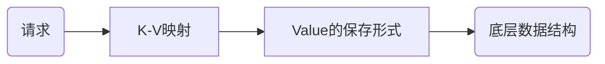

# 大纲


- **高性能主线**，包括线程模型、数据结构、持久化、网络框架；
- **高可靠主线**，包括主从复制、哨兵机制；
- **高可扩展主线**，包括数据分片、负载均衡。

### Redis问题画像图


## 一个简单的键-值数据库SIMPLEKV

### 功能模块示意图


一个简单的键-值数据库包含以下几个模块，

1. 访问框架

   - 访问框架是指访问数据库的方式，常见的有：动态链接库，和网络访问模块

2. 操作模块

   - ##### 什么是操作模块？

     操作模块是数据库提供给调用方可以使用的操作接口，对值为不同类型的数据结构，可能存在特定用途的数据接口。

3. 索引模块

   - ##### 什么是索引模块？

     键值数据库使用索引模块，根据Key值，查找到对应Value的值。常见的索引模块有，哈希表，B+树，字典树等。

4. 存储模块

   - 存储模块是指数据的保存形式，空间的分配策略，以及如何持久化缓存中的数据。例如：数据存在哪里？内键还是外键？如何解决内存碎片的问题？突然断电如何保留数据？


# 存储模块

## Redis的数据结构



### Redis如何根据进行K-V映射？

Redis使用一个全局哈希表保存数据，其中的每一个元素被称为一个哈希桶。每个哈希桶中保存了键值对的数据，其中键值对的值是指向结果数据结构的指针。


#### Redis如何解决Hash冲突？

##### 链式哈希

当遇到哈希冲突时，使用链表解决。


##### 渐进式rehash

###### 什么是rehash？

rehash是指哈希表扩容的过程，增加多个哈希桶，降低哈希冲突的问题。

###### Redis是如何rehash的？

redis使用两张哈希表，第二张表用来扩容。Redis 开始执行 rehash，这个过程分为三步：

1. 给哈希表 2 分配更大的空间，例如是当前哈希表 1 大小的两倍；
2. 把哈希表 1 中的数据重新映射并拷贝到哈希表 2 中；
3. 释放哈希表 1 的空间。

其中，rehash的过程是渐进式的。简单来说就是在第二步拷贝数据时，Redis 仍然正常处理客户端请求，每处理一个请求时，从哈希表 1 中的第一个索引位置开始，顺带着将这个索引位置上的所有 entries 拷贝到哈希表 2 中；等处理下一个请求时，再顺带拷贝哈希表 1 中的下一个索引位置的 entries。如下图所示：


### Redis数据的中间类型和底层结构

在Redis中，数据的保存形式分为，String，List，Hash，Sorted Set，和Set。

#### Redis不同形式数据的操作

##### String形式

```sql
redis 127.0.0.1:6379> SET runoob "菜鸟教程"
OK
redis 127.0.0.1:6379> GET runoob
"菜鸟教程"
```

##### Hash形式

```sql
redis 127.0.0.1:6379> HMSET runoob field1 "Hello" field2 "World"
"OK"
redis 127.0.0.1:6379> HGET runoob field1
"Hello"
```

##### List形式

##### 

```sql
redis 127.0.0.1:6379> lpush runoob redis
(integer) 1
redis 127.0.0.1:6379> lpush runoob mongodb
(integer) 2
redis 127.0.0.1:6379> lpush runoob rabbitmq
(integer) 3
redis 127.0.0.1:6379> lrange runoob 0 10
1) "rabbitmq"
2) "mongodb"
3) "redis"
```

#### 数据类型和底层数据结构的对应关系


##### 什么是压缩列表？

压缩列表实际上类似于一个数组，数组中的每一个元素都对应保存一个数据。和数组不同的是，压缩列表在表头有三个字段 zlbytes、zltail 和 zllen，分别表示列表长度、列表尾的偏移量和列表中的 entry 个数；压缩列表在表尾还有一个 zlend，表示列表结束。在压缩列表中，如果我们要查找定位第一个元素和最后一个元素，可以通过表头三个字段的长度直接定位，复杂度是 O(1)。


而查找其他元素时，就没有这么高效了，只能逐个查找，此时的复杂度就是 O(N) 了。

##### 什么是跳表？


跳表在链表的基础上，增加了**多级索引**，通过索引位置的几个跳转，实现数据的快速定位。

##### 数据结构的时间复杂度


#### 数据操作的方式

1. 单元素操作，是指每一种集合类型对单个数据实现的增删改查操作。
2. 范围操作，是指集合类型中的遍历操作，可以返回集合中的所有数据。
3. 统计操作，是指集合类型对集合中所有元素个数的记录。
4. 例外情况，是指某些数据结构的特殊记录，例如压缩列表和双向链表都会记录表头和表尾的偏移量。

## Redis的访问框架（I/O模型）

主要是指 Redis 的网络 IO 和键值对读写是由一个线程来完成的，这也是 Redis 对外提供键值存储服务的主要流程。但 Redis 的其他功能，比如持久化、异步删除、集群数据同步等，其实是由额外的线程执行的。

##### 为什么不使用多线程？

### Redis如何使用单线程/主线程实现高并发读取

#### 多路复用

Redis使用同步非阻塞I/O网络模型实现单线程的多路复用

##### 什么是非阻塞模式？

Socket网络模型中的非阻塞模式体现在三个函数的调用


在 socket 模型中，不同操作调用后会返回不同的套接字类型。

socket() 方法会返回主动套接字，然后调用 listen() 方法，将主动套接字转化为监听套接字，此时，可以监听来自客户端的连接请求。最后，调用 accept() 方法接收到达的客户端连接，并返回已连接套接字。

**当设置为非阻塞模式时**：当 Redis 调用 accept() 但一直未有连接请求到达时，Redis 线程可以返回处理其他操作，而不用一直等待。但是，你要注意的是，调用 accept() 时，已经存在监听套接字了。


#### Redis主线程的 I/O 执行过程


### 扩展(`todo`)

Redis单线程处理IO请求性能瓶颈主要包括2个方面：

1、任意一个请求在server中一旦发生耗时，都会影响整个server的性能，也就是说后面的请求都要等前面这个耗时请求处理完成，自己才能被处理到。耗时的操作包括以下几种：
a、操作bigkey：写入一个bigkey在分配内存时需要消耗更多的时间，同样，删除bigkey释放内存同样会产生耗时；
b、使用复杂度过高的命令：例如SORT/SUNION/ZUNIONSTORE，或者O(N)命令，但是N很大，例如lrange key 0 -1一次查询全量数据；
c、大量key集中过期：Redis的过期机制也是在主线程中执行的，大量key集中过期会导致处理一个请求时，耗时都在删除过期key，耗时变长；
d、淘汰策略：淘汰策略也是在主线程执行的，当内存超过Redis内存上限后，每次写入都需要淘汰一些key，也会造成耗时变长；
e、AOF刷盘开启always机制：每次写入都需要把这个操作刷到磁盘，写磁盘的速度远比写内存慢，会拖慢Redis的性能；
f、主从全量同步生成RDB：虽然采用fork子进程生成数据快照，但fork这一瞬间也是会阻塞整个线程的，实例越大，阻塞时间越久；
2、并发量非常大时，单线程读写客户端IO数据存在性能瓶颈，虽然采用IO多路复用机制，但是读写客户端数据依旧是同步IO，只能单线程依次读取客户端的数据，无法利用到CPU多核。

针对问题1，一方面需要业务人员去规避，一方面Redis在4.0推出了lazy-free机制，把bigkey释放内存的耗时操作放在了异步线程中执行，降低对主线程的影响。

针对问题2，Redis在6.0推出了多线程，可以在高并发场景下利用CPU多核多线程读写客户端数据，进一步提升server性能，当然，只是针对客户端的读写是并行的，每个命令的真正操作依旧是单线程的。

## Redis的持久化

Redis的持久化主要有两大机制，AOF(Append Only File)日志和RDB日志。

### AOF日志

不同于数据库的写前日志(WAL)，AOF使用**写后日志**。

##### 为什么使用AOF日志？

Redis常作为缓存，一旦服务器宕机，所有内存中数据都会丢失。需要使用持久化的方式保存这些数据，以便宕机后能够恢复数据。

##### 为什么Redis的AOF日志是写后日志？

因为Redis使用单线程执行命令，写后日志可以避免语法检查的开销，而且不会阻塞当前的执行命令。

##### AOF的写回策略

- Always，同步写回：每个写命令执行完，立马同步地将日志写回磁盘；
- Everysec，每秒写回：每个写命令执行完，只是先把日志写到 AOF 文件的内存缓冲区，每隔一秒把缓冲区中的内容写入磁盘；
- No，操作系统控制的写回：每个写命令执行完，只是先把日志写到 AOF 文件的内存缓冲区，由操作系统决定何时将缓冲区内容写回磁盘。


##### 如何选取写回策略？

想要获得高性能，就选择 No 策略；

如果想要得到高可靠性保证，就选择 Always 策略；

如果允许数据有一点丢失，又希望性能别受太大影响的话，那么就选择 Everysec 策略。

#### AOF的重写机制

##### 为什么使用AOF重写机制？

持续对AOF文件的添加，可能会造成AOF文件过大。会有以下的影响：

- 文件系统的限制，无法保存过大的文件。
- 文件很大后，追加信息的速度也会下降。
- 故障恢复的时候，这样做十分缓慢，会影响redis的正常使用。

##### 什么是重写机制？

重写机制是将多次对同一条数据的修改，压缩成一整行，保证数据的最终一致性。


##### 重写机制是如何进行的？


在Redis启动重写后，

1. 会从主线程中fork出一个后台的bgrewriteaof子线程（**Fork瞬间会阻塞主线程**）
   1. fork过程会把主线程的内存拷贝给子线程（这里的内存是指内存页表，即虚拟内存指向物理内存的映射索引表），内存中就包含了数据库的最新数据。
2. 子线程会根据这些信息，整理成为重写日志，写入缓冲区。

在这个过程中，系统维护两份日志。主线程的AOF日志和子线程的AOF重写日志，他们都会被写入缓冲区中，以便故障恢复时使用。

### 扩展(`todo`)

问题1，Redis采用fork子进程重写AOF文件时，潜在的阻塞风险包括：fork子进程 和 AOF重写过程中父进程产生写入的场景，下面依次介绍。

a、fork子进程，fork这个瞬间一定是会阻塞主线程的（注意，fork时并不会一次性拷贝所有内存数据给子进程，老师文章写的是拷贝所有内存数据给子进程，我个人认为是有歧义的），fork采用操作系统提供的写实复制(Copy On Write)机制，就是为了避免一次性拷贝大量内存数据给子进程造成的长时间阻塞问题，但fork子进程需要拷贝进程必要的数据结构，其中有一项就是拷贝内存页表（虚拟内存和物理内存的映射索引表），这个拷贝过程会消耗大量CPU资源，拷贝完成之前整个进程是会阻塞的，阻塞时间取决于整个实例的内存大小，实例越大，内存页表越大，fork阻塞时间越久。拷贝内存页表完成后，子进程与父进程指向相同的内存地址空间，也就是说此时虽然产生了子进程，但是并没有申请与父进程相同的内存大小。那什么时候父子进程才会真正内存分离呢？“写实复制”顾名思义，就是在写发生时，才真正拷贝内存真正的数据，这个过程中，父进程也可能会产生阻塞的风险，就是下面介绍的场景。

b、fork出的子进程指向与父进程相同的内存地址空间，此时子进程就可以执行AOF重写，把内存中的所有数据写入到AOF文件中。但是此时父进程依旧是会有流量写入的，如果父进程操作的是一个已经存在的key，那么这个时候父进程就会真正拷贝这个key对应的内存数据，申请新的内存空间，这样逐渐地，父子进程内存数据开始分离，父子进程逐渐拥有各自独立的内存空间。因为内存分配是以页为单位进行分配的，默认4k，如果父进程此时操作的是一个bigkey，重新申请大块内存耗时会变长，可能会产阻塞风险。另外，如果操作系统开启了内存大页机制(Huge Page，页面大小2M)，那么父进程申请内存时阻塞的概率将会大大提高，所以在Redis机器上需要关闭Huge Page机制。Redis每次fork生成RDB或AOF重写完成后，都可以在Redis log中看到父进程重新申请了多大的内存空间。

问题2，AOF重写不复用AOF本身的日志，一个原因是父子进程写同一个文件必然会产生竞争问题，控制竞争就意味着会影响父进程的性能。二是如果AOF重写过程中失败了，那么原本的AOF文件相当于被污染了，无法做恢复使用。所以Redis AOF重写一个新文件，重写失败的话，直接删除这个文件就好了，不会对原先的AOF文件产生影响。等重写完成之后，直接替换旧文件即可。

### RDB（Redis Database）快照

##### 什么是RDB快照？

RDB快照是Redis的另一种持久化方式，它会将某一时刻的状态以文件的形式写到磁盘上，即使宕机，快照的文件也不会丢失，数据的可靠性也就得到了保障。

##### 为什么使用RDB快照？

当服务宕机时，如果单纯使用AOF日志恢复，需要按顺序一条一条执行命令，会造成长时间的服务不可用，整体回复的效率也不高。

如果使用RDB快照结合AOF日志，就能很快的回复到宕机之前的状态，而且数据也能够完整的恢复。

#### Redis是如何实现RDB快照的？

RDB快照执行的是**全量快照**。在Redis中，有save和bgsave两个命令可以生成RDB快照文件。

- save会在主线程中执行，会导致阻塞。

- bgsave是RDB的默认快照方式，它会创建一个子进程，专门用于写入RDB文件，避免主线程阻塞。

  - ###### 为什么使用子线程执行作为默认方式？

  - 因为子线程执行时，主线程不会被阻塞，不会影响服务的可用性。

在快照执行时，Redis会使用操作系统提供的写时复制（Copy-On-Write/COW）的方式，在执行快照的时候，正常执行读写任务。

###### 什么是Copy-On-Write？

###### 为什么使用Copy-On-Write的方式进行内存快照？

Copy-On-Write即保证了快照瞬间数据的一致性，又保证了Redis服务的可用性。

##### Redis快照的执行bgsave具体流程是怎样的？

