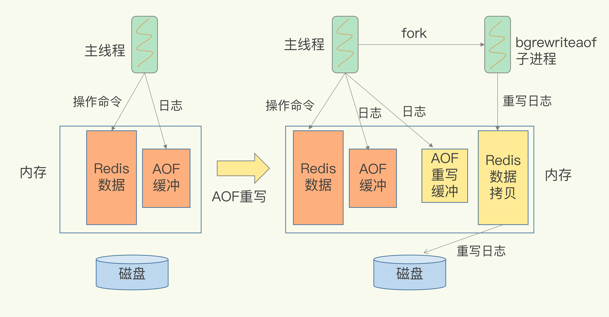
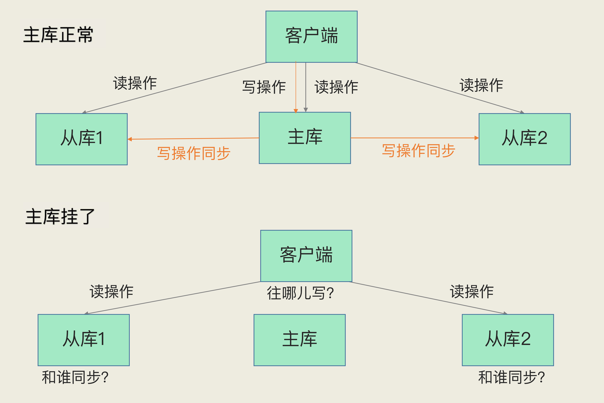
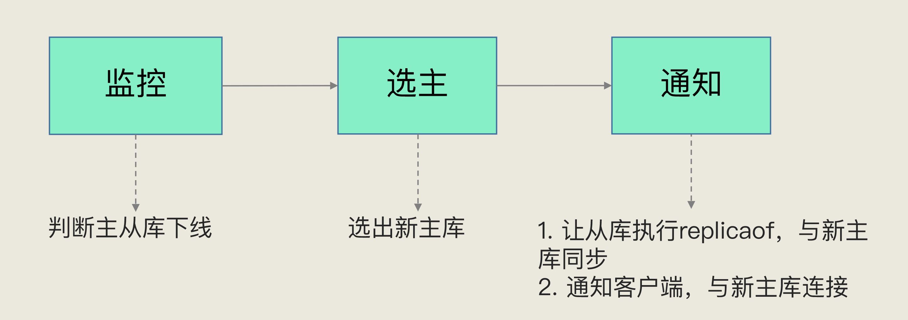

#  大纲


- **高性能主线**，包括线程模型、数据结构、持久化、网络框架；
- **高可靠主线**，包括主从复制、哨兵机制；
- **高可扩展主线**，包括数据分片、负载均衡。

### Redis问题画像图


## 一个简单的键-值数据库SIMPLEKV

### 功能模块示意图


一个简单的键-值数据库包含以下几个模块，

1. 访问框架

   - 访问框架是指访问数据库的方式，常见的有：动态链接库，和网络访问模块

2. 操作模块

   - ##### 什么是操作模块？

     操作模块是数据库提供给调用方可以使用的操作接口，对值为不同类型的数据结构，可能存在特定用途的数据接口。

3. 索引模块

   - ##### 什么是索引模块？

     键值数据库使用索引模块，根据Key值，查找到对应Value的值。常见的索引模块有，哈希表，B+树，字典树等。

4. 存储模块

   - 存储模块是指数据的保存形式，空间的分配策略，以及如何持久化缓存中的数据。例如：数据存在哪里？内键还是外键？如何解决内存碎片的问题？突然断电如何保留数据？


# 存储模块

## Redis的数据结构


### Redis如何根据进行K-V映射？

Redis使用一个全局哈希表保存数据，其中的每一个元素被称为一个哈希桶。每个哈希桶中保存了键值对的数据，其中键值对的值是指向结果数据结构的指针。


#### Redis如何解决Hash冲突？

##### 链式哈希

当遇到哈希冲突时，使用链表解决。


##### 渐进式rehash

###### 什么是rehash？

rehash是指哈希表扩容的过程，增加多个哈希桶，降低哈希冲突的问题。

###### Redis是如何rehash的？

redis使用两张哈希表，第二张表用来扩容。Redis 开始执行 rehash，这个过程分为三步：

1. 给哈希表 2 分配更大的空间，例如是当前哈希表 1 大小的两倍；
2. 把哈希表 1 中的数据重新映射并拷贝到哈希表 2 中；
3. 释放哈希表 1 的空间。

其中，rehash的过程是渐进式的。简单来说就是在第二步拷贝数据时，Redis 仍然正常处理客户端请求，每处理一个请求时，从哈希表 1 中的第一个索引位置开始，顺带着将这个索引位置上的所有 entries 拷贝到哈希表 2 中；等处理下一个请求时，再顺带拷贝哈希表 1 中的下一个索引位置的 entries。如下图所示：


### Redis数据的中间类型和底层结构

在Redis中，数据的保存形式分为，String，List，Hash，Sorted Set，和Set。

#### Redis不同形式数据的操作

##### String形式

```sql
redis 127.0.0.1:6379> SET runoob "菜鸟教程"
OK
redis 127.0.0.1:6379> GET runoob
"菜鸟教程"
```

##### Hash形式

```sql
redis 127.0.0.1:6379> HMSET runoob field1 "Hello" field2 "World"
"OK"
redis 127.0.0.1:6379> HGET runoob field1
"Hello"
```

##### List形式

##### 

```sql
redis 127.0.0.1:6379> lpush runoob redis
(integer) 1
redis 127.0.0.1:6379> lpush runoob mongodb
(integer) 2
redis 127.0.0.1:6379> lpush runoob rabbitmq
(integer) 3
redis 127.0.0.1:6379> lrange runoob 0 10
1) "rabbitmq"
2) "mongodb"
3) "redis"
```

#### 数据类型和底层数据结构的对应关系


##### 什么是压缩列表？

压缩列表实际上类似于一个数组，数组中的每一个元素都对应保存一个数据。和数组不同的是，压缩列表在表头有三个字段 zlbytes、zltail 和 zllen，分别表示列表长度、列表尾的偏移量和列表中的 entry 个数；压缩列表在表尾还有一个 zlend，表示列表结束。在压缩列表中，如果我们要查找定位第一个元素和最后一个元素，可以通过表头三个字段的长度直接定位，复杂度是 O(1)。


而查找其他元素时，就没有这么高效了，只能逐个查找，此时的复杂度就是 O(N) 了。

##### 什么是跳表？


跳表在链表的基础上，增加了**多级索引**，通过索引位置的几个跳转，实现数据的快速定位。

##### 数据结构的时间复杂度


#### 数据操作的方式

1. 单元素操作，是指每一种集合类型对单个数据实现的增删改查操作。
2. 范围操作，是指集合类型中的遍历操作，可以返回集合中的所有数据。
3. 统计操作，是指集合类型对集合中所有元素个数的记录。
4. 例外情况，是指某些数据结构的特殊记录，例如压缩列表和双向链表都会记录表头和表尾的偏移量。

## Redis的访问框架（I/O模型）

主要是指 Redis 的网络 IO 和键值对读写是由一个线程来完成的，这也是 Redis 对外提供键值存储服务的主要流程。但 Redis 的其他功能，比如持久化、异步删除、集群数据同步等，其实是由额外的线程执行的。

##### 为什么不使用多线程？

### Redis如何使用单线程/主线程实现高并发读取

#### 多路复用

Redis使用同步非阻塞I/O网络模型实现单线程的多路复用

##### 什么是非阻塞模式？

Socket网络模型中的非阻塞模式体现在三个函数的调用


在 socket 模型中，不同操作调用后会返回不同的套接字类型。

socket() 方法会返回主动套接字，然后调用 listen() 方法，将主动套接字转化为监听套接字，此时，可以监听来自客户端的连接请求。最后，调用 accept() 方法接收到达的客户端连接，并返回已连接套接字。

**当设置为非阻塞模式时**：当 Redis 调用 accept() 但一直未有连接请求到达时，Redis 线程可以返回处理其他操作，而不用一直等待。但是，你要注意的是，调用 accept() 时，已经存在监听套接字了。


#### Redis主线程的 I/O 执行过程


### 扩展(`todo`)

Redis单线程处理IO请求性能瓶颈主要包括2个方面：

1、任意一个请求在server中一旦发生耗时，都会影响整个server的性能，也就是说后面的请求都要等前面这个耗时请求处理完成，自己才能被处理到。耗时的操作包括以下几种：
a、操作bigkey：写入一个bigkey在分配内存时需要消耗更多的时间，同样，删除bigkey释放内存同样会产生耗时；
b、使用复杂度过高的命令：例如SORT/SUNION/ZUNIONSTORE，或者O(N)命令，但是N很大，例如lrange key 0 -1一次查询全量数据；
c、大量key集中过期：Redis的过期机制也是在主线程中执行的，大量key集中过期会导致处理一个请求时，耗时都在删除过期key，耗时变长；
d、淘汰策略：淘汰策略也是在主线程执行的，当内存超过Redis内存上限后，每次写入都需要淘汰一些key，也会造成耗时变长；
e、AOF刷盘开启always机制：每次写入都需要把这个操作刷到磁盘，写磁盘的速度远比写内存慢，会拖慢Redis的性能；
f、主从全量同步生成RDB：虽然采用fork子进程生成数据快照，但fork这一瞬间也是会阻塞整个线程的，实例越大，阻塞时间越久；
2、并发量非常大时，单线程读写客户端IO数据存在性能瓶颈，虽然采用IO多路复用机制，但是读写客户端数据依旧是同步IO，只能单线程依次读取客户端的数据，无法利用到CPU多核。

针对问题1，一方面需要业务人员去规避，一方面Redis在4.0推出了lazy-free机制，把bigkey释放内存的耗时操作放在了异步线程中执行，降低对主线程的影响。

针对问题2，Redis在6.0推出了多线程，可以在高并发场景下利用CPU多核多线程读写客户端数据，进一步提升server性能，当然，只是针对客户端的读写是并行的，每个命令的真正操作依旧是单线程的。

## Redis的持久化

Redis的持久化主要有两大机制，AOF(Append Only File)日志和RDB日志。

### AOF日志

不同于数据库的写前日志(WAL)，AOF使用**写后日志**。

##### 为什么使用AOF日志？

Redis常作为缓存，一旦服务器宕机，所有内存中数据都会丢失。需要使用持久化的方式保存这些数据，以便宕机后能够恢复数据。

##### 为什么Redis的AOF日志是写后日志？

因为Redis使用单线程执行命令，写后日志可以避免语法检查的开销，而且不会阻塞当前的执行命令。

##### AOF的写回策略

- Always，同步写回：每个写命令执行完，立马同步地将日志写回磁盘；
- Everysec，每秒写回：每个写命令执行完，只是先把日志写到 AOF 文件的内存缓冲区，每隔一秒把缓冲区中的内容写入磁盘；
- No，操作系统控制的写回：每个写命令执行完，只是先把日志写到 AOF 文件的内存缓冲区，由操作系统决定何时将缓冲区内容写回磁盘。


##### 如何选取写回策略？

想要获得高性能，就选择 No 策略；

如果想要得到高可靠性保证，就选择 Always 策略；

如果允许数据有一点丢失，又希望性能别受太大影响的话，那么就选择 Everysec 策略。

#### AOF的重写机制

##### 为什么使用AOF重写机制？

持续对AOF文件的添加，可能会造成AOF文件过大。会有以下的影响：

- 文件系统的限制，无法保存过大的文件。
- 文件很大后，追加信息的速度也会下降。
- 故障恢复的时候，这样做十分缓慢，会影响redis的正常使用。

##### 什么是重写机制？

重写机制是将多次对同一条数据的修改，压缩成一整行，保证数据的最终一致性。


##### 重写机制是如何进行的？



在Redis启动重写后，

1. 会从主线程中fork出一个后台的bgrewriteaof子线程（**Fork瞬间会阻塞主线程**）
   1. fork过程会把主线程的内存拷贝给子线程（这里的内存是指内存页表，即虚拟内存指向物理内存的映射索引表），内存中就包含了数据库的最新数据。
2. 子线程会根据这些信息，整理成为重写日志，写入缓冲区。

在这个过程中，系统维护两份日志。主线程的AOF日志和子线程的AOF重写日志，他们都会被写入缓冲区中，以便故障恢复时使用。

### 扩展(`todo`)

问题1，Redis采用fork子进程重写AOF文件时，潜在的阻塞风险包括：fork子进程 和 AOF重写过程中父进程产生写入的场景，下面依次介绍。

a、fork子进程，fork这个瞬间一定是会阻塞主线程的（注意，fork时并不会一次性拷贝所有内存数据给子进程，老师文章写的是拷贝所有内存数据给子进程，我个人认为是有歧义的），fork采用操作系统提供的写实复制(Copy On Write)机制，就是为了避免一次性拷贝大量内存数据给子进程造成的长时间阻塞问题，但fork子进程需要拷贝进程必要的数据结构，其中有一项就是拷贝内存页表（虚拟内存和物理内存的映射索引表），这个拷贝过程会消耗大量CPU资源，拷贝完成之前整个进程是会阻塞的，阻塞时间取决于整个实例的内存大小，实例越大，内存页表越大，fork阻塞时间越久。拷贝内存页表完成后，子进程与父进程指向相同的内存地址空间，也就是说此时虽然产生了子进程，但是并没有申请与父进程相同的内存大小。那什么时候父子进程才会真正内存分离呢？“写实复制”顾名思义，就是在写发生时，才真正拷贝内存真正的数据，这个过程中，父进程也可能会产生阻塞的风险，就是下面介绍的场景。

b、fork出的子进程指向与父进程相同的内存地址空间，此时子进程就可以执行AOF重写，把内存中的所有数据写入到AOF文件中。但是此时父进程依旧是会有流量写入的，如果父进程操作的是一个已经存在的key，那么这个时候父进程就会真正拷贝这个key对应的内存数据，申请新的内存空间，这样逐渐地，父子进程内存数据开始分离，父子进程逐渐拥有各自独立的内存空间。因为内存分配是以页为单位进行分配的，默认4k，如果父进程此时操作的是一个bigkey，重新申请大块内存耗时会变长，可能会产阻塞风险。另外，如果操作系统开启了内存大页机制(Huge Page，页面大小2M)，那么父进程申请内存时阻塞的概率将会大大提高，所以在Redis机器上需要关闭Huge Page机制。Redis每次fork生成RDB或AOF重写完成后，都可以在Redis log中看到父进程重新申请了多大的内存空间。

问题2，AOF重写不复用AOF本身的日志，一个原因是父子进程写同一个文件必然会产生竞争问题，控制竞争就意味着会影响父进程的性能。二是如果AOF重写过程中失败了，那么原本的AOF文件相当于被污染了，无法做恢复使用。所以Redis AOF重写一个新文件，重写失败的话，直接删除这个文件就好了，不会对原先的AOF文件产生影响。等重写完成之后，直接替换旧文件即可。

### RDB（Redis Database）快照

##### 什么是RDB快照？

RDB快照是Redis的另一种持久化方式，它会将某一时刻的状态以文件的形式写到磁盘上，即使宕机，快照的文件也不会丢失，数据的可靠性也就得到了保障。

##### 为什么使用RDB快照？

当服务宕机时，如果单纯使用AOF日志恢复，需要按顺序一条一条执行命令，会造成长时间的服务不可用，整体回复的效率也不高。

如果使用RDB快照结合AOF日志，就能很快的回复到宕机之前的状态，而且数据也能够完整的恢复。

#### Redis是如何实现RDB快照的？

RDB快照执行的是**全量快照**。在Redis中，有save和bgsave两个命令可以生成RDB快照文件。

- save会在主线程中执行，会导致阻塞。

- bgsave是RDB的默认快照方式，它会创建一个子进程，专门用于写入RDB文件，避免主线程阻塞。

  - ###### 为什么使用子线程执行作为默认方式？

  - 因为子线程执行时，主线程不会被阻塞，不会影响服务的可用性。

在快照执行时，Redis会使用操作系统提供的写时复制（Copy-On-Write/COW）的方式，在执行快照的时候，正常执行读写任务。

###### 什么是Copy-On-Write？

###### 为什么使用Copy-On-Write的方式进行内存快照？

Copy-On-Write即保证了快照瞬间数据的一致性，又保证了Redis服务的可用性。

##### Redis快照的执行bgsave具体流程是怎样的？


1. bgsave从主线程中fork 出来，可以共享主线程的内存数据，并开始把它们写入RDB文件。
2. 如果主线程和bgsave子线程同时读取同一个键值，则互不印象。
3. 如果主线程想要在运行时修改一条记录，bgsave子线程则会创建原纪录的副本，并使用这个副本进行RDB文件的写入。

##### 如何使用RDB快照？

1. 在第一次快照备份时，使用全量快照。后续的操作使用增量快照。

   - 问题：记录内存中的增量变动需要额外的内存开销

2. 在Redis4.0后，使用AOF和RDB快照混合的方式持久化信息。

   1. 周期性的使用RDB快照将当前内存状态持久化
   2. 在RDB周期间，使用AOF日志记录快照间的操作

   好处：1. 减少重写开销 2. 降低高频率快照的影响 3. 减少AOF或者RDB增量追踪的内存使用 4. 提升宕机恢复的速度

   ##### 

#### RDB快照的宕机恢复流程是怎样的？

#### RDB快照的风险

2核CPU、4GB内存、500G磁盘，Redis实例占用2GB，写读比例为8:2，此时做RDB持久化，产生的风险主要在于 CPU资源 和 内存资源 这2方面：

a、内存资源风险：Redis fork子进程做RDB持久化，由于写的比例为80%，那么在持久化过程中，“写实复制”会重新分配整个实例80%的内存副本，大约需要重新分配1.6GB内存空间，这样整个系统的内存使用接近饱和，如果此时父进程又有大量新key写入，很快机器内存就会被吃光，如果机器开启了Swap机制，那么Redis会有一部分数据被换到磁盘上，当Redis访问这部分在磁盘上的数据时，性能会急剧下降，已经达不到高性能的标准（可以理解为武功被废）。如果机器没有开启Swap，会直接触发OOM，父子进程会面临被系统kill掉的风险。

b、CPU资源风险：虽然子进程在做RDB持久化，但生成RDB快照过程会消耗大量的CPU资源，虽然Redis处理处理请求是单线程的，但Redis Server还有其他线程在后台工作，例如AOF每秒刷盘、异步关闭文件描述符这些操作。由于机器只有2核CPU，这也就意味着父进程占用了超过一半的CPU资源，此时子进程做RDB持久化，可能会产生CPU竞争，导致的结果就是父进程处理请求延迟增大，子进程生成RDB快照的时间也会变长，整个Redis Server性能下降。

c、另外，可以再延伸一下，老师的问题没有提到Redis进程是否绑定了CPU，如果绑定了CPU，那么子进程会继承父进程的CPU亲和性属性，子进程必然会与父进程争夺同一个CPU资源，整个Redis Server的性能必然会受到影响！所以如果Redis需要开启定时RDB和AOF重写，进程一定不要绑定CPU。

## 高可用机制

### Redis的主从库

##### 为什么需要主从库？

1. 多个一致的数据库能够提供数据连接的高可用
2. 能够提高读操作的并发量

#### 主从一致机制

Redis 提供了主从库模式，以保证数据副本的一致，主从库之间采用的是读写分离的方式。

- 读操作：主库、从库都可以接收；
- 写操作：首先到主库执行，然后，主库将写操作同步给从库。


##### 为什么需要读写分离？

读写分离可以保证数据写入的最终一致性。如果，不存在主库，则可能造成一条数据存在多个版本，无法保证数据库的一致性。

#### 主从复制的流程

##### 首次同步

在从库terimal中调用命令**replicaof 主库IP 主库端口**

##### 同步流程

###### 第一阶段：通信

1. 从库发送psync(？(随机ID)，offset)
2. 主库返回FULLRESYNC(主库runID，offset)

FULLRESYNC是指全量复制

###### 第二阶段：快照复制

复制的过程是具体来说，主库执行 bgsave 命令，生成 RDB 文件，接着将文件发给从库。从库接收到 RDB 文件后，会先清空当前数据库，然后加载 RDB 文件。这是因为从库在通过 replicaof 命令开始和主库同步前，可能保存了其他数据。为了避免之前数据的影响，从库需要先把当前数据库清空。

###### 第三阶段：增量复制

主库会将RDB镜像开始生成后的命令，保存在replicaiton buffer中，当第二阶段完成后，会将replication buffer中的数据复制给从库。


###### 为什么主从全量同步使用RDB而不是用AOF？

1、RDB文件内容是经过压缩的二进制数据（不同数据类型数据做了针对性优化），文件很小。而AOF文件记录的是每一次写操作的命令，写操作越多文件会变得很大，其中还包括很多对同一个Key的多次冗余操作。在主从全量数据同步时，传输RDB文件可以尽量降低对主库机器网络带宽的消耗，从库在加载RDB文件时，一是文件小，读取整个文件的速度会很快，二是因为RDB文件存储的都是二进制数据，从库直接按照RDB协议解析还原数据即可，速度会非常快，而AOF需要依次重放每个写命令，这个过程会经历冗长的处理逻辑，恢复速度相比RDB会慢得多，所以使用RDB进行主从全量同步的成本最低。

2、假设要使用AOF做全量同步，意味着必须打开AOF功能，打开AOF就要选择文件刷盘的策略，选择不当会严重影响Redis性能。而RDB只有在需要定时备份和主从全量同步数据时才会触发生成一次快照。而在很多丢失数据不敏感的业务场景，其实是不需要开启AOF的。

##### 后续同步

在完成首次同步后，主从库之间会维持**长连接**，保证后续命令的同步。

##### 如果主从库之间的长连接中断怎么办？

Redis2.8之前，断开后会开启一个全新的全量复制，开销很大。

Redis2.8之后，使用增量复制的方式继续同步。

##### 断线后，如何进行增量复制？

当存在主从复制的场景下，主库会将所有的写操作写入repl_backlog_buffer，只要有从库存在，这个repl_backlog_buffer就会存在。主库的所有写命令除了传播给从库之外，都会在这个repl_backlog_buffer中记录一份，缓存起来，只有预先缓存了这些命令，当从库断连后，从库重新发送psync $master_runid $offset，主库才能通过$offset在repl_backlog_buffer中找到从库断开的位置，只发送$offset之后的增量数据给从库即可。

###### 主从复制的两种buffer

- repl_backlog_buffer，用于保留主从数据之间差异的buffer
  - **repl_backlog_buffer**：就是上面我解释到的，它是为了从库断开之后，如何找到主从差异数据而设计的环形缓冲区，从而避免全量同步带来的性能开销。如果从库断开时间太久，repl_backlog_buffer环形缓冲区被主库的写命令覆盖了，那么从库连上主库后只能乖乖地进行一次全量同步，所以repl_backlog_buffer配置尽量大一些，可以降低主从断开后全量同步的概率。而在repl_backlog_buffer中找主从差异的数据后，如何发给从库呢？这就用到了replication buffer。
- replication_buffer，在主从数据库同步时使用的buffer
  - **replication_buffer**：Redis和客户端通信也好，和从库通信也好，Redis都需要给分配一个 内存buffer进行数据交互，客户端是一个client，从库也是一个client，我们每个client连上Redis后，Redis都会分配一个client buffer，所有数据交互都是通过这个buffer进行的：Redis先把数据写到这个buffer中，然后再把buffer中的数据发到client socket中再通过网络发送出去，这样就完成了数据交互。所以主从在增量同步时，从库作为一个client，也会分配一个buffer，只不过这个buffer专门用来传播用户的写命令到从库，保证主从数据一致，我们通常把它叫做replication buffer。

再延伸一下，既然有这个内存buffer存在，那么这个buffer有没有限制呢？如果主从在传播命令时，因为某些原因从库处理得非常慢，那么主库上的这个buffer就会持续增长，消耗大量的内存资源，甚至OOM。所以Redis提供了client-output-buffer-limit参数限制这个buffer的大小，如果超过限制，主库会强制断开这个client的连接，也就是说从库处理慢导致主库内存buffer的积压达到限制后，主库会强制断开从库的连接，此时主从复制会中断，中断后如果从库再次发起复制请求，那么此时可能会导致恶性循环，引发复制风暴，这种情况需要格外注意。

#### 主从级联模式


### Redis的哨兵机制

##### 为什么需要哨兵机制？

在分布式系统中，主库可能因为各种原因不可用，其他从库由于没有主库节点的能力，无法执行写操作，需要一个机制保证Redis数据库的可用性。



##### 哨兵机制解决了什么问题？

哨兵机制给Redis集群提供了主库监控的能力，能够在主库不可用时在从库中选取新主库。

#### 哨兵机制的基本流程

哨兵时一个在特殊模式下运行的Redis进程，提供**监控，选主**和**通知**三个功能。

1. **监控**主从库状态，如果从库下线，就标记为主观下线。如果主库下线，则通过哨兵集群决策，如果主库被判定为客观下线状态，就执行选主操作。

2. **选主**是指哨兵通过一系列的规则，在从库中选取合适的某一个从库作为主库。

3. **通知**，哨兵领导者会通知其他从库与新主库同步，然后通知客户端与新主库连接。

   1. 但是如何选出“哨兵领导者”？

      这个问题也是一个分布式系统中的问题，就是我们经常听说的共识算法，指的是集群中多个节点如何就一个问题达成共识。共识算法有很多种，例如Paxos、Raft，这里哨兵集群采用的类似于Raft的共识算法。

##### 主观下线和客观下线

哨兵会周期性的使用PING命令检查自己和集群中的主从库之间的网络状态，从而判断实例的状态。

**主观下线**是指，当哨兵向某个节点发送的PING命令超时，会将该实例标记为主观下线。

**客观下线**是哨兵集群为了防止误判，针对主库主观下线的场景，通过多哨兵一起决策的方式，避免误判。只有当网络中超过半数的哨兵判定主库为主观下线时，主库才会被判定为*客观下线*，并执行**主库切换流程**。



##### 什么时候会执行主库切换？

当主库被哨兵集群标记为客观下线时，Redis会进行选主操作。在完成选主后，通知其他从库与新主库同步，然后通知客户端与新主库连接。

##### 如何选取新主库？

1. 筛选，把与哨兵断连超过10次的从库过滤掉。

2. 打分，按照以下顺序打分，如果分数相等，则继续向下打分。
   1. 优先级最高的从库得分高
      - 通过配置slave-priority设置从库的优先级
   2. 和旧主库同步程度最接近的从库得分高
      - 比较不同的slave_repl_offset，确定同步程度最高的从库
   3. ID 号小的从库得分高
      - 根据实例的默认ID打分


#### 问题：

##### 哨兵在操作主从切换的过程中，客户端能否正常地进行请求操作？

如果客户端使用了读写分离，那么读请求可以在从库上正常执行，不会受到影响。但是由于此时主库已经挂了，而且哨兵还没有选出新的主库，所以在这期间写请求会失败，失败持续的时间 = 哨兵切换主从的时间 + 客户端感知到新主库 的时间。

如果不想让业务感知到异常，客户端只能把写失败的请求先缓存起来或写入消息队列中间件中，等哨兵切换完主从后，再把这些写请求发给新的主库，但这种场景只适合对写入请求返回值不敏感的业务，而且还需要业务层做适配，另外主从切换时间过长，也会导致客户端或消息队列中间件缓存写请求过多，切换完成之后重放这些请求的时间变长。

哨兵检测主库多久没有响应就提升从库为新的主库，这个时间是可以配置的（down-after-milliseconds参数）。配置的时间越短，哨兵越敏感，哨兵集群认为主库在短时间内连不上就会发起主从切换，这种配置很可能因为网络拥塞但主库正常而发生不必要的切换，当然，当主库真正故障时，因为切换得及时，对业务的影响最小。如果配置的时间比较长，哨兵越保守，这种情况可以减少哨兵误判的概率，但是主库故障发生时，业务写失败的时间也会比较久，缓存写请求数据量越多。

应用程序不感知服务的中断，还需要哨兵和客户端做些什么？当哨兵完成主从切换后，客户端需要及时感知到主库发生了变更，然后把缓存的写请求写入到新库中，保证后续写请求不会再受到影响，具体做法如下：

哨兵提升一个从库为新主库后，哨兵会把新主库的地址写入自己实例的pubsub（switch-master）中。客户端需要订阅这个pubsub，当这个pubsub有数据时，客户端就能感知到主库发生变更，同时可以拿到最新的主库地址，然后把写请求写到这个新主库即可，这种机制属于哨兵主动通知客户端。

如果客户端因为某些原因错过了哨兵的通知，或者哨兵通知后客户端处理失败了，安全起见，客户端也需要支持主动去获取最新主从的地址进行访问。

所以，客户端需要访问主从库时，不能直接写死主从库的地址了，而是需要从哨兵集群中获取最新的地址（sentinel get-master-addr-by-name命令），这样当实例异常时，哨兵切换后或者客户端断开重连，都可以从哨兵集群中拿到最新的实例地址。

一般Redis的SDK都提供了通过哨兵拿到实例地址，再访问实例的方式，我们直接使用即可，不需要自己实现这些逻辑。当然，对于只有主从实例的情况，客户端需要和哨兵配合使用，而在分片集群模式下，这些逻辑都可以做在proxy层，这样客户端也不需要关心这些逻辑了，Codis就是这么做的。

##### 1、哨兵集群中有实例挂了，怎么办，会影响主库状态判断和选主吗？

这个属于分布式系统领域的问题了，指的是在分布式系统中，如果存在故障节点，整个集群是否还可以提供服务？而且提供的服务是正确的？

这是一个分布式系统容错问题，这方面最著名的就是分布式领域中的“拜占庭将军”问题了，“拜占庭将军问题”不仅解决了容错问题，还可以解决错误节点的问题，虽然比较复杂，但还是值得研究的，有兴趣的同学可以去了解下。

简单说结论：存在故障节点时，只要集群中大多数节点状态正常，集群依旧可以对外提供服务。具体推导过程细节很多，大家去查前面的资料了解就好。

##### 2、哨兵集群多数实例达成共识，判断出主库“客观下线”后，由哪个实例来执行主从切换呢？

哨兵集群判断出主库“客观下线”后，会选出一个“哨兵领导者”，之后整个过程由它来完成主从切换。

但是如何选出“哨兵领导者”？这个问题也是一个分布式系统中的问题，就是我们经常听说的共识算法，指的是集群中多个节点如何就一个问题达成共识。共识算法有很多种，例如Paxos、Raft，这里哨兵集群采用的类似于Raft的共识算法。

简单来说就是每个哨兵设置一个随机超时时间，超时后每个哨兵会请求其他哨兵为自己投票，其他哨兵节点对收到的第一个请求进行投票确认，一轮投票下来后，首先达到多数选票的哨兵节点成为“哨兵领导者”，如果没有达到多数选票的哨兵节点，那么会重新选举，直到能够成功选出“哨兵领导者”。