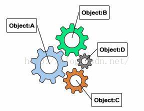
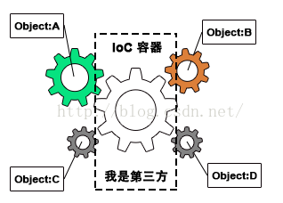

# Spring

#### 两个核心概念

1. IoC（Inverse of Control:控制反转）是一种**设计思想**，就是 **将原本在程序中手动创建对象的控制权，交由Spring框架来管理。** IoC 在其他语言中也有应用，并非 Spring 特有。 **IoC 容器是 Spring 用来实现 IoC 的载体， IoC 容器实际上就是个Map（key，value）, Map 中存放的是各种对象。**

2. **AOP**

#### 什么是IOC？

IOC是基于

