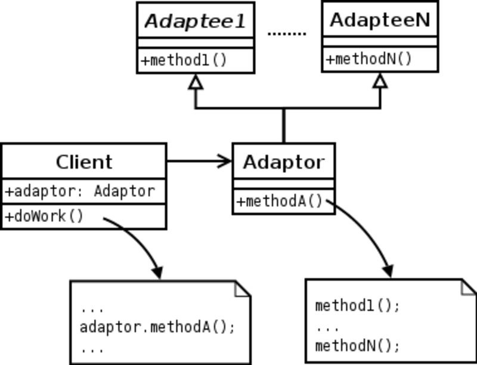
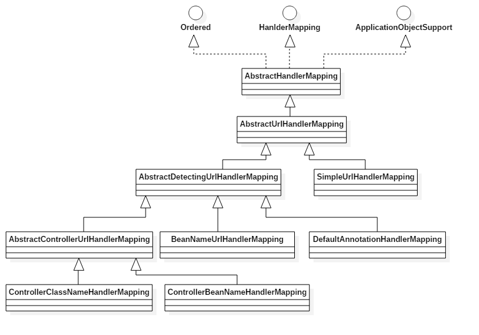

# SpringMVC入门

## 如何开始(Naive)

首先，需要在tomcat的web.xml中嵌入DispatcherServlet， DispatcherServlet将会拦截请求，执行SpringMVC的操作。

##### 1. 配置web.xml

```xml
<?xml version="1.0" encoding="UTF-8"?>
<web-app xmlns="http://xmlns.jcp.org/xml/ns/javaee"
         xmlns:xsi="http://www.w3.org/2001/XMLSchema-instance"
         xsi:schemaLocation="http://xmlns.jcp.org/xml/ns/javaee
         http://xmlns.jcp.org/xml/ns/javaee/web-app_4_0.xsd"
         version="4.0">


    <servlet>
        <servlet-name>springMVC</servlet-name>
        <servlet-class>org.springframework.web.servlet.DispatcherServlet</servlet-class>
        <init-param>
            <param-name>contextConfigLocation</param-name>
          	<!-- -classpath后对应的是spring的配置文件-->
            <param-value>classpath:springmvc-servlet.xml</param-value>
        </init-param>
        <load-on-startup>1</load-on-startup>
    </servlet>

    <servlet-mapping>
        <servlet-name>springMVC</servlet-name>
      	<!--拦截所有请求-->
        <url-pattern>/</url-pattern>
    </servlet-mapping>

</web-app>

```

##### 2. 配置springmvc-servlet.xml

```xml
<?xml version="1.0" encoding="UTF-8"?>
<beans xmlns="http://www.springframework.org/schema/beans"
       xmlns:xsi="http://www.w3.org/2001/XMLSchema-instance"
       xsi:schemaLocation="http://www.springframework.org/schema/beans
        http://www.springframework.org/schema/beans/spring-beans.xsd">

  	<!--设置handler映射器，基于名称寻找handler-->
    <bean class="org.springframework.web.servlet.handler.BeanNameUrlHandlerMapping"/>
  	<!-- 设置hanlderAdapter去寻找如下hello的class，执行并返回ModelAndView-->
    <bean class="org.springframework.web.servlet.mvc.SimpleControllerHandlerAdapter"/>

    <bean id="viewResolver" class="org.springframework.web.servlet.view.InternalResourceViewResolver">
        <property name="viewClass" value="org.springframework.web.servlet.view.JstlView"/>
        <property name="prefix" value="/WEB-INF/jsp/"/>
        <property name="suffix" value=".jsp"/>
    </bean>

    <bean id="/hello" class="controller.controller.HelloController"/>

</beans>
```

##### 3. 配置一个controller

```java
public class HelloController implements Controller {
    @Override
    public ModelAndView handleRequest(HttpServletRequest httpServletRequest, HttpServletResponse httpServletResponse) throws Exception {
        ModelAndView mv = new ModelAndView();

        mv.addObject("msg","Hello world.");

        mv.setViewName("hello");
        return mv;
    }
}
```

## 基于注解开发

#### XML编写

```xml
<!--自动扫描器，注解由IOC容器统一管理--> 
<context:component-scan base-package="com.zhiwei"/>
<!--过滤静态资源，如css等-->
<mvc:default-servlet-handler/>
<!--注解开发-->
<mvc:annotation-driven/>

```

#### Controller编写（Handler）

```java
//Contorl返回一个view
@Controller		
//RestController返回JSON消息，前后端分离使用
@RestController
//RequestMapping在这里作为父路径，子路径均需要加这个前缀
@RequestMapping("/h1")			
public class HelloController {

  	//链接到对应url路径
    @RequestMapping("/hello")	
    public String hello(Model model) {
      	//model将会被送到hello.jsp中解析
        model.addAttribute("msg", "Hello, SpringMVC.");
       	//返回值被viewResolver解析，生产/WEB-INF/jsp/Hello.jsp的路径
        return "hello";  
    }

}
```

## SpringMVC中XML的方法

```xml
<!--设置handler映射器，基于名称寻找handler-->
<bean class="org.springframework.web.servlet.handler.BeanNameUrlHandlerMapping"/>

<!-- 设置hanlderAdapter去寻找如下hello的class，执行并返回ModelAndView-->
<bean class="org.springframework.web.servlet.mvc.SimpleControllerHandlerAdapter"/>

<!--自动扫描器，注解由IOC容器统一管理--> 
<context:component-scan base-package="com.zhiwei"/>

<!--过滤静态资源，如css等-->
<mvc:default-servlet-handler/>
```


## SpringMVC的注解

```java
@SpringBootApplication

/*
 *	@SpringBootApplication 注解等价于以同时使 
 *	用@SpringBootConfiguration,@EnableAutoConfiguration 和@ComponentScan
 *	其中@SpringBootConfiguration 跟进去发现，其就等价于@Configuration，一个是在 Spring Boot 的名称，一起是在 Spring 中的名称。@Configuration 本质上也就是一个@Component，也是一个组件而已。
 * @EnableAutoConfiguration: 打开 Spring Boot 的自动配置机制 
 * @ComponentScan: 允许程序自动扫描包，扫描当前包及其子包下标注了@Component，@Controller，@Service，@Repository 类并纳入到 spring 容器中进行管理。
 * @Configuration: @Configuration 标注的类能够被 Spring IoC 容器作为一个定义各种 bean 的配置源。
*/

//Contorl返回一个view
@Controller		
//RestController返回JSON消息，前后端分离使用
@RestController
//RequestMapping可做父路径，子路径为最终路径
@RequestMapping("/h1")
//代替Bean
@Component 		//组件
@Service			//service
@Respository	//dao

```


## 转发和重定向

```java
return "text"								//是转发
return "redirect:index.jsp"	//将不走视图解析器，直接重定向
```


## 接收参数


```java
@PostMapping("/add/{a}/{b}")
public String test(@PathVariable int a, @PathVariable String b, Model model) {
  String res = a + b;
  model.addAttribute("msg", res);
  return res;
}
```

以上代码是使用RestFul风格去接收参数。

@PostMapping是@RequestMapping的一个子类，只能接收Post的方法。

@PathVariable将允许variable以指定的path传入参数。

/add/{a}/{b}也是入参的方式，若a，b的类型与入参中不匹配则会报错。

# 面试问题

### @RestController vs @Controller的区别

**`Controller` 返回一个页面**

单独使用 `@Controller` 不加 `@ResponseBody`的话一般使用在要返回一个视图的情况，这种情况属于比较传统的Spring MVC 的应用，对应于前后端不分离的情况。

[](https://camo.githubusercontent.com/5474972f83f61bc6d3a684ba73ff2cc2da80c55ee575a8dde270d79c6ef2d699/68747470733a2f2f6d792d626c6f672d746f2d7573652e6f73732d636e2d6265696a696e672e616c6979756e63732e636f6d2f323031392d372f537072696e674d56432545342542432541302545372542422539462545352542372541352545342542442539432545362542352538312545372541382538422e706e67)

**`@RestController` 返回JSON 或 XML 形式数据**

但`@RestController`只返回对象，对象数据直接以 JSON 或 XML 形式写入 HTTP 响应(Response)中，这种情况属于 RESTful Web服务，这也是目前日常开发所接触的最常用的情况（前后端分离）。

[](https://camo.githubusercontent.com/55cbcce8007cbb1c408cd766178c91986498187ef1f9b4aba13c2741504b24c7/68747470733a2f2f6d792d626c6f672d746f2d7573652e6f73732d636e2d6265696a696e672e616c6979756e63732e636f6d2f323031392d372f537072696e674d564352657374436f6e74726f6c6c65722e706e67)

**`@Controller +@ResponseBody` 返回JSON 或 XML 形式数据**

如果你需要在Spring4之前开发 RESTful Web服务的话，你需要使用`@Controller` 并结合`@ResponseBody`注解，也就是说`@Controller`+`@ResponseBody`= `@RestController`（Spring 4 之后新加的注 解）。

> `@ResponseBody` 注解的作用是将 `Controller` 的方法返回的对象通过适当的转换器转换为指定的格式之后，写入到HTTP 响应(Response)对象的 body 中，通常用来返回 JSON 或者 XML 数据，返回 JSON 数据的情况比较多。

[](https://camo.githubusercontent.com/99880ce9b9bb9fe245fec5362b09c597d8f2030ad2d14cba2790f2f63bbd601d/68747470733a2f2f6d792d626c6f672d746f2d7573652e6f73732d636e2d6265696a696e672e616c6979756e63732e636f6d2f323031392d372f537072696e67332e784d56435245535466756c5765622545362539432538442545352538412541312545352542372541352545342542442539432545362542352538312545372541382538422e706e67) 

## 响应流程

SpringMVC是servlet的进一步开发，核心是通过**DispatcherServlet**实现对web请求的响应。


1. 客户端（浏览器）发送请求，直接请求到 `DispatcherServlet`。
2. `DispatcherServlet` 根据请求信息调用 `HandlerMapping`，解析请求对应的 `Handler`。
3. 解析到对应的 `Handler`（也就是我们平常说的 `Controller` 控制器）后，开始由 `HandlerAdapter` 适配器处理。
4. `HandlerAdapter` 会根据 `Handler `来调用真正的处理器来处理请求，并处理相应的业务逻辑。
5. 处理器处理完业务后，会返回一个 `ModelAndView` 对象，`Model` 是返回的数据对象，`View` 是个逻辑上的 `View`。
6. `ViewResolver` 会根据逻辑 `View` 查找实际的 `View`。
7. `DispaterServlet` 把返回的 `Model` 传给 `View`（视图渲染）。
8. 把 `View` 返回给请求者（浏览器）


##  AOP配置

==TODO== DAO AOP和MVC AOP的拦截器

# 源码剖析

## Spring的上下文(父子上下文的关系)

- 当Spring在子上下文中无法寻找到bean的时候，会去父上下文中寻找。
  - 但父子上下文是相对独立的，被定义的增强只对当前上下文生效
    - e.g.子上下文开启@EnableAspectJAuto 不会对父上下文生效，父上下文开启@EnableAspectJAuto 也不会对父上下文生效。

## Handler相关问题

> 参考资料：
>
> SpringMVC中HandlerMapping和HandlerAdapter详解（适配器模式）https://blog.csdn.net/zxd1435513775/article/details/103000992

#### 什么是Handler？

Handler是Spring实现web请求的接口，存在Controller(等于HttpServlet), HttpRequestHandler, RequestMappingHandler等多种Handler。

- 当 Spring 容器发现一个方法用`@RequestMapping`注解标注的时候，就用`RequestMappingHandlerMapping`这个类去实例化。
- 当发现一个类实现了`org.springframework.web.servlet.mvc.Controller`这个接口的时候，就用`BeanNameUrlHandlerMapping`去实例化，然后将所有请求放在一个Map里，用请求路径（比如：/index）和对应的`Handler`做映射处理。

#### 什么是适配器模式(Adapter)？



#### 什么是handlerAdapter？为什么需要它？

#####  HandlerAdapter的作用：

因为`Spring MVC`中的`Handler`可以有多种实现形式，但是`Servlet`需要的处理方法的结构却是固定的，都是以`request`和`response`作为方法入参，那么如何让固定参数的`Servlet`处理方法调用灵活的`Handler`来进行处理呢？这就需要`HandlerAdapter`来做适配。

##### 为什么需要HandlerAdapter？：
前面说过不同的请求会获取到不同的`Handler`，那么不同的`Handler`它是怎么实现处理不同的请求的呢？我的第一反应是抽象出一个接口，定义一个公共接口，然后让每个`Handler`实现这个接口，我想的没问题吧，但 `Spring` 不是这么做的，为什么呢？

再次强调：`Spring MVC`的`Handler`（`Controller接口，HttpRequestHandler，@RequestMapping、Servlet`）有多种表现形式，不同的`Handler`，处理请求的方式是不一样的，注解`@RequestMapping`方式使用的是用方法处理请求，而实现`Controller`接口和`HttpRequestHandler`接口方式使用的是一个类，而适配器模式就能模糊掉具体的实现，从而就能提供统一访问接口，所以这地方就要使用适配器了。

这样做的好处有两个 （1）、处理器程序，也就是`Handler`，允许的是任意的Object，只要返回封装好的`HandlerExecutionChain`，具体的`Handler`不用管；（2）、集成第三方请求处理器的时候，本处代码也无需修改，加个适配器就行（PS：这地方可以参考文章最后的模拟程序）


#### Handler是怎么被配置到上下文中的？

以下是HandlerMapping的所有派生类。



当@Controller被注解的时候，会创造一个contoller的bean。

继承 Controller 方式所使用的`HandlerMapping`：`BeanNameUrlHandlerMapping`，
继承 Controller 方式所使用的适配器：`HttpRequestHandlerAdapter` 、
注解方式`@Controller`的`HandlerMapping`器：`RequestMappingHandlerMapping`
注解方式`@Controller`适配器：`RequestMappingHandlerAdapter`

在DispatcherServlet中，initHandlerMapping会通过beanFactory获取到所有HandlerMapping的派生类，那么这个Controller的方法就会被配置到上下文中。

#### request相关的handler是在哪里被调用的？是怎样的流程？

## MVC的视图解析

### 什么是View？

返回的Application/json, Application/xml等

### DispatcherServlet中视图解析的逻辑

1. 在initStrategies()中，
   1. 通过 initViewResolvers() 初始化所有ViewResolver，方法是通过获取所有实现viewResolver的派生类bean。 

2. 在doDispatch() 中，
   1. 调用applyDefaultViewName，检查mv是否存在viewName，若没有，设置默认的viewName。
   2. 在processDispatchResult()中，
      1. 若包含异常view，会被处理。
      2. 调用render()渲染，
         1. resolveViewName() 解析 View 对象
         2. 使用view的render，将modelAndView中的model处理后。直接通过response输出view到浏览器(类似于Servlet)。
            1. 以AbstractView为例，先对header进行设置

### DispatcherServlet如何返回@ResponseBody

#### ResponseBody是如何定义的?

```java
    @GetMapping("/")
    @ResponseBody
    public List<Coffee> getAll() {
        return coffeeService.getAllCoffee();
    }
```

其中返回的对象是直接以对象类型的形式返回

#### 什么是HttpMessageConverter ？有什么作用？

在SpringMVC中，可以使用@RequestBody和@ResponseBody两个注解，分别完成请求报文到对象和对象到响应报文的转换，底层这种灵活的消息转换机制就是利用HttpMessageConverter来实现的，Spring内置了很多HttpMessageConverter，比如MappingJackson2HttpMessageConverter，StringHttpMessageConverter等。

**HttpMessageConverter是Spring首先根据请求头或响应头的Accept属性选择匹配的HttpMessageConverter，进而根据参数类型和泛型类型的过滤得到匹配的HttpMessageConverter。**

#### HttpMessageConverter怎么配置？是在哪里加载的？

定义一个bean就可以了，WebMvcAutoConfigurationAdapter会将所有HttpMessageConverter加载配置。

#### ==实际调用步骤==

1. 在doDispatche()中
   1.  ha.handler()是实际invoke handler的步骤，在@ResponseBody的情境中，
      1. 会调用到AbstractHandlerMethodAdapter的handlerInternal()，Adapter通过适配器模式，实际调用到RequestMappingHandlerAdapter的handlerInternal()。
      2. 在handlerInternal()中，调用invokeHandlerMethod()
         1. 调用setHandlerMethodReturnValueHandlers()获取到返回值handler集合，其中包含了实际使用的RequestResponseBodyMethodProcessor。 
         2. 调用invokeAndHandle()去实际调用controller中注册的handler，并使用返回值Handler处理结果。
            1. 调用invokeForRequest()去调用时图层注册的handler
            2. 在returnValueHandlers.handleReturnValue()处理returnValue
               1. handleReturnValue中使用selectHandler寻找到RequestResponseBodyMethodProcessor作为handler.
               2. 调用RequestResponseBodyMethodProcessor的handleReturnValue()
                  1. RequestResponseBodyMethodProcessor调用writeWithMessageConverters去对结果处理输出。
                     1. 在selectedMediaType中，获得对应的处理类型(e.g. application/json)，使用==convertor==尝试去处理
                        1. 寻找到MappingJackson2HttpMessage的converter
                        2. 通过genricConverter输出到浏览器


### 返回结果的==convertor==怎么自定义

1. 在自动配置WebMvcAutoConfigurationAdapter 的configureMessageConvertoers中
   1. 通过messageConverterProvider获取到上下文中所有实现了HttpMessageConverter的bean。

## MVC的异常处理机制

#### 核⼼接⼝

- HandlerExceptionResolver

#### 实现类

- SimpleMappingExceptionResolver
- DefaultHandlerExceptionResolver 
-  ResponseStatusExceptionResolver 
- ExceptionHandlerExceptionResolver

### 源码

1. 在doDispatch()的processDispatchResult中
   1. 如果有异常，调用processHandlerException()
      1. 通过handlerExceptionResolver的链式解析，如果发现可以处理的resolver，就处理并返回

## SpringMVC的拦截器

#### 核⼼接⼝

- HandlerInteceptor
- boolean preHandle() 
-  void postHandle() 
- void afterCompletion()

#### 针对 @ResponseBody 和 ResponseEntity 的情况

- ResponseBodyAdvice 

#### 针对异步请求的接⼝

- AsyncHandlerInterceptor 
  - void afterConcurrentHandlingStarted()

### 定义拦截器

1. 定义一个拦截器实现类，实现interceptor接口
   1. 实现preHandler, postHandler, afterCompletion等方法
2. 创建带@Configuration的配置类实现WebMvcConfigurer接口
3. 重载实现addInterceptors的方法，将拦截器实现类加入到Mvc的interceptor 中

 ### 源码

1. 在doDispatch中调用applyPreHandle
   1. 遍历所有的拦截器
   2. 执行每个拦截器，如果拦截器返回false，意味着终止，执行triggerAfterCompletion(e.g. 账户认证不通过，执行跳转请求)
   3. triggerAfterCompletion会遍历所有的结束拦截器，并尝试去执行

## 分布式场景下如何使用 Session ？

集中存储（通过Redis等）

### Spring Session的运行机制是怎样的？

#### 什么是Filter？

Filter是Java Servlet中的过滤器，会在每个HttpServletRequest前执行doFilter。

#### 源码运行流程

1. 在/org/springframework/session/web/http/SessionRepositoryFilter.class中定义了Session的Filter，那么Spring会在初始化Servlet的时候引入这个Filter。
2. SessionRepositoryFilter.class中的doFilterInternal()会将每个HttpServletRequest包裹为SessionRepositoryRequestWrapper。
   1. 在SessionRepositoryRequestWrapper实例不拥有Session时，它的getSession()方法会sessionRepository.createSession()创建一个新的Session，并作为Wrapper实例的session。
   2. 在DoFilterInternal请求结束时会调用commitSession。其中sessionRepository.save()会调用对应Session的集中存储，保存Session的变化。
      1. 以redis为例，Save中，会先调用SaveDelta去保存session的变化，然后调用SessionRedisOperation.convertAndSend(session.delta)把变化存到Redis中。