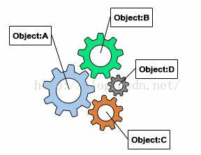
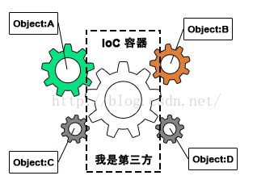
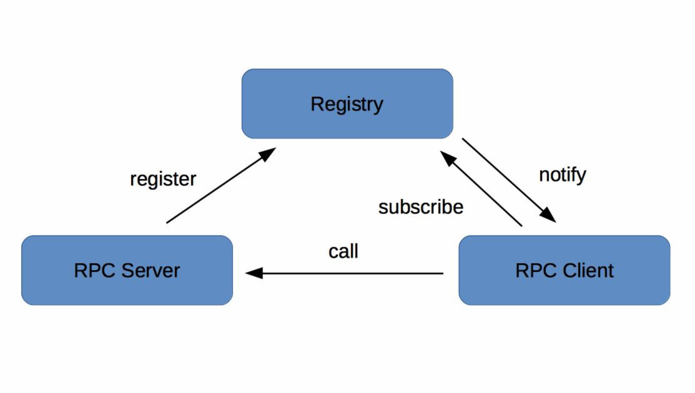

> TODO:
> Spring IOC
>
> Spring AOP
>
> Spring启动流程
>
> Spring Cloud Commons阅读

# Spring的核心概念

#### 两个核心概念

1. IoC（Inverse of Control:控制反转）是一种**设计思想**，就是 **将原本在程序中手动创建对象的控制权，交由Spring框架来管理。** IoC 在其他语言中也有应用，并非 Spring 特有。 **IoC 容器是 Spring 用来实现 IoC 的载体， IoC 容器实际上就是个Map（key，value）Map 中存放的是各种对象。**



2. **AOP**的本质是对类做了一个代理，看似在调用自己写的类，实际上调用Spring Aop拦截增强后的代理类

## Spring AOP和事务

| 概念          | 含义                                                         |
| ------------- | ------------------------------------------------------------ |
| Aspect        | 切⾯，在切面中去对Pointcut执行advice的方法                   |
| Join Point    | 连接点，Spring AOP⾥总是代表⼀次⽅法执⾏                     |
| Advice        | 通知的方法，在连接点执⾏的动作，可以在方法前，@Before，方法后@Around |
| Pointcut      | 切⼊点，说明如何匹配连接点。是一个**拦截器**，拦截被定义的类调用 |
| Introduction  | 引⼊，为现有类型声明额外的⽅法和属性                         |
| Target object | ⽬标对象                                                     |
| AOP proxy     | AOP 代理对象，可以是 JDK 动态代理，也可以是 CGLIB 代理       |
| Weaving       | 织⼊，连接切⾯与⽬标对象或类型创建代理的过程                 |


Spring事务是将不含事务的方法封装，使其能够commit或者rollback。具体的实现是在spring-tx的jar包里面ProxyTransactionManagementConfiguration的实现。	


### 如何实现拦截

1. 定义一个PointCut去拦截指定类的调用
2. 创建Aspect类或方法，添加@Component或者@Bean去生成Container，至此，这个类被定义为一个切面
3. 然后在方法上添加Advice的方式，包括@Before，@After，@Around等，并指定PointCut的名称，对PointCut的拦截的方法进行Advice
4. 在@Before等的方法内，对调用前的行为进行定制。


## SpringBoot bean的生命周期

1. InitializingBean / PostConstruct / init-method
2. DisposableBean / PreDestroy / destroy-method

### XxxAware 接口

- ApplicationContexAware	在bean中可以取得整个ApplicationContext
- BeanFactoryAware				在bean中可以取得BeanFactory
- BeanNameAware					在bean中可以取得BeanName


### AbstractBeanFactory

#### getBean()，bean的创建是在这里做的 

1. 在doGetBean中的第356行，当获取不到bean时，会去创建bean`return createBean(beanName, mbd, args);`
2. createBean是在AbstractAutowireCapableBeanFactory中实现的。
3. 在create的结尾，调用`registerDisposableBeanIfNecessary(beanName, bean, mbd)`;
   1. 在registerDisposableBeanIfNecessary(beanName, bean, mbd)中
   2. 会判断是否需要销毁这个bean，e.g.在requiresDestruction中，会去看是否实现了DisposableBean之类的接口，或者有没有实现close之类的方法。


### 一些常用的操作

#### 判断类是否存在

• ClassUtils.isPresent() 

####  判断 Bean 是否已定义

 • ListableBeanFactory.containsBeanDefinition() 


• ListableBeanFactory.getBeanNamesForType()

#### 注册 Bean 定义

• BeanDefinitionRegistry.registerBeanDefinition() 


​	• GenericBeanDefinition 


• BeanFactory.registerSingleton()


# SpringBoot入门知识

## SpringBoot的四大核心

- 自动配置 - Auto Configuration
- 起步依赖 - Starter Dependency
- 命令行界面 - Spring Boot CLI
- Actuator 

## 常用的注解

### config的注解

```java
@Configuation代表当前类配置类
@ImportResource可以注入配置
@Componentscan告诉Spring去扫描哪些package下的Bean
@Bean在Configuation类中方法被标注Bean注解，它的返回就是Spring bean的配置
@ConfigurationProperties将配置文件中（properties/yaml）prefixs是spring.datasource.hikari开头的配置绑定到bean的配置中(通过构造器)
```


### Bean的注解

```java
@SpringBootApplication
/*
 *	@SpringBootApplication 注解等价于以同时使 
 *	用@SpringBootConfiguration,@EnableAutoConfiguration 和@ComponentScan
 *	其中@SpringBootConfiguration 跟进去发现，其就等价于@Configuration，一个是在 Spring Boot 的名称，一起是在 Spring 中的名称。@Configuration 本质上也就是一个@Component，也是一个组件而已。
 * @EnableAutoConfiguration: 打开 Spring Boot 的自动配置机制 
 * @ComponentScan: 允许程序自动扫描包，扫描当前包及其子包下标注了@Component，@Controller，@Service，@Repository 类并纳入到 spring 容器中进行管理。
 * @Configuration: @Configuration 标注的类能够被 Spring IoC 容器作为一个定义各种 bean 的配置源。
*/

//代替Bean
@Component 		//组件
@Service			//service
@Respository	//dao
@Service
//Contorl返回一个view
@Controller		
//RestController返回JSON消息，前后端分离使用
@RestController
//RequestMapping可做父路径，子路径为最终路径
@RequestMapping("/h1")


//注入相关注解
@Autowired会根据类型从上下文中寻找bean注入
@Qualifier在同类型有多个bean的情况下，配合AutoWired指定bean的名称
@Resource等于Autowired和Qualifier组合
@Value注入bean的常量

```

类上面定义@Component或@Controller等，会生成bean的实例

##  如何配置SpringBoot

### pom.xml

- SpringBoot的依赖存在在<parent>父工程中，即父工程配置了简化Spring的配置。

- 启动器

  ```xml
  <dependency>
    <groupId>org.springframework.boot</groupId>
    <artifactId>spring-boot-starter</artifactId>
    <version>2.4.0</version>
  </dependency>
  <dependency>
    <groupId>org.springframework.boot</groupId>
    <artifactId>spring-boot-starter-web</artifactId>
  </dependency>
  ```

  e.g.Spring-boot-starter-web会自动导入关于web环境的所有依赖。

  **需要启动什么，使用什么启动器，官网上有。**

### application.properties是SpringBoot的配置文件

```properties
//更改端口
server.port=8081
//Spring boot banner也可以改
```


## 多环境配置，配置地址，以及环境切换

### 配置文件加载位置

**外部加载配置文件的方式十分多，我们选择最常用的即可，在开发的资源文件中进行配置！**

官方外部配置文件说明参考文档


springboot 启动会扫描以下位置的application.properties或者application.yml文件作为Spring boot的默认配置文件：

- 优先级1：项目路径下的config文件夹配置文件
- 优先级2：项目路径下配置文件
- 优先级3：资源路径下的config文件夹配置文件
- 优先级4：资源路径下配置文件

优先级由高到底，高优先级的配置会覆盖低优先级的配置；

**SpringBoot会从这四个位置全部加载主配置文件；互补配置；**

profile是Spring对不同环境提供不同配置功能的支持，可以通过激活不同的环境版本，实现快速切换环境；

### 多配置文件

我们在主配置文件编写的时候，文件名可以是 application-{profile}.properties/yml , 用来指定多个环境版本；

**例如：**

application-test.properties 代表测试环境配置

application-dev.properties 代表开发环境配置

但是Springboot并不会直接启动这些配置文件，它**默认使用application.properties主配置文件**；

我们需要通过一个配置来选择需要激活的环境：

```yaml
#比如在配置文件中指定使用dev环境，我们可以通过设置不同的端口号进行测试；
#我们启动SpringBoot，就可以看到已经切换到dev下的配置了；
spring.profiles.active=dev
```

### yaml的多文档块

和properties配置文件中一样，但是使用yml去实现不需要创建多个配置文件，更加方便了 !

```yaml
server:
  port: 8081
#选择要激活那个环境块
spring:
  profiles:
    active: prod

---
server:
  port: 8083
spring:
  profiles: dev #配置环境的名称


---

server:
  port: 8084
spring:
  profiles: prod  #配置环境的名称
```

**注意：如果yml和properties同时都配置了端口，并且没有激活其他环境 ， 默认会使用properties配置文件的！**

# Spring的数据库操作

## 事务的背景知识

### 什么是事务

事务是一系列的数据库执行操作，是实现ACID原则的工作单位。ACID即为(Atomicity，Consistency，Isolation，Durability)。

### JDBC中的事务处理

在JDBC中，事务是通过Connection完成的，**同一事物的所有操作，都在同一个Connection对象中执行。**

### Spring的事务处理机制

Spring并不直接管理事务，而是提供了多种事务管理器(TransactionManager)，他们将事务管理委托给Hibernate或者JTA等持久化机制所提供的相关平台框架的事务来实现。

### 事务并发问题

- 脏读：事务A读取了事务B更新的数据，然后B回滚操作，那么A读取到的数据是脏数据
- 不可重复读：事务 A 多次读取同一数据，事务 B 在事务A多次读取的过程中，对数据作了更新并提交，导致事务A多次读取同一数据时，结果不一致。
- 幻读：用户A将数据库中所有学生的成绩从具体分数改为ABCDE等级，但是用户B就在这个时候插入了一条具体分数的记录，当修改A改结束后发现还有一条记录没有改过来，就好像发生了幻觉一样，这就叫幻读。

### MySQL事务的四个隔离级别

| 事务隔离级别                 | 脏读 | 不可重复读 | 幻读 |
| ---------------------------- | ---- | ---------- | ---- |
| 读未提交（read-uncommitted） | 是   | 是         | 是   |
| 不可重复读（read-committed） | 否   | 是         | 是   |
| 可重复读（repeatable-read）  | 否   | 否         | 是   |
| 串行化（serializable）       | 否   | 否         | 否   |


### 7种事务的传播方法	

| 传播特性                  | 值   | 描述                                                         |
| :------------------------ | :--- | :----------------------------------------------------------- |
| PROPAGATION_REQUIRED      | 0    | 当前有事务就⽤当前的，没有就⽤新的                           |
| PROPAGATION_SUPPORTS      | 1    | 事务可有可⽆，不是必须的                                     |
| PROPAGATION_MANDATORY     | 2    | 当前⼀定要有事务，不然就抛异常                               |
| PROPAGATION_REQUIRES_NEW  | 3    | ⽆论是否有事务，都起个新的事务，两个事务没有关联             |
| PROPAGATION_NOT_SUPPORTED | 4    | 不⽀持事务，按⾮事务⽅式运⾏                                 |
| PROPAGATION_NEVER         | 5    | 不⽀持事务，如果有事务则抛异常                               |
| PROPAGATION_NESTED        | 6    | 当前有事务就在当前事务⾥再起⼀个事务，新事物是内嵌事务，外部事务回滚，会导致内部事务提交后仍然回滚。 |

### PROPAGATION_REQUIRES_NEW和PROPAGATION_NESTED的区别

在一个事务中执行new的另一个事务，外部事务的回滚并**不会**导致new的内部事务回滚

在一个事务中执行nested的另一个事务，外部事务的回滚**会**导致new的内部事务回滚

## Spring的事务处理机制

Spring并不直接管理事务，而是提供了多种事务管理器(TransactionManager)，他们将事务管理委托给Hibernate或者JTA等持久化机制所提供的相关平台框架的事务来实现。

###  Spring中事务管理和sql任务执行的关系是什么

```java
log.info("COUNT BEFORE TRANSACTION: {}", getCount());
transactionTemplate.execute(new TransactionCallbackWithoutResult() {
   @Override
   protected void doInTransactionWithoutResult(TransactionStatus transactionStatus) {
      jdbcTemplate.execute("INSERT INTO FOO (ID, BAR) VALUES (1, 'aaa')");
      log.info("COUNT IN TRANSACTION: {}", getCount());
      transactionStatus.setRollbackOnly();
   }
});
log.info("COUNT AFTER TRANSACTION: {}", getCount());
```

即Sql语句在事务管理中被调用。

## Spring事务抽象的核心接口

- 对JDBC/Hibernate/myBatis或者DataSource/JTA提供一致的事务模型。
- 通过定义实现PlatformTransactionManageer，TransactionDefinition和TransactionStatus接口
  - PlatformTransactionManager :事务管理器(用来管理事务，包含事务的提交，回滚)，对不同ORM提供配置不同的PlatformTransactionManager。
  - TransactionDefinition :定义事务定义信息(隔离，传播，超时，只读)
  - TransactionStatus :定义事务具体运行状态，行为。
  - 例如：
    - TransactionTemplate就是TransactionDefination的一个实现类，里面包含TransactionManager的实例。
    - e.g. setRollbackOnly()设置事务执行结束必须回滚。

## Spring的编程式事务和声明式事务

### 编程式事务（管理）

编程式事务是通过对ransactionTemplate和PlatformTransactionManager的定义进行事务管理。

#### TransactionTemplate

- TransactionTemplate就是TransactionDefination的一个实现类，里面包含TransactionManager的实例。

- 采用TransactionTemplate和采用其他Spring模板一样，使用回调方法，把应用程序从处理取得和释放资源中解放出来。TransactionTemplate是线程安全的。代码示例如下：

```java
transactionTemplate.execute(new TransactionCallbackWithoutResult() {
   @Override
   protected void doInTransactionWithoutResult(TransactionStatus transactionStatus) {
      jdbcTemplate.execute("INSERT INTO FOO (ID, BAR) VALUES (1, 'aaa')");
      transactionStatus.setRollbackOnly();
   }
});
```

使用TransactionCallback()可以返回一个值。如果使用TransactionCallbackWithoutResult则没有返回值。

#### PlatformTransactionManager

```java
DataSourceTransactionManager dataSourceTransactionManager = new DataSourceTransactionManager(); //定义一个某个框架平台的TransactionManager，如JDBC、Hibernate
    dataSourceTransactionManager.setDataSource(this.getJdbcTemplate().getDataSource()); // 设置数据源
    DefaultTransactionDefinition transDef = new DefaultTransactionDefinition(); // 定义事务属性
    transDef.setPropagationBehavior(DefaultTransactionDefinition.PROPAGATION_REQUIRED); // 设置传播行为属性
    TransactionStatus status = dataSourceTransactionManager.getTransaction(transDef); // 获得事务状态
    try {
        // 数据库操作
        dataSourceTransactionManager.commit(status);// 提交
    } catch (Exception e) {
        dataSourceTransactionManager.rollback(status);// 回滚
    }
```

### 声明式事务（管理）

声明式事务利用AOP的Proxy对被定义的类做了增强，对事务封装有助于用户将操作与事务规则进行解耦。


## 一些琐碎的知识点

### Spring中代理类内部的方法调用不会执行代理方法

```java
@Override
@Transactional(rollbackFor = RollbackException.class)
public void insertThenRollback() throws RollbackException {
  jdbcTemplate.execute("INSERT INTO FOO (BAR) VALUES ('BBB')");
  throw new RollbackException();
}

@Override
public void invokeInsertThenRollback() throws RollbackException {
  insertThenRollback();
}
fooService.invokeInsertThenRollback();
```

invokeInsertThenRollback中的insertThenRollback不会执行transactional这个代理类。


### Spring JDBC错误码怎么自定义

- 在org/springframework/jdbc/support/sql-error-codes.xml中被定义
- 可以通过在classpath下创建sql-error-codes.xml，在xml中定义的bean会覆盖原生sql-error-code.,xml中的bean。
  - e.g. resource下面置放sql-error-codes.xml

## 面试问题

### SpringBoot的启动流程

## Object/Relational Mapping

### JPA和JDBC

**JPA**为对象关系映射提供了基于POJO的持久化模型，POJO是简单的java对象，即一个bean 。Hibernate是JPA的实现。


JPA和JDBC都是规范，JPA可以看做ORM的一套规范，Hibernate是JPA的实现；JDBC提供了Java数据库操作的底层规范，各种连接啊、查询啊什么的操作都是JDBC来定义的，不同数据库都提供了遵循JDBC的驱动；Druid和HikariCP都是数据源，或者简单点说是数据库连接池；ShardingShpere是用来做分库分表。平时这些东西是要根据实际情况结合在一起来使用。

### 对象与关系的范式不匹配

|          | Object             | RDBMS                |
| -------- | ------------------ | -------------------- |
| 粒度     | 类                 | 表                   |
| 继承     | 有                 | 没有                 |
| 唯⼀性   | a == b a.equals(b) | 主键                 |
| 关联     | 引⽤               | 外键                 |
| 数据访问 | 逐级访问           | 表与表，SQL 数量要少 |


## JPA

## Mybatis

# 注解解析

## 什么是@Configuration?

　　从Spring3.0，@Configuration用于定义配置类，可替换xml配置文件，被注解的类内部包含有一个或多个被@Bean注解的方法，这些方法将会被AnnotationConfigApplicationContext或AnnotationConfigWebApplicationContext类进行扫描，并用于构建bean定义，初始化Spring容器。

## @Configuration的内部实现

> 作者：听歌闭麦开始自闭
> 链接：https://www.jianshu.com/p/721c76c1529c
> 来源：简书
> 著作权归作者所有。商业转载请联系作者获得授权，非商业转载请注明出处。

```java
@Target(ElementType.TYPE)
@Retention(RetentionPolicy.RUNTIME)
@Documented
@Component
public @interface Configuration { ... }
```

可以看到这个 `@Component` 注解, 意味也将会注册为bean, 其内部也可以依赖注入。 (换个方式说,一般Bean能用的东西,它也能用) 例如: @Autowired、@Inject、@Scope等

@Configuration类 通常 使用`AnnotationConfigApplicationContext`或 其支持Web的变体`AnnotationConfigWebApplicationContext`进行引导。
 前者的一个简单示例如下：

```java
AnnotationConfigApplicationContext ctx = new AnnotationConfigApplicationContext();
ctx.register(AppConfig.class);
ctx.refresh();
MyBean myBean = ctx.getBean(MyBean.class);
// use myBean ...
```

如果你看过`ClassXmlPathApplicationContext`的 工作过程, 你应该就能明白。
 @Configuration 注释的类 类似于于一个 xml 配置文件的存在(针对于 ClassXmlPathApplicationContext 来说)。
 不过它是由`AnnotationConfigApplicationContext`类进行解析并注册到Bean的注册表中。
 关于`AnnotationConfigApplicationContext`的工作过程就不说明了。  和`ClassXmlPathApplicationContext`差不多,换汤不换药。 真有兴趣自己调试。

### TODO 学习`ClassXmlPathApplicationContext`和`AnnotationConfigApplicationContext`

## @Import注解

> 作者：听歌闭麦开始自闭
> 链接：https://www.jianshu.com/p/56d4cadbe5c9
> 来源：简书
> 著作权归作者所有。商业转载请联系作者获得授权，非商业转载请注明出处。

**Spring @Import 注解介绍**

提供与 xml 中 <import/> 等效的功能, 允许去导入@Configuration类, ImportSelector 和 ImportBeanDefinitionRegistrar 的具体实现, 以及常规组件类 (这一句划重点)。
 类似于 AnnotationConfigApplicationContext.register(java.lang.Class<?>...) 这种操作。

可以在类级别声明或作为元注释声明。

如果需要导入XML或其他非@Configuration bean定义资源，请改用@ImportResource注释。
 **以上是官方的意思**

不了解ApplicationContext的可能会懵逼。
 简单说明: AnnotationConfigApplicationContext 是 ApplicationContext 的具体实现, ApplicationContext 又能代表Spring IOC 容器。(不过这都是题外话)

通过使用来慢慢解析官方给出的解释吧。

**这是第一种方式用法**
 往简单了说就是将 @Import 标记的类注册成 bean。   (就是划重点地方的 "常规组件类"这个描述的具现化.)
 示例:

```kotlin
// Test 类   这里不需要任何注解(@Component、@Service)这些都不需要
public class Test {}

// MyConfig 类
@Configuration
@Import({Test.class})
public class AppConfig {}
```

当AppConfig类被处理的时候, 顺便就把Test类给注册成bean了。

**第二种用法   “导入@Configuration类”的具现化**

```java
// AppConfigAux 类
@Configuration
public class AppConfigAux { // 假设这里内部由很多使用了@Bean注解的方法 }

// AppConfig 类
@Configuration
@Import({AppConfigAux.class})
public class AppConfig {}

// 开始测试的Test类
public class Test {  public static void main(String[] args) { new AnnotationConfigApplicationContext(AppConfig.class); } }
```

这里运行完成后, 会把 AppConfigAux 类中定义的所有Bean也全部加载了(包含 AppConfigAux)。  虽然我没遇到过不得不使用这种方式的情况,但是源码里面有啊。

**第三种用法  “导入ImportBeanDefinitionRegistrar的具体实现”**

```java
// AppConfigAux 类  不需要任何注解
public class AppConfigAux implements ImportBeanDefinitionRegistrar {
    @Override
    public void registerBeanDefinitions(AnnotationMetadata importingClassMetadata, BeanDefinitionRegistry registry) {
        registry.registerBeanDefinition("simple", BeanDefinitionBuilder.rootBeanDefinition(Simple.class).getBeanDefinition());
    }
}

// AppConfig 类
@Configuration
@Import({AppConfigAux.class})
public class AppConfig {}

// Simple 类  不需要注解
pulic class Simple {}

// 开始测试的Test类
public class Test {  public static void main(String[] args) { new AnnotationConfigApplicationContext(AppConfig.class); } }
```

这里运行完成后, 会把 AppConfigAux 方法中指定的类加载(不包含 AppConfigAux 本身)。  我也没用过。。

**第四种 也是最后一种 “导入ImportSelector的具体实现”**

```java
// AppConfigAux 类  不需要任何注解
public class AppConfigAux implements ImportSelector {
    @Override
    public String[] selectImports(AnnotationMetadata importingClassMetadata) { return new String[] { Simple.class.getName() }; }
}

// AppConfig 类
@Configuration
@Import({AppConfigAux.class})
public class AppConfig {}

// Simple 类  不需要注解
pulic class Simple {}

// 开始测试的Test类
public class Test {  public static void main(String[] args) { new AnnotationConfigApplicationContext(AppConfig.class); } }
```

以上是对@Import的使用介绍, 也是对上面第一行和第二行文字描述的介绍

**可以在类级别声明或作为元注释声明。**  
 这句是什么意思呢?  1.该注解只能在类上面使用,不能在方法上面    2.元注释就是 作为 注解 的 注解

AnnotationConfigApplicationContext.register(java.lang.Class<?>...) 的内部实现属于IOC的范畴,不做具体描述
 最后提到的@ImportResource就不做介绍了


## `TODO`:Component-scan

# 深入理解SpringBoot自动配置机制

## 背景知识

##### 包： Spring-boot-autoconfiguration

##### 如何开启自动配置？

- @EnableAutoConfiguration
  - exclude= Class<?>[]
- @SpringBootApplication包含@EnableAutoConfiguration

#### 自动配置的条件注解

-  @Conditional

- @**ConditionalOnClass()**				 	当ClassPath上出现括号内被指定的类的时候生效

- @**ConditionalOnBean**						 当Spring中存在某个bean时

- @ConditionalOnMissingBean			当Spring中不存在某个bean时

- @ConditionalOnProperty					当属性配置了特定属性

#### 自动配置的执行顺序

- @AutoConfigureBefore						在某个config前执行
- @AutoConfigureAfter							在某个config后执行
- @AutoConfigureOrder						 指定指定顺序

## 实现原理

@EnableAutoConfiguration

- AutoConfigurationImportSelector 

-  META-INF/spring.factories  是一个properties，包含EnableAutoConfiguration需要加载的所有配置项。

- org.springframework.boot.autoconfigure.EnableAutoConfiguratio

#### 步骤

1. 进入@SpringBootApplication
2. 进入@EnableAutoConfiguration，注解@Import({AutoConfigurationImportSelector.class})
3.  进入AutoConfigurationImportSelector 
4. 进入selectImports()
5. 进入getAutoConfigurationEntry()，加载自动配置的配置项 
6. 进入getCandidateConfigurations()，通过`SpringFactoriesLoader.loadFactoryNames(
         getSpringFactoriesLoaderFactoryClass(), getBeanClassLoader())`，==加载所有配置==。
     7. 其中，getSpringFactoriesLoaderFactoryClass()会获取到 EnableAutoConfiguration.class;
     2. EnableAutoConfiguration.class的ENABLED_OVERRIDE_PROPERTY参数指向META-INF/spring.factories的EnableAutoConfiguration参数
     3. org.springframework.boot.autoconfigure.EnableAutoConfiguration包含所有Configuration的配置类


##  解析DataSourceAutoConfiguration

1. DataSourceAutoConfiguration类会在上文中的META-INF/spring.factories被定义。

```java
@Configuration
@ConditionalOnClass({ DataSource.class, EmbeddedDatabaseType.class })
@EnableConfigurationProperties(DataSourceProperties.class)
@Import({ DataSourcePoolMetadataProvidersConfiguration.class,
		DataSourceInitializationConfiguration.class })
public class DataSourceAutoConfiguration {
  
	@Configuration
	@Conditional(EmbeddedDatabaseCondition.class)
	@ConditionalOnMissingBean({ DataSource.class, XADataSource.class })
	@Import(EmbeddedDataSourceConfiguration.class)
	protected static class EmbeddedDatabaseConfiguration {

	}
```

2. @ConditionalOnClass({ DataSource.class, EmbeddedDatabaseType.class })是指，当classpath中出现EmbeddedDatabaseType.class或Datasource.class是才会生效。

3. 对于H2来说，这种就是嵌入式数据库，需要激活EmbeddedDatabaseConfiguration，于是需要满足以下两个条件

   1. @Conditional(EmbeddedDatabaseCondition.class)会使EmbeddedDatabaseConfiguration生效。
      1. EmbeddedDatabaseCondition.class是SpringBootCondition的一个子类，SpringBootCondition是Condition的一个子类。
         1. Condition会返回一个Boolean去指定结果是否match。
         2. 当EmbeddedDatabaseCondition.class返回match结果时，EmbeddedDatabaseConfiguration才会生效
   2. ​	@ConditionalOnMissingBean({ DataSource.class, XADataSource.class })，即不存在DataSource.class类等。
      1. @ConditionalOnMissingBean 是指不存在指定的特定名称或者特定类型的bean时，才会生效。

4. 于是会@import(EmbeddedDataSourceConfiguration.class)，去import内嵌数据库的配置。

   1. ```java
      @Configuration
      @EnableConfigurationProperties(DataSourceProperties.class)
      public class EmbeddedDataSourceConfiguration implements BeanClassLoaderAware {
        //。。。
      	@Bean
      	public EmbeddedDatabase dataSource() {
      		this.database = new EmbeddedDatabaseBuilder()
      				.setType(EmbeddedDatabaseConnection.get(this.classLoader).getType())
      				.setName(this.properties.determineDatabaseName()).build();
      		return this.database;
      	}
      ```

   2. 于是会在dataSource中创建EmbeddedDatabase这么一个bean


## 如何了解自动配置

在Run的program argument 中添加--debug


## 如何动手实现自己的自动配置类

1. 编写Java Config -> @Configuration

2. 添加条件 @Conditional

3. ```java
   @Configuration
   @ConditionalOnClass(GreetingApplicationRunner.class)
   public class GreetingAutoConfiguration {
       @Bean
       @ConditionalOnMissingBean(GreetingApplicationRunner.class)
       @ConditionalOnProperty(name = "greeting.enabled", havingValue = "true", matchIfMissing = true)
       public GreetingApplicationRunner greetingApplicationRunner() {
           return new GreetingApplicationRunner();
       }
   }
   ```

4. 在META-INFO/spring.factories中定位自动配置


## SpringBoot Failure Analysis(TODO)

在Run的program argument 中添加--debug

## SpringBoot起步依赖

通过Starter引入需要的jar包集合

## Maven依赖管理技巧

- mvn dependency:tree	显示maven的所有依赖，以树状展示
- IDEA MAVEN helper

### 排除特定依赖

- exclusion

### 统一管理依赖

##### 定义到dependencyManagement统一管理


## Spring配置加载机制

### 外化配置加载生效顺序

1. 开启 DevTools 时，~/.spring-boot-devtools.properties
2. 测试类上的 @TestPropertySource 注解
3. @SpringBootTest#properties 属性
4. 命令⾏参数（ --server.port=9000 ）
5. SPRING_APPLICATION_JSON 中的属性
6. ServletConfig 初始化参数
7. ServletContext 初始化参数
8. java:comp/env 中的 JNDI 属性
9. System.getProperties() 
10. 操作系统环境变量
11. random.* 涉及到的 RandomValuePropertySource
12. jar 包外部的 application-{profile}.properties 或 .yml
13. jar 包内部的 application-{profile}.properties 或 .yml
14. jar 包外部的 application.properties 或 .yml
15. jar 包内部的 application.properties 或 .yml
16. @Configuration 类上的 @PropertySource 
17. SpringApplication.setDefaultProperties() 设置的默认属性


### application.properties的默认位置

1. ./config 
2.  ./ 
3. CLASSPATH 中的 /config 
4. CLASSPATH 中的 /


修改application.properties的名字或路径

1. spring.config.name
2. spring.config.location
3. spring.config.additional-location


## Spring的@propertySource

### 添加 PropertySource

• <context:property-placeholder> 


• PropertySourcesPlaceholderConfigurer 


• PropertyPlaceholderConfigurer 


• @PropertySource 

• @PropertySources

### Springboot的@configurationProperties

• 可以将属性绑定到结构化对象上


• ⽀持 Relaxed Binding


• ⽀持安全的类型转换


• @EnableConfigurationProperties

### 定制 PropertySource

#### 主要步骤

• 实现 PropertySource<T>


• 从 Environment 取得 PropertySources 


• 将⾃⼰的 PropertySource 添加到合适的位置

#### 切⼊位置

• EnvironmentPostProcessor 


• BeanFactoryPostProcessor


> EnvironmentPostProcessor和PropertySource注释的区别？

在实现EnvironmentPostProcessor接口的postProcessEnvironment时，只需要保证返回的值是key-Value 形式的，可以通过多种方式在内部实现加载，比如，通过RPC从配置中心获取到配置信息，然后配置到应用中。

# 运行中的SpringBoot

## 使用Actuator监控管理运行中的 应用程序

#### 访问方式：

- HTTP

- JMX

### Actuator提供很多方面的监控

#### 一些常用的Endpoint

| ID          | 说明                                  | 默认开启 | 默认 HTTP | 默认 JMX |
| ----------- | ------------------------------------- | -------- | --------- | -------- |
| beans       | 显示容器中的 Bean 列表                | Y        | N         | Y        |
| caches      | 显示应⽤中的缓存                      | Y        | N         | Y        |
| conditions  | 显示配置条件的计算情况                | Y        | N         | Y        |
| configprops | 显示 @ConfigurationProperties 的信息  | Y        | N         | Y        |
| env         | 显示 ConfigurableEnvironment 中的属性 | Y        | N         | Y        |
| health      | 显示健康检查信息                      | Y        | Y         | Y        |
| httptrace   | 显示 HTTP Trace 信息                  | Y        | N         | Y        |
| info        | 显示设置好的应⽤信息                  | Y        | Y         | Y        |

| ID             | 说明                              | 默认开启 | 默认 HTTP | 默认 JMX |
| -------------- | --------------------------------- | -------- | --------- | -------- |
| loggers        | 显示并更新⽇志配置                | Y        | N         | Y        |
| metrics        | 显示应⽤的度量信息                | Y        | N         | Y        |
| mappings       | 显示所有的 @RequestMapping 信息   | Y        | N         | Y        |
| scheduledtasks | 显示应⽤的调度任务信息            | Y        | N         | Y        |
| shutdown       | 优雅地关闭应⽤程序                | N        | N         | Y        |
| threaddump     | 执⾏ Thread Dump                  | Y        | N         | Y        |
| heapdump       | 返回 Heap Dump ⽂件，格式为 HPROF | Y        | N         | N/A      |
| prometheus     | 返回可供 Prometheus 抓取的信息    | Y        | N         | N/A      |

### Actuator的源码运行流程

端点及处理方法在应用启动时初始化.
Actuator相关代码在spring-boot-actuator-[version].jar下面.

1. DefaultListableBeanFactory.getBeanNamesForAnnotation() : 按照Annotation类名来获取Bean实例名;
2. EndpointDiscoverer.createEndpointBeans() : 按照获取到的Bean实例名创建EndpointBean
3. AbstractWebMvcEndpointHandlerMapping.initHandlerMethods() : 根据刚才查找到的enpoints列表进行注册.
4. OnEnabledEndpointCondition.getMatchOutcome() : 获取配置文件中management.endpoint.[id].enabled的值,[id]为变量值,类似management.endpoint.shutdown.enabled.


在端点处理类（比如:org.springframework.boot.actuate.health.HealthEndpoint）的方法上添加@ReadOperation(GET)、@WriteOperation(POST)、@DeleteOperation(DELETE)可以暴露该方法到路由中,同时可以在方法参数上添加@Selector指定子端点(例如:org.springframework.boot.actuate.health.HealthEndpoint:healthForComponent(@Selector String component)方法)


Shutdown端点:

处理类: org.springframework.boot.actuate.context.ShutdownEndpoint
处理方法: shutdown()

1. 首先检查应用上下文是否为空,为空则返回无可关闭应用,不为空则继续执行;
2. 返回关闭消息,并且新开一个线程,调用实际的关闭应用方法(this.context.close()),并设置500毫秒之后关闭应用.

## 自制Health Indicator

1. 创建一个实现HealthIndicator的类
2. 实现healthIndicator接口
3. 在health方法中实现一些获取服务调用信息去检查健康的方法


## 如何配置内嵌Web容器

• spring-boot-starter-tomcat


• spring-boot-starter-jetty


• spring-boot-starter-undertow


• spring-boot-starter-reactor-netty

### 修改容器配置

##### 端⼝

• server.port 

• server.address 

##### 压缩

• server.compression.enabled 


• server.compression.min-response-size 

• server.compression.mime-types

##### Tomcat 特定配置

• server.tomcat.max-connections=10000

• server.tomcat.max-http-post-size=2MB

• server.tomcat.max-swallow-size=2MB

• server.tomcat.max-threads=200

• server.tomcat.min-spare-threads=10

##### 错误处理

• server.error.path=/error 


• server.error.include-exception=false 


• server.error.include-stacktrace=never 

• server.error.whitelabel.enabled=true 

##### 其他

• server.use-forward-headers

• server.servlet.session.timeout

##### 编程⽅式

• WebServerFactoryCustomizer<T> 


• TomcatServletWebServerFactory 


• JettyServletWebServerFactory 


• UndertowServletWebServerFactory


## 如何支持HTTPS和HTTP/2


## JAR文件是如何运行的

### 如何使jar文件可执行


### Manifest.mf文件

```

Manifest-Version: 1.0
Created-By: Apache Maven 3.6.0
Built-By: digitalsonic
Build-Jdk: 11.0.1
Implementation-Title: waiter-service
Implementation-Version: 0.0.1-SNAPSHOT
Implementation-Vendor-Id: geektime.spring.springbucks
Implementation-URL: https://projects.spring.io/spring-boot/#/spring-boot
 -starter-parent/waiter-service
Main-Class: org.springframework.boot.loader.JarLauncher
Start-Class: geektime.spring.springbucks.waiter.WaiterServiceApplication
Spring-Boot-Version: 2.1.3.RELEASE
Spring-Boot-Classes: BOOT-INF/classes/
Spring-Boot-Lib: BOOT-INF/lib/
```


在MANIFEST.MF中，定义了文件的main-class和start-class。

如果是jar包，那么main-class就是jarLauncher。如果是war包，那么main-class就是warLauncher。

start-class则是指定了启动类的位置，springbootApplication会自动将启动类添加到MANIFEST.MF

这是

## 如何将SpringBoot的应用打包到Docker

- 可以通过DockerFile打包
- 也可以通过maven的dockerfile-maven-plugin打包


## HTTP Client

# Spring Cloud总览

SpringCloud使用Discovery Client将服务的发现和注册封装起来，下面的实现可以是eureka，zookeeper，或者nacos。


## Spring Cloud 的主要功能

• 服务发现							->		 	eureka，zookeeper或者nacos等


• 服务熔断							->			 hystrix，Resilience4j


• 配置服务							->			 git，zk，consul，或者nacos


• 服务安全							->			  Spring Cloud Security 			->			接入Outh身份认证

• 服务⽹关							->			 SpringCloud Gateway


• 分布式消息				  	->			 rabbitMQ，kafka，rocketMQ


• 分布式跟踪				 	 ->			 Spring Cloud实现跟踪，openTracing可以展示出来


• 各种云平台⽀持

# 服务的发现和注册

> 什么是DiscoveryClient？

DiscoveryClient是Spring Cloud中，是注册中心在服务提供者端所需要启动的客户端。



### 使用Eureka作为注册中心（主要用在AWS）

#### 在本地启动⼀个简单的 Eureka 服务（Register端）

##### Starter

• spring-cloud-dependencies


• spring-cloud-starter-netflix-eureka-starter

##### 声明

• @EnableEurekaServer 	`只能作为本地测试用，产线要真正配置一个Eureka service`

##### 注意事项

• 默认端⼝8761


• Eureka ⾃⼰不要注册到 Eureka 了

#### 将服务注册到 Eureka Server（RPC Server端）

##### Starter

• spring-cloud-starter-netflix-eureka-client

##### 声明

• @EnableDiscoveryClient 


• @EnableEurekaClient 

##### ⼀些配置项

• eureka.client.service-url.default-zone


• eureka.client.instance.prefer-ip-address

#### 关于 Bootstrap 属性

##### Bootstrap 属性

• 启动引导阶段加载的属性


• bootstrap.properties | .yml


• spring.cloud.bootstrap.name=bootstrap 

##### 常⽤配置

• spring.application.name=应⽤名 


• 配置中⼼相关


### 使用Nacos作为注册中心

> 博客：程序猿DD

#### 提供功能

- 动态服务配置
- 服务发现和管理
- 动态dns


## 从注册中心上获取服务并调用

### Load Balancer Client(TODO)(RPC Client)

在RestTemplate的bean上添加@LoadBalanced为，使其提供负载均衡。


### 流程

1. RestTemplate再自动配置期间，被LoadBalancerAutoConfiguration注入loadBalancerInterceptor。
2. 每个loadBalancerInterceptor包含loadBalancerClient和RequestFactory
   1. loadBalancerClient是执行负载均衡请求的客户端，是真正执行execute的客户端，有Ribbon和Feign两种。
   2. RequestFactory会将Http请求包裹为loadBalancerRequest，和服务器名称，一起输入到loadBalanceClient


### 源码剖析

##### RestTemplate的负载均衡是如何实现的？

1. LoadBalancerInterceptor实现ClientHttpRequestIntercepter（类似于Servlet的HttpRequst拦截器）。
2. LoadBalancerInterceptor中的Intercept方法，从HttpRequest的url中获取到serviceName。
3. 使用requestFactory将请求的所有内容Wrap包裹起来，创造一个loadBalanceRequest。
4. 调用loadBalancer.execute，将ServiceName和新的loadBalanceRequest输入执行。
   1. **假设loadBalancer是RibbonLoadBalancerClient**
   2. 在RibbonLoadBalancerClient的execute中
   3. `通过getLoadBalancer方法依照serviceName寻找到LoadBalancer`，寻找到对应服务的负载均衡器。
   4. `通过getServer寻找到server`，getServer是按照负载均衡规则寻找服务器的具体实现。
   5. 将server转化为RibbonServer，在调用RibbonLoadBalancerClient的execute
   6. execute的输入包括serverID，RibbonServer和Request
      1. 是真正要调用的服务实例
      2. 通过RibbonServer真正调用Request


##### Loadbalance是如何做自动配置的?(loadbalance Intercepter是如何被注入到RestTemplate中的？)

1. 在LoadBalancerAutoConfiguration中
2. 首先将所有的RestTemplate注入
3. 当RetryTemplate不存在时
4. 在LoadBalancerInterceptorConfig中的
   1. 创建LoadBalancerIntercepter（RibbonIntercepter）
   2. restTemplateCustomizer，对每个RestTemplate添加上一步创建的拦截器


##### Ribbon是如何自动配置的？

1. 在RibbonAutoConfiguration中会去创建RibbonLoadBalancerClient的bean
2. 也会创建RestTemplateCustomizer去设置requestFactory


##### 是什么Ribbon?

Ribbon和Feign是基于HTTP和TCP的客户端负载均衡工具

### Feign (RPC Client)

## 深入理解DiscoveryClient

Spring Cloud Commons提供的抽象

##### 服务注册抽象

- 提供ServiceRegistry抽象（注册中心）

```java
public interface ServiceRegistry<R extends Registration> {

	/**
	 * Registers the registration. A registration typically has information about an
	 * instance, such as its hostname and port.
	 * @param registration registration meta data
	 */
	void register(R registration);

	/**
	 * Deregisters the registration.
	 * @param registration registration meta data
	 */
	void deregister(R registration);
	void close();
	void setStatus(R registration, String status);
	<T> T getStatus(R registration);
}
```


##### 服务发现抽象

- 提供DiscoveryClient抽象（Server端）

  ```java
  public interface DiscoveryClient extends Ordered {
  	int DEFAULT_ORDER = 0;
  
  	/**
  	 * A human-readable description of the implementation, used in HealthIndicator.
  	 * @return The description.
  	 */
  	String description();
  
  	/**
  	 * Gets all ServiceInstances associated with a particular serviceId.
  	 * @param serviceId The serviceId to query.
  	 * @return A List of ServiceInstance.
  	 */
  	List<ServiceInstance> getInstances(String serviceId);
  
  	/**
  	 * @return All known service IDs.
  	 */
  	List<String> getServices();
  	@Override
  	default int getOrder() {
  		return DEFAULT_ORDER;
  	}
  }
  ```

  

  - @enableDiscoveryClient

- 提供LoadBalancer抽象（Client端）

### 以Eureka为例，配置流程是怎样的

#### EurekaServiceRegistry的实现

在Eureka中，ServiceRegistry由EurekaServiceRegistry实现， DiscoveryClient由EurekaRegistration实现。

1. EurekaServiceRegistry实现了ServiceRegistry的接口
2. EurekaServiceRegistry.register()传入EurekaRegistration
   1. 首先对client做初始化
   2. 然后设置实例状态和健康状态
3. EurekaServiceRegistry.deregister()将状态设置为Down


#### 自动配置（以Eureka为例）

##### EurekaAutoServiceRegistration是怎么注册的?

EurekaAutoServiceRegistration实现smartLifeCycle接口

1. EurekaAutoServiceRegistration.start()检查端口状态和运行状态，如果第一次运行，将自己注册到注册中心
2. 这个start()会被DefaultLifeCycleProcessor调用
   1. DefaultLifeCycleProcessor会获取到所有LifeCycle的实现类，并调用它的start方法
   2. 于是注册中心就会被自动注册


##### EurekaDiscoveryClient是如何发现服务的？

1. EurekaDiscoveryClient的getInstances()通过EurekaClient获取到对应的服务地址
2. EurekaClient是lookUpService的实现类，提供服务发现功能


## 使用Zookeeper作为注册中心

### 什么是Zookeeper？

zooKeeper是一套分布式的协调服务

### Zookeeper的特性

• 简单


• 多副本


• 有序

• 快

### Zookeeper的问题

保证了CAP中的CP，但注册中心需要的是AP。在跨机房的ZooKeeper集群中，网络连接不同可能导致整个对向机房的服务不可用。还有抖动的问题（TODO）;

## 使用Consul 所作为注册中心

### HashiCorp Consul有什么功能？

• 服务发现


• 健康检查


• KV 存储


• 多数据中⼼⽀持


• 安全的服务间通信


### Consul作为服务发现的功能

• HTTP API


• DNS（ xxx.service.consul ）


• 与 Nginx 联动，⽐如 ngx_http_consul_backend_module

## 使用Nacos作为注册中心


## 如何实现自己的DiscoveryClient（RPC Client端）？

### 需要做的：

• 返回该 DiscoveryClient 能提供的服务名列表


• 返回指定服务对应的 ServiceInstance 列表


• 返回 DiscoveryClient 的顺序


• 返回 HealthIndicator ⾥显示的描述

## 如何实现RibbonClient的支持？（实现RibbonClient的ServerList）

### 需要做的：

• 实现⾃⼰的 ServerList<T extends Server>


​	• Ribbon 提供了 AbstractServerList<T extends Server>


• 提供⼀个配置类，声明 ServerList Bean 实例

# 服务熔断

## 断路器模式

##### 核心思想

- 在断路器对象中封装受保护的⽅法调⽤
- 该对象监控调⽤（监控服务是什么时候被调用的）和断路情况（对发生断路保护的行为监控埋点）
- 调⽤失败触发阈值后，断路器熔断服务，后续调⽤直接由断路器返回错误，不再执⾏实际调⽤，直到超出熔断值后，再次重试探活


## Hystrix实现服务降级


### 什么是Hystix？

> • https://github.com/Netflix/Hystrix/wiki/Configuration

- 实现了断路器模式
- 在方法上注解 @HystrixCommand ，当熔断时就会调用fallbackMethod，fallbackMethod带有和被注解方法相同的参数
  -  fallbackMethod，fallbackMethod带有和被注解方法相同的参数
  -  commandProperties可以用来指定属性
- Hytrix的fallback默认是在另一个线程中执行，如果想要改变可以通过设置@HystrixProperty(name="execution.isolation.strategy", value=“SEMAPHORE") 的方式

当方法熔断时，对服务降级，使用fallback 方法

### Spring Cloud ⽀持

• spring-cloud-starter-netflix-hystrix


• @EnableCircuitBreaker 

#### Feign ⽀持

- feign.hystrix.enabled=true 
- @FeignClient 
  - fallback 指定fallback类
  - fallbackFactory根据异常类型，指定fallback对象

## 如何了解熔断的情况(Hystrix Dashboard/ Micrometer/ 普罗米修斯)

>  什么是EndPoint？ 

##### 打⽇志

• 在发⽣熔断时打印特定该⽇志

##### 看监控

• 主动向监控系统埋点，上报熔断情况


• 提供与熔断相关的 Endpoint，让第三⽅系统来拉取信息

将hystri.

### Hystrix Dashboard

将hystrix的stream端口暴露，然后启动hystix dashboard，把stream的url填入


### 聚合集群熔断信息Netflix Turbine


• spring-cloud-starter-netflix-turbines


• @EnableTurbine 

• /turbine.stream?cluster=集群名


Turbine会从注册中心中抓取指定的所有服务的stream，并把这个stream输出到/turbine.stream?cluster=集群名中，最后将集群stream的url填入hystrix dashboard中 

## 使⽤ Resilience4j 实现服务熔断

• https://github.com/resilience4j/resilience4j 


• ⼀款受 Hystrix 启发的轻量级且易于使⽤的容错库

• 针对 Java 8 与函数式编程设计

### 自动配置部分`TODO`

## 使⽤ Resilience4j 实现服务限流

### Bulkhead(隔舱)

##### ⽬的

• 防⽌下游依赖被并发请求冲击

• 防⽌发⽣连环故障

#####  ⽤法

• BulkheadRegistry / BulkheadConfig 


• @Bulkhead(name = "名称")

##### 配置

- BulkheadProperties 
- resilience4j.bulkhead.backends.服务名称 
  - max-concurrent-call 最大并发数
  - max-wait-time 最大等待时间 

##### `TODO自动配置`


### RateLimiter(速率限制器)

##### ⽬的

• 限制特定时间段内的执⾏次数

##### ⽤法

• RateLimiterRegistry / RateLimiterConfig 


• @RateLimiter(name = "名称")

##### `TODO自动配置`


## `TODO `Google Guava

速度限制器/缓存等

## `TODO `压测工具

ab工具压测

## `TODO `函数式编程

## `TODO `监控系统(普罗米修斯)

# 服务配置

## 使用GIT作为配置中心

### Spring Cloud Config Server

##### ⽬的

• 提供针对外置配置的 HTTP API

##### 依赖

• spring-cloud-config-server


• @EnableConfigServer 


• ⽀持 Git / SVN / Vault / JDBC …

##### 配置

• MultipleJGitEnvironmentProperties 


• spring.cloud.config.server.git.uri

##### 配置⽂件的要素

• {application}，即客户端的 spring.application.name


• {profile}，即客户端的 spring.profiles.active


• {label}，配置⽂件的特定标签，默认 master

#### 配置中心merge

当存在通用配置和dev配置时，Spring Cloud Config Server会将dev的配置和通用配置合并，结果以dev为准。

### Spring Cloud Config Client

#### 不通过注册中心

##### 依赖

• spring-cloud-starter-config

##### 发现配置中⼼

• 在bootstrap.properties | yml中配置


​	• spring.cloud.config.fail-fast=true 


​	• spring.cloud.config.uri=http://localhost:8888

#### 通过注册中心

##### 发现配置中⼼

• 在bootstrap.properties | yml中配置


​	• spring.cloud.config.discovery.enabled=true 


​	• spring.cloud.config.discovery.service-id=configserver 

##### 配置刷新

• 在对应加载配置类的bean上面添加注解@RefreshScope 


•可以通过请求 Endpoint - /actuator/refresh刷新配置


## 使用ZooKeeper作为配置中心


##### Zookeeper有默认的key值监听功能，当Zookeeper在Server中key的对应值发生变化后，变化会被推送到Client中。


## `配置中心原理（TODO)`

### Zookeeper配置剖析

### Nacos配置剖析

### Consul配置剖析

# Spring Cloud Stream

## 背景知识

什么是消息中间件？(`TODO`)

为什么使用消息中间件？(`TODO`)

消息中间件的流程是怎么样的？(`TODO`)

消息中间件的应用场景一般是怎样的？(`TODO`)

消息中间件的缺点有哪些？(`TODO`)

消息中间件的核心概念和名称？(`TODO`)

### 什么是Spring Cloud Stream？

是一款⽤于构建消息驱动的微服务应⽤程序的轻量级框架，支持多种消息中间件框架。

##### 特性

• 声明式编程模型


• 引⼊多种概念抽象


​	• 发布订阅、消费组、分区


• ⽀持多种消息中间件


​	• RabbitMQ、Kafka ……

### Spring Cloud Stream 的⼀些核⼼概念


#### Binder

 Binder是Spring Cloud Stream和mq之间的一层抽象，将不同的mq封装成Binder类型。

##### Binder支持

• RabbitMQ


• Apache Kafka


• Kafka Streams


• Amazon Kinesis


• RocketMQ

• ……

#### Binding

应⽤中⽣产者、消费者与消息系统之间的桥梁


​	• @EnableBinding 


​	• @Input / SubscribableChannel

​	• @Output / MessageChannel

#### 消费组

• 对同⼀消息，每个组中都会有⼀个消费者收到消息

##### 为什么使用消费组？

当A系统产生了一个消息，传到MQ上。有B，C，D三个系统都希望收到消息。同时，每个系统都是一个集群，集群中只有一个消费者能够收到这个消息，并做对应处理。

注：⚠️ 消费者仍需要对消费做幂等处理，防止重复消费。

#### 分区


##### 什么是分区？

分区内收到的消息可以被认为是有序的。注：仍可能有乱序的情况

##### ⽣产消息

• 使⽤ MessageChannel 中的 send()


• @SendTo 

##### 消费消息

• @StreamListener 


• @Payload / @Headers / @Header 

##### 其他说明

• 可以使⽤ Spring Integration