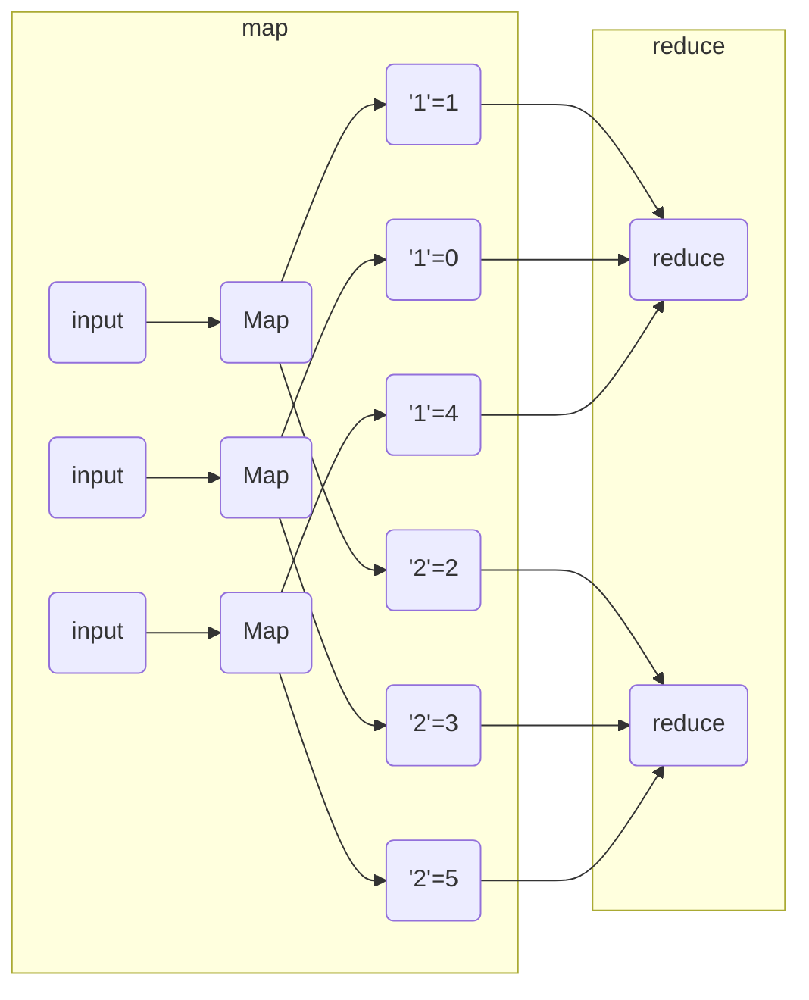

# MIT6.824

## 分布式系统介绍

### 分布式系统的目的

- parallelism：并行
  - 并行管理大量CPU和内存，存储信息等。
- fault tolerance：容错
  - 数据备份，允许单机硬件失败后，系统仍然可用
- physical location: 物理分布
  - 不同服务器之间坐落在不同地方，例如：不同银行有不同的服务器
- security/ isolate：机器之间隔离
  - 分布式系统的复杂在于机器多之后，在不同的网络环境下会出现意想不到的故障。除此以外，机器也会出现故障。

### 分布式系统的目的

对内，通过添加更多机器的方式，提升系统的性能（吞吐量，计算力）

对外，提供统一的接口，使其使用起来和单机

### 分布式系统的特性

1. 提供可扩展性（scalability）

   - 通过加机器的方式提供性能

2. 提供容错性（Fault-Tolerance）

   1. 提供可用性
      - 在大规模计算机集群中，每天有机器出现问题，是必然的。
   2. 提供鲁棒性
      - 可以在出现错误时，提供恢复能力

   ##### 解决方式：

   1. 数据持久化(NV storage)
   2. 副本(Replication)

3. 提供一致性（consistency）

   **解决方法：**

   - 强一致性

   - 弱一致性

   - ##### 为什么有了强一致性还需要考虑弱一致性？

     - ##### 实现强一致性的成本高。需要昂贵的储存和传输成本

#### 为什么我们要使用分布式系统？

###   MapReduce

#### MapReduce的目的

提供一个分布式的框架，允许不熟悉分布式的程序员，在不考虑分布式系统的细节（比如，如何将任务分配到集群中，如何储存这些结果），只通过编写Map函数，就能从计算机的集群中计算出函数结果。

#### MapReduce的两个步骤

##### Map

每个Input都是一个file之类的数据信息

通过计算

##### Reduce

#### 一个wordCount的例子



# COMP90020

## 全局时钟与逻辑时钟

### 全局时钟（global clock）

##### 什么是全局时钟?

全局时钟的概念来自于现实世界的时间。在分布式系统中，使用同一个时钟去执行任务。

##### 实现全局时钟有哪些困难？

在分布式系统中，实现多个设备使用统一的全局时钟是不太可能的。有以下原因：

1. 计算机设备的时间会由于各种原因，增长过快或者过慢，或者由于关机停止。
2. 数据包在计算机网络中的传输时间是不可测量的，无法从一个时间服务器精准的获取到正确的时间，只能通过发收的总体时间来预估，回程数据包的传输时间，最终结果总有误差。
3. 哪怕使用一个时间服务器来同步时间，仍然有出现单点失败的可能。
4. 由于计算机网络是不可靠的，因此，时间同步时，数据包在路上的花销总有偏差，无法获取到精确时间。
5. 由于不同计时设备自身的问题，时间的流逝并不精准，在任务执行时，最多只能保证任务执行的时间区间的正确性。

#### 时间同步的算法

##### 在同步系统中内部同步的算法（Internal synchronization of synchronous system）

##### 在异步系统中内部同步的算法（Internal synchronization of asynchronous systems）

###### Berkeley Algorithm

在集群中，刨除异常值（outlier），使用多个机器的平均值作为设备的时钟

##### 在异步系统中外部同步的算法（External synchronization of asynchronous systems）

######  Cristian's Method

使用服务器时间➕数据往返时间的平均值，同步本机的时钟。

###  逻辑时钟

##### 什么是逻辑时钟？

逻辑时钟是指，在分布式系统中，任务的执行是逻辑顺序的。具有依赖关系的任务，必须执行完当前任务后，才能执行下一个任务。

##### 为什么使用逻辑时钟？

在很多情况下，时钟的目的是用来定位任务执行的先后顺序。将这个概念抽象化后，如果有一个系统能够在分布式系统中提供任务执行的逻辑顺序。那么，这个系统也可以用来代替时钟。

##### 为什么逻辑时钟好于全局时钟？

逻辑时钟可以保证任务执行的先后顺序，而全局时钟则不能保证。

###### 为什么全局时钟不能保证任务执行的先后顺序？

因为全局时钟是周期性同步的，而且每个机器维护自己的计时系统。在任务执行的瞬间，全局时钟无法保证在分布式系统中的两个任务是按顺序执行的。

##### Happened-Before Relation

###### Definition (happened-before, ➝ )

Let a, b, c be three events. Then, the following global happenedbefore orders hold:

- HB1: If ∃ process p: a ➝ p b, then a ➝ b 
- HB2: For any message m: a = send(m) ➝ b = receive(m)
- HB3: If a ➝ b and b ➝ c, then a ➝ c

##### Lamport逻辑时钟（Lamport's Logical Clocks）

对于在每个进程中的逻辑时钟，它们都支持以下原则

1. 在初始阶段，逻辑时钟的值为0
2. LC1：
   - 每当执行一个事件后，进程的逻辑时钟+1
3. LC2：
   - 如果事件信息被进程发送，那么这个事件将包含任务的逻辑时钟
   - 对于接收到的信息，接受线程会将自身的逻辑时钟设为MAX（信息携带时钟，自身时钟）的最大值。

`TODO: Lamport的思考`

## 全局状态与快照

## 分布式Week4

### 同步系统（synchronized）和异步(asynchronized)系统

### 失败前提 (Failure Assumption)

- 进程通过可靠的channel连接
  - 即信息最终会被交付。在互联网中，由于极端情况（例如：断网），则可能最终不会被交付
- 进程不依赖其他进程去沟通
  - 即线程a和c不能通过线程b去沟通。
- 根据不同算法：
  - 进程不能失败
  - 进程可以crash
    - 可以使用failure detector去侦测
  - 进程可以执行异常行为

### 失败探测器（Failure Detector）

##### 什么是失败探测器？

一个服务可以探测集群中的进程是否crash

##### 常见的实施方式

在集群中的每个进程，包含一个运行失败探测算法的失败检测器

##### 失败侦测器两种形式

- 不可靠的失败探测器（unreliable Failure Detector）

  - ##### 进程的状态

    - unsuspected
      - 根据已有信息，认为该进程仍然正常运行
    - suspected
      - 通过一些机制，判定进程已经失败

  - ##### 一个实现方式：心跳包

    - 周期性的发送心跳包

    ###### 心跳包的问题

    - 可能会由于网络堵塞，导致整体服务降级。即使在这种场景下，服务仍然正常运行
    - 在心跳包的周期内，仍然不知道进程是否存活

- 可靠的失败探测器（Reliable Failure Detector）

  - ##### 进程的状态

    - Unsuspected
    - Failed
      - 确认进程已经失败

  - ##### 实现方式

    - 注：只能在同步系统中实现

### 分布式锁 

##### 分布式系统中实现锁的挑战

1. 没有共享变量
2. 没有内核调度资源
3. 需要解决信息延迟问题

##### 实现的前提

1. 只有一个临界区
2. 系统是异步的
3. 信息传输是可靠的
4. 进程不会失败

##### 独占锁的要求

1. safety，最多只有一个进程在临界区
2. liveness，尝试进入或退出临界区最终都会成功
3. ordering，执行顺序是FIFO（非必须）

##### 独占锁的算法评估方式

1. 带宽消耗
2. 客户延迟
3. 总体吞吐量

#### 分布式锁的实现方式

##### 中央服务器算法(Central server algorithm)

所有锁的获取都需要通过中心服务器

##### 环状锁(Ring-Based algorithm)

1. token向一个方向传递成环
   1. 环是逻辑上的
2. 只有持有token的进程才能够进入临界区
3. 当没有进入临界区的需求或者正在退出临界区时，将token传给邻居

##### Ricart And Agrawala's Algorithm

1. 基于逻辑时钟Lamport clock
2. 进程通过请求去进入临界区
   1. 发送全局获取锁请求，只有获取到所有进程的准许后，才能进入临界区
   2. 正在临界区中的进程或者之前申请独占锁的进程，会延迟回复获取锁的请求
3. 每个进程都有自己的ID


###### 线程的三种状态

1. Release，初始阶段
2. Wanted，需要锁时，携带自身的逻辑时钟
3. Held

###### ME Condition

符合ME1，只有一个进程可以进入临界区

符合ME2，所有获取锁的进程都将进入临界区

符合ME3，获取锁的顺序是FIFIO

##### Maekawa's Voting Algorithm

1. 一个进程不需要从所有进程中获得许可，只需要在一个subset的进程中获取许可
2. 进程被分为许多组，任意两个组之间一定有交集，即一个进程存在于两个voting组中。
3. 进程只有获取到足够的投票才能进入临界区

###### Voting Set

1. 任意两个组之间一定有交集
2. 当一个进程属于某个voting set，那么他一定存在于该voting set
3. 所有的voting set大小相等，为K
4. 每个进程可以存在于K个voting set
   1. 每个voting set中，有一个进程会被选为代表投票

###### 优化的k值

K = sqrt(N)时效率最高

###### 算法细节

```
1. 初始阶段
   - state = release
   - voted = false
2. 当一个线程想要进入临界区
   - statue转化为Wanted
   - 对所有进程广播，获取permission
   - 等待K个permission
3. 当Pi收到Pj的请求时
   - 如果state = Held 或者 vote = true
     - 将请求加入队列
   - 不然则回复，并将voting设为true
4. 当Pj退出临界区时，
   - 设置state = release
   - 广播释放锁的消息
5. 当Pj收到释放请求时
   - 如果请求队列不为空
     - 将投票给头并设置voting为true
   - 否则
     - 设置voting为false
```

#### `TODO`提一些问题