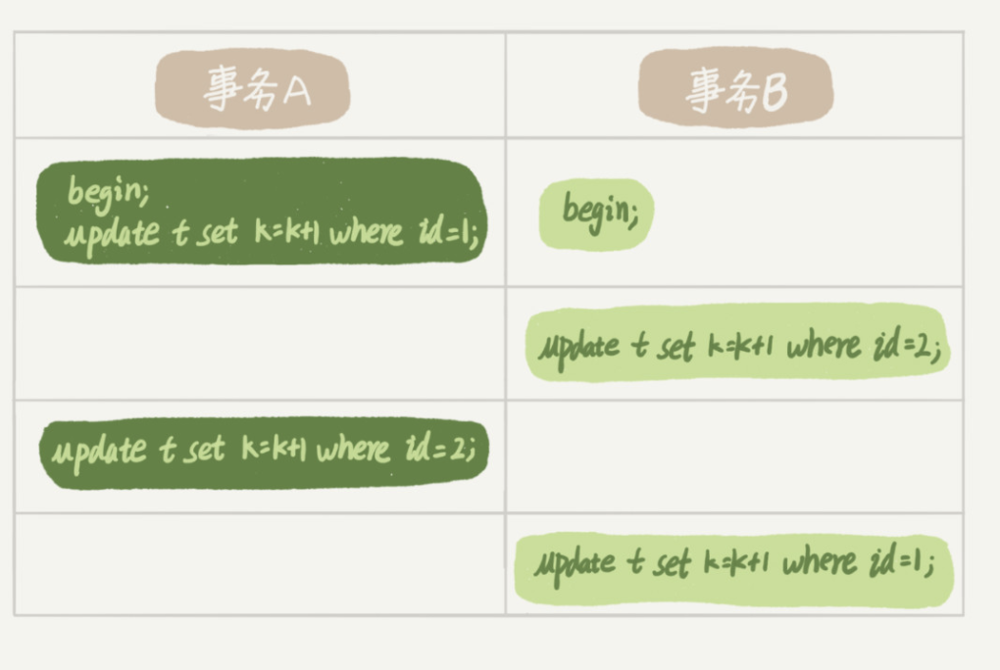

# 数据库原理

## 名词

##### OLTP(online transaction processing )在线事务处理


##### OLAP(online analytic processing)在线分析处理

## 数据库结构

#### 什么是数据库？

数据库只做两件事

1. 当插入数据时，保存数据
2. 当查询数据时，取出对应的保存数据

#### 如何实现一个简单的数据库？

一个简单的数据库可以通过日志和索引实现。

##### 使用日志实现

增删改查

增：日志系统将每个数据插入操作，以key-value的形式， 添加到文件结尾。

改：和增加操作一样，查询时以最新内容为准

查：逐行扫描，以最新值为准

##### 使用索引提高效率

假设索引保存在内存

使用HashMap，以Key-Value的形式保存映射关系

增：索引系统在每次插入时，将value指向日志偏移量

改：修改偏移量

##### 如何保证避免内存用尽？

使用段式存储

1. 文件写满指定行，创建新文件。
2. 旧的段文件查重压缩后，生成压缩后的段文件，删除旧的段文件。

#### 两种主流的数据库结构

LSM-Tree和B-Tree

##### LSM-Tree(Log-Structured Merg-Tree)

使用SStables代替索引提高效率

##### B-Tree


# MYSQL实战

## 数据库结构

数据库分为server层和引擎层，server层负责管理逻辑操作，引擎层具体执行数据库的修改。

### server层的分层

- 连接器，分析器，优化器和执行器


## 存储层是如何保存的: 日志系统

在Mysql使用innoDB的情况下，日志系统被保存在两个部分。

server层保存bin log，这个日志记录所有对数据库的逻辑操作（select *， add ）等

引擎层保存redo log，暂时记录对数据库实体数据的操作

#### redo log - 保证事务的持久性

**Redo log是引擎层用来记录server层传入的修改，可以保证cache-safe，即数据库重启仍可以保证数据不丢失**

在InnoDB中，引擎层的操作分为两个步骤，

1. 将数据写入redo log 
2. 根据redo log操作持久层数据

这是因为对持久层的操作比较耗时，可以在数据库空闲时执行，这样可以降低数据库执行的耗时。

redo log是循环写入的，这也就意味的，当redo log分配的内存满了之后，就需要暂停下来，将redo log的内容写下来，然后继续执行。

#### bin log 

**bin log记录了server层接收到的所有被成功执行的数据库操作**


### Update执行的流程图


### 两阶段提交

1. 当操作被写入redo log时，该操作的状态设置为prepare
2. 当操作被写入bin log后，并将bin log写入硬盘，调用引擎层的提交接口，这个操作redo log的状态会被改写为提交

## 事务的隔离性

#### 什么是事务？

事务是保证数据库的一系列操作要么全部成功，要么全部失败。

#### 为什么需要引入事务？

事务是保证了数据库的一致性，完整性，和安全性。

#### MySql中事务是怎样被实现的？

在Mysql中，事务是在引擎层被支持的。Mysql的原生引擎MyISAM不支持事务，InnoDb引擎支持，这也是InnoDB取到MyISAM的重要原因。


### 隔离性问题：

- 脏读：一个事务读到了另一个没有提交的事务
  - 脏读指的是读到了其他事务未提交的数据，未提交意味着这些数据可能会回滚，也就是可能最终不会存到数据库中，也就是不存在的数据。读到了并一定最终存在的数据，这就是脏读。
- 可重复读
  - 可重复读指的是在一个事务内，最开始读到的数据和事务结束前的任意时刻读到的同一批数据都是一致的。通常针对数据**更新（UPDATE）**操作。
- 不可重复读：同一个事务内，重复读取表中的数据，表数据发生改变
  - 对比可重复读，不可重复读指的是在同一事务内，不同的时刻读到的同一批数据可能是不一样的，可能会受到其他事务的影响，比如其他事务改了这批数据并提交了。通常针对数据**更新（UPDATE）**操作。
- 幻读：在一个事务内，读取到别人插入的数据，导致前后读出来的结果不一致
  - 幻读是针对数据**插入（INSERT）**操作来说的。假设事务A对某些行的内容作了更改，但是还未提交，此时事务B插入了与事务A更改前的记录相同的记录行，并且在事务A提交之前先提交了，而这时，在事务A中查询，会发现好像刚刚的更改对于某些数据未起作用，但其实是事务B刚插入进来的，让用户感觉很魔幻，感觉出现了幻觉，这就叫幻读。

### SQL的四种隔离级别：

1. 读未提交，当记录发生改变时，就可以被读到。

2. 读已提交，只能读到已经提交的事务 。

3. 可重复读，在一个事务中，查询的结果应该是一致的。

   可重复读的场景：e.g.对帐时，哪怕新的交易完成了，也是基于开始对帐的记录值为准。

4. 串行化（Serialization），保证不会发生幻读。

### 隔离级别和事务隔离的关系


### 一张图理解四种隔离级别


### 事务隔离级别的实现机制

>  背景知识: 快照是指一执性视图

#### 快照

在事务的第一次查询时，会产生快照，后续查询都将以这个快照为准。

#### 快照和隔离状态

**Mysql通过MVCC(多版本并发控制) 的方式实现事务隔离级别。**

读未提交：**没有快照**概念，直接返回记录上的最新值。

读已提交：在每个SQL语句执行的时候，会创建一个视图，后续查询都将基于这个。

可重复读：在事务开始时，创建一个视图，事务结束前的查询都将基于这个**快照**

串行化：事务开始时**加锁**，可以并发读，不能并发写，事务B只能在事务A结束后开启

##### 快照读是如何实现的？

快照读是通过当前查询的结果结合UNDO log实现的。具体机制在MVCC实现中详述。

#### UNDO log - 保证事务的一致性

##### 什么是UNDO log？

##### 

UNDO log记录一条Record的一系列变动，可以使每条事务获取到对应版本的记录值。

undo log和redo log记录物理日志不一样，它是逻辑日志。可以认为当delete一条记录时，undo log中会记录一条对应的insert记录，反之亦然，当update一条记录时，它记录一条对应相反的update记录。另外，**undo log也会产生redo log，因为undo log也要实现持久性保护。**

##### 为什么使用UNDO log？

- undo log有两个作用：提供回滚和多个行版本控制(MVCC)。在数据修改的时候，不仅记录了redo，还记录了相对应的undo，如果因为某些原因导致事务失败或回滚了，可以借助该undo进行回滚。

##### UNDO log什么时候会被删除？

当数据库发现没有事务的快照需要UNDO log时，这部分Undo log就会被删除。

### 默认的事务隔离级别

**Oracle**：读已提交

**Mysql**：可重复读

#### 如何查询长事务，以及如何避免？

在事务开始时，显式声明set autocommit=1，可以通过commit work and chain减少事务操作的次数。

#### 如何查询长事务

```sql
select * from information_schema.innodb_trx where TIME_TO_SEC(timediff(now(),trx_started))>60
```

### 总结复习

1.事务的概念是什么?
2.mysql的事务隔离级别读未提交, 读已提交, 可重复读, 串行化各是什么意思?
3.读已提交, 可重复读是怎么通过视图构建实现的?
4.可重复读的使用场景举例? 对账的时候应该很有用?
5.事务隔离是怎么通过read-view(读视图)实现的?
6.并发版本控制(MCVV)的概念是什么, 是怎么实现的?

7.同一条记录在数据库中会有不同的版本,实现就是每个事务启动都会对应的read-view(视图),每个视图都有一个版本id来区分

7.使用长事务的弊病? 为什么使用长事务可能拖垮整个库?
8.事务的启动方式有哪几种?
9.commit work and chain的语法是做什么用的?
10.怎么查询各个表中的长事务?
11.如何避免长事务的出现?

## 数据库索引

### 数据库索引的三种模型

1. 哈希表
2. 有序数列
3. 搜索树

每个索引都会被写入内存和硬盘中。

#### 优势和劣势

1. 哈希表没有相对顺序，当进行范围查询，需要需要查询整张表。适合等值查询的场景，例如NoSql
2. 有序数组在等值查询和范围查询的场景中非常优秀。但插入数据需要挪动所有后续记录，成本高，只适用于静态储存引擎（数据不需要修改）。
3. 平衡二叉树查询和插入都是logN，但对于数据量大的情况下，需要多次内存节点跳转，开销太大（机械硬盘每次寻址需要10ms），e.g.100万条记录，需要20次跳转。

**MySQL的InnoDb引擎使用N叉树中的B+树，结合二叉树和有序数组的优点，将速度提高到最快，当N值为1200时，树高为4就可以存储17亿条记录**

### MySql中InnoDB的索引模型

在InnoDB中，使用B+树作为索引模型，每一个索引对应一个B+树。一个表可以有一个主键索引和多个普通索引

#### 主键索引和普通索引

主键索引又称为聚簇索引，非主键索引又称为普通索引。


##### 主键索引和非主键索引的区别

主键索引中，Key为主键，Value是一条完整的记录

普通索引中，key为被选中的索引列值，Value是主键索引对应值

主键索引只需要查询一次。

使用非主键索引查询时，先通过普通索引获取到主键值，然后通过主键索引获取到记录。这个操作也称为回表。

### 如何使用索引

1. 尽可能使用自增主键作为主键，这样会最大可能减少B+树中页分裂和页合并的次数。因为新记录永远是在B+尾部添加。
2. 对于普通索引来说，每个索引树的值都会包含主键索引，那么主键的值越大，会导致普通索引的占用空间变大，消耗更多存储空间。

### 覆盖索引

当索引树包含查询所需要的值时，将不会进行回表操作，直接返回结果。e.g. select ID from T where k between 3 and 5，因为存在以k为键的普通索引，且查询字段为主键，那么，查询将会直接返回普通索引的结果。

### 联合索引和最左前缀原则

联合索引是使用多个key值进行索引，以key(a,b)为例，排列顺序先以a排序，后以b排序。这样，当查询特定值时，可以通过联合索引的特性，减少回表操作，增加速度。

#### 最左前缀原则

最左前缀原则是指联合索引的索引项是以字段顺序排序的。


当搜索张三时，只需要找到第一个张三，然后遍历后续部分，直到名称不为张三时结束。

### 索引下推

MySql5.6以后，若第二个key值在联合索引中存在，会通过第二个key值筛选，减少回表查询次数。


### 重建索引树

##### 如何重建索引树？

**alter table T engine=InnoDB**重建索引树。

innodb_file_per_table开启每张表一个文件

##### 为什么需要重建索引树？

1. 降低空间消耗，当表进行大量的删除操作以后，旧数据的索引还存在于索引树中，索引树的大小甚至有可能超出数据本身的大小。
2. 提高索引效率，大量删除后，导致索引树中包含很多空洞，会印象索引效率。

## 数据库锁

### 全局锁

全局锁就是对整个数据库实例加锁，使整个数据库处于只读状态。在MySql中，命令是 Flush tables with read lock (FTWRL)，数据更新语句（数据的增删改）、数据定义语句（包括建表、修改表结构等）和更新类事务的提交语句。全局锁会在客户端断开的时候自动释放。全局锁是在**server层**实现的。

##### 全局锁的备选项：使用事务的一致性视图

官方自带的逻辑备份工具是 mysqldump，在导入数据前开启事务，获取一致性视图。

### 表级锁

#### 表锁

表锁分为读锁和写锁，表锁的语法是 lock tables … read/write。与 FTWRL 类似，可以用 unlock tables 主动释放锁，也可以在客户端断开的时候自动释放。表级锁也是在**server 层**实现的。

##### 读锁

当一个线程对一个表使用**读锁**时，该表对所有线程只读（包括占有线程）。

select * from table Lock in share mode.

##### 写锁

当一个线程对一个表使用**写锁**时，该表被该线程独占，其他线程不可读写。

#### 元数据锁（MDL）

MDL的目的是防止DDL和DML并发的冲突。

##### 读锁

当对一个表做**增删改查**操作的时候，加**MDL读锁**。读锁之间不互斥，因此你可以有多个线程同时对一张表增删改查。

##### 写锁

当要对表做**结构变更操作**的时候，加**MDL写锁**。

读写锁之间、写锁之间是互斥的，用来保证变更表结构操作的安全性。因此，如果有两个线程要同时给一个表加字段，其中一个要等另一个执行完才能开始执行。

##### 阻塞问题


假设有多个会话对同一个表进行操作。

​	会话A：使用读锁查询

​	会话B：使用读锁查询，不受影响

​	会话C：改变表结果，受读锁影响，请求写锁

​	会话D：请求读锁，受写锁影响，无法进行查询操作

后续的查询会话均会被堵塞，直到会话C的操作完成。

因此，在语句执行开始时申请，但是语句结束后并不会马上释放，而会等到整个事务提交后再释放。

##### 如何安全的解决堵塞问题，变更表结构？

1. 等待长事务关闭，或暂停长事务后申请变更表结构。

2. 在server层定制方法，使数据库可以在限时内执行Sql，超时则返回失败。在新版MySql中，支持NOWAIT/WAIT n 这个语法变更表结构，可以使用以下语句修改表结构。

   ```sql
   ALTER TABLE tbl_name NOWAIT add column ...
   ALTER TABLE tbl_name WAIT N add column ... 
   ```

#### Online DDL（Data Definiton Language）

##### 什么是Online DDL？

Online DDL的主要作用是允许数据库在结构变更的时候，不会影响其他读写操作。有copy和inspect方式。（由于第一步是获取写锁，以上提及的读写问题仍会发生）

1. 拿MDL写锁
2. 降级成MDL读锁
3. 真正做DDL
4. 升级成MDL写锁
5. 释放MDL锁

通过对副本并行操作的方式变更表结构，将锁降级为读锁，允许其他会话的查询请求。等到副本变更完成后，获取写锁，并将Online期间的其他CRUD操作添加到该副本上。

##### 为什么叫Online DDL？

因为副本并行操作类似于云端服务器操作一样，不影响查询操作。

### 行锁

在MySql中，行锁是在引擎层实现的，MyISAM不支持行锁，InnoDB支持行锁。

##### 什么是行锁？

行锁就是针对数据表中行记录的锁。例如：当事务 A 更新了一行，而这时候事务 B 也要更新同一行，则必须等事务 A 的操作完成后才能进行更新。

#### InnoDB的两阶段锁

##### 什么是两阶段锁？

InnoDB 事务中，行锁是在需要的时候才加上的，但并不是不需要了就立刻释放，而是要等到事务结束时才释放。这个就是两阶段锁协议。

##### 为什么需要两阶段锁？

两阶段锁在维护事务的一致性的同时，尽可能的减少了并发操作的等待时间。

##### 怎样使用两阶段锁？

如果你的事务中需要锁多个行，要把最可能造成锁冲突、最可能影响并发度的锁尽量往后放。

##### 举一个例子🌰

**场景：**一个在线购票平台的购票事务

1. 从顾客 A 账户余额中扣除电影票价；
2. 给影院 B 的账户余额增加这张电影票价；
3. 记录一条交易日志。

使用两阶段锁的特性，按照3，1，2的执行顺序，能够尽可能的降低锁等待时间，提升并发量。

#### 死锁和死锁检测

以上一个场景为例，在两个事务并发执行时

- 事务A执行操作1，请求操作2的行锁
- 同时，事务B执行操作2，请求操作1的行锁

由于事务尚未结束，事务A和事务B同时占有行锁1 和 行锁2，并互相请求对方的行锁，造成死锁



##### 死锁的解决策略

1. 按顺序修改避免死锁

2. 超时释放

   ​	问题：等待值低时，容易误伤。等待值高时，影响并发。

3. 主动死锁检测

   **什么是死锁检测？**

   当事务执行时发现对应行被加锁时，会检测自身是否造成死锁。发现死锁后，主动回滚死锁链条中的某一个事务，让其他事务得以继续执行。

   ##### 如何设置死锁检测？

   通过设置innodb_deadlock_detect为on开启死锁检测，默认为on。

   问题：高峰场景时，多个线程并发操作，同时检查是否发生死锁，消耗大量计算力。

   **什么时候进行死锁检测？**

   当事务执行时发现对应行被加锁时

##### 两种解决方案

1. 在没有死锁的场景下，关闭死锁。
2. 控制并发速度。
   1. 在通过在客户端，中间件或Mysql源码中，对向同一行的操作的会话限流排队。
   2. 拆分单行记录为多行，降低并发压力，并通过总额的方式获取源数据。

### 思考题

1.两阶段锁的概念是什么? 对事务使用有什么帮助?
2.死锁的概念是什么? 举例说明出现死锁的情况.
3.死锁的处理策略有哪两种?
4.等待超时处理死锁的机制什么?有什么局限?
5.死锁检测处理死锁的机制是什么? 有什么局限?
6.有哪些思路可以解决热点更新导致的并发问题?

## MVCC的具体实现

### 什么是MVCC（Multi-Version Concurrency Control）？

MVCC，全称Multi-Version Concurrency Control，即多版本并发控制。MVCC是一种并发控制的方法，一般在数据库管理系统中，实现对数据库的并发访问。通过将同一条记录以链表的形式记录多个版本，允许多个事务对同一条记录进行CRUD，提高并发能力。

### MySql的两种视图

#### 视图

即一个用查询语句定义的虚拟表，在调用的时候执行查询语句并生成结果。创建视图的语法是 create view … ，而它的查询方法与表一样。

#### 一致性视图（Consistent Read View）

InnoDB 在实现 MVCC 时用到的一致性读视图，即 consistent read view，用于支持 RC（Read Committed，读提交）和 RR（Repeatable Read，可重复读）隔离级别的实现。

##### 一致性视图的启动时刻

1. 第一种启动方式，一致性视图是在执行第一个快照读语句时创建的；
2. 第二种启动方式，一致性视图是在执行 start transaction with consistent snapshot 时创建的。

### MVCC的背景知识

> ##### 什么是Transaction ID？
>
> Transaction ID用于标记当前执行的事务，使MVCC能够通过该ID从多个版本的同一条记录中，获取对应的记录值。
>
> ##### 如何获取Transaction ID？
>
> InnoDB的事务管理系统统一管理事务创建，在每个事务开始时，会申请一个transaction id，ID值是按申请顺序**严格递增**的。
>
> #### UNDO log - 保证事务的一致性
>
> ##### 什么是UNDO log？
>
> ##### 
>
> UNDO log记录一条Record的一系列变动，可以使每条事务获取到对应版本的记录值。
>
> undo log和redo log记录物理日志不一样，它是逻辑日志。可以认为当delete一条记录时，undo log中会记录一条对应的insert记录，反之亦然，当update一条记录时，它记录一条对应相反的update记录。另外，**undo log也会产生redo log，因为undo log也要实现持久性保护。**
>
> ##### 为什么使用UNDO log？
>
> - undo log有两个作用：提供回滚和多个行版本控制(MVCC)。在数据修改的时候，不仅记录了redo，还记录了相对应的undo，如果因为某些原因导致事务失败或回滚了，可以借助该undo进行回滚。
>
> ##### UNDO log什么时候会被删除？
>
> 当数据库发现没有事务的快照需要UNDO log时，这部分Undo log就会被删除。

### MVCC是如何实现事务的可重复读？

数据库的操作分为4种：增删改查，其中添增和删除不存在并发问题。于是可重复读的范围在于**改和查**。

**对于改的操作：**

MVCC通过指定规则要求：**更新数据都是先读后写的，而这个读，只能读当前的值，称为“当前读”（current read）。**

即每次操作必须获取到写锁，保证并发结果的正确性。

然后通过上述规则，保证多个事务并发执行的结果一致性

**对于查的操作：**

MVCC通过一致性视图，允许事务查询时，溯源到开始事务的版本，保证事务执行时，查询的可重复读。

#### MVCC是如何维护单行记录的多版本管理？

在InnoDB中，当多个事务并发操作时，每当事务对一条记录进行操作的时候，就会创建一条Undo log，附带上一个版本对应事务的Transaction ID，并修改这条记录到最新值。通过调用Undo log保存的操作，将记录通过计算回滚到对应版本。


#### MVCC是如何管理每个事务的可见性，实现事务内的一致性视图？

InnoDB的事务管理系统会保存当前执行的所有事务。每当一个事务开启视图时，就会向事务管理系统获取当前所有运行的事务数组。其中，

- 低水位是当前运行的最小事务的ID。
- 高水位是当前事务中最大值的ID+1，一般为当前事务。
- 在低水位和高水位之间，代表的是，在创建视图时所有正在运行的事务。
  - 注：由于低水位不代表当前事物的ID，那么在低水位ID和当前事务ID的区间，可能存在已经提交的事务ID，由于已经完成，不会保存在事务数组中。


那么，以上图为例，

- 如果落在绿色部分，表示这个版本是已提交的事务或者是当前事务自己生成的，这个数据是可见的；
- 如果落在红色部分，表示这个版本是由将来启动的事务生成的，是肯定不可见的；
- 如果落在黄色部分，那就包括两种情况；
  - a. 若 row trx_id 在数组中，表示这个版本是由还没提交的事务生成的，不可见。
  - b. 若 row trx_id 不在数组中，表示这个版本是已经提交了的事务生成的，可见。
    - 注：这个trx_id即为在最早开始事务还没有结束的情况下，当前事务的开始前，期间commit的事务。

#### 一个简单的并发事务情景

事务A最先以 start transaction with consistent snapshot 的形式开启，紧接着是事务B，然后是事务C。


在这个过程中，有三种情况

1. 版本未提交，不可见；
2. 版本已提交，但是是在视图创建后提交的，不可见；
3. 版本已提交，而且是在视图创建前提交的，可见。

现在，我们用这个规则来判断图 4 中的查询结果，事务 A 的查询语句的视图数组是在事务 A 启动的时候生成的，这时候：

- (1,3) 还没提交，属于情况 1，不可见；

- (1,2) 虽然提交了，但是是在视图数组创建之后提交的，属于情况 2，不可见；

- (1,1) 是在视图数组创建之前提交的，可见。

#### 记录(Record)更新与行锁

在InnoDB中，为了保证事务执行记录的更新时，不会抹去其他事务的提交。**更新数据都是先读后写的，而这个读，只能读当前的值，称为“当前读”（current read）。事务使用当前读时，会先获取对应记录行锁的写锁，然后更新记录的值。**

- 因此，当多个事务并行对一条记录 +1 时，不会抹去其他事务的增量。而且获取写锁的方式，保证了在 +1 动作执行时，不会出现并行修改的问题。

##### 如何允许Select时，读取对应记录的当前读？

下面这两个 select 语句，就是分别加了读锁（S 锁，共享锁）和写锁（X 锁，排他锁）。

```sql
mysql> select k from t where id=1 lock in share mode;
mysql> select k from t where id=1 for update;
```

##### 两阶段锁在更新中的场景


上图的情景中，事务C'获取了行锁后，事务B只能等待事务C'提交后，才能执行获取到行锁写锁。如此，才能获取到**当前读**，并执行更新操作。


#### 事务的可重复读的能力是怎么实现的？

可重复读的核心就是**一致性读（consistent read）**。

而**事务更新数据的时候，只能用当前读**。如果当前的记录的行锁被其他事务占用的话，就需要进入锁等待。

而读提交的逻辑和可重复读的逻辑类似，它们最主要的区别是：

- 在**可重复读**隔离级别下，只需要在**事务开始**的时候创建**一致性视图**，之后事务里的其他查询都共用这个一致性视图；

- 在**读提交**隔离级别下，**每个语句**执行前都会**重新算出一个新的视图**。

## InnoDB是如何解决幻读的？

# InnoDB底层原理

## 行（记录）

Mysql中的每一行代表一条记录，包含记录的概要信息，其中包括记录的状态信息（记录头信息），和记录的真实数据以及其他数据。

##### 概要信息包含

- 变长字段的长度信息（varchar的长度，number的长度）
- Null值列表
- 记录头信息

##### 记录头信息

| 位           | 描述                                                         |
| :----------- | ------------------------------------------------------------ |
| delete_flag  | 记录是否被删除                                               |
| min_rec_flag | B+树非页节点记录的标示                                       |
| n_owned      | 代表页中该记录所在分组中的记录数目                           |
| heap_no      | 记录在页堆中的相对位置                                       |
| record_type  | 0代表普通记录，1代表B+树非叶节点目录项，2代表Infimum，3代表Supremum |
| next_record  | 下一条记录距离当前记录的Offset（页堆是一整块内存）           |
| roll_pointer | 回滚指针                                                     |

##### 真实数据

真实数据除了用户自定义的数据，还包括默认添加列，row_id, trx_id（事务ID），和roll_pointer。


## 页

在Mysql的页中，数据为一整块16KB的磁盘空间，该页所有数据是由单向链表的形式串联起来的。为了提高效率，页将4-8条记录分为1组，并将该组最大值的偏移量写入Page Directory中。

###  页的数据格式

页的数据格式分为以下部分：File Header, Page Header, Infimum + Supremum, User Record(用户数据), Free Space，Page Directory和File Trailer。

| 格式部分           | 描述                                       |
| :----------------- | :----------------------------------------- |
| File Header        | 页的通用信息                               |
| Page Header        | 数据页的专有信息                           |
| Infimum + Supremum | 最小值行和最大值行的伪记录                 |
| User Record        | 插入的数据记录                             |
| Free Space         | 可用空间                                   |
| Page Directory     | 页目录，每个槽记录该分组最大值的内存偏移量 |
| File Trailer       | 用于检验页是否完整                         |

### 页如何查找某条记录

通过二分法在Page Directory中查找记录对应的分组

##### 具体步骤类似于二分查找

先查中间槽的值，如果大于主键，则设为高位。不然，则设为低位。略。

## 索引和B+树

**注：索引的根节点的所在页不会变动**

### 聚簇索引

在InnoDb中，真实数据和主键索引储存在同一颗B+树上。

##### 叶子节点包含什么信息？

叶子节点为数据页节点，每个叶子节点代表一个数据页。

##### 叶节点之间的关系

InnoDB的数据结构中，所有的数据页节点串联在一个双向链表中，以主键大小顺序排列。左边的页节点最大值小于等于右边页节点的最小值。

##### 非叶节点包含什么信息？

非叶节点的页和数据页较为类似，但不包含真实数据。但不同点在于，每条记录只包含页的索引和该页主键索引的最小值。枝节点页中的记录也是以主键的顺序排列的，于是可以通过二分查找的形式，定位具体某条记录所在的子页或者子目录。非叶节点的所有记录的record_type均为1。

##### 非叶节点和叶节点之间的关系

非叶节点类似于页节点的目录，指向可以通过一个记录，获取到该记录对应页的所有主键所在区间。


### 二级索引

二级索引也是一个B+树。不同的是，

- 二级索引的叶子节点中，记录只包含被索引的字段和主键。
- 二级索引的非叶节点中，每条记录包含，对应页的页号和被索引的字段的最小值，以及该最小值所对应的主键

##### 为什么非叶节点需要包含主键？

因为二级索引的对应字段可能出现，该字段多条记录值相同的情况，需要使用主键判断，新添加的记录应存放的位置。

##### 二级索引是如何查询的？

首先查询到第一个符合的对应值，然后进行回表查询。然后通过链表遍历，针对后续符合条件的索引值，对每个记录同样回表查询，直到字段条件不符合时停止。

### 扫描区间

根据Select语句的命令，MySql会预估命令所需的扫描区间，

例如 select * from table where col_a > 10 and col_b < 100为的扫描区间col_a(10, +inf)或者col_b(-inf, 100)。

假如需要对SQL语句调优时，那么就需要分析每一个部分的扫描区间大小，确定所需要扫描的二级索引区间。在一般场景下，

- 由于使用二级索引需要回表查询，innoDB在查询中，只会使用一个二级索引。
- 当出现扫描区间过大时，即使用二级索引所需的回表操作过多时，则会使用全表扫描代替二级索引，因为顺序查询的速度更快。在只需要少部分结果的情况时，使用LIMIT语句，可以降低查询的区间，提升性能。

### 使用联合索引排序

当使用联合索引查询并排序时，应该按照联合索引的顺序，依次ORDER BY索引字段。

## 单表的访问方法

##### 什么是单表的访问方法？

SQL是声明式语言。对同一条命令的解析，可以有多种访问执行的方式，虽然结果是一样的，但这些不同的访问方式的速度可能会有很大的差异。

### const

使用主键索引或者唯一二级索引与常数等值比较，通常会调用const方法访问单表

### ref

对不唯一的二级索引等值比较查询时，会采用ref方式。

### ref_or_null

是二级索引值为常数，或者为null的情况都需要查询时，使用ref_or_null方式。

### range

区间查询时，使用range

### index

### all

全表查询

## 连接的原理

##### innoDB中的连接是指什么？

连接是指将多张表中的关联数据整合起来。例如：

select * from table_a, table_b where table_a.length > 100 and table_a.id = table_b.id;

需要将表A中所有length >100的记录和它ID在表B中的记录，连接起来。

### 外连接和内连接的区别

##### 什么是外连接？

外连接是指，选取指定表作为驱动表，当指定表中的关联变量不存在于非驱动表中，返回NULL值。

##### 什么是内连接？

内连接只返回双方共有的交集作为查询结果。


##### 联表查询是如何进行的？

对于内连接来说，选取哪张表作为驱动表都可以。对于外连接来说，驱动表已经被指定了。

1. 选取驱动表，并根据驱动表的过滤条件，即选取代价最低的单表访问方法
2. 对从驱动表中查询到的每一条记录，都将在被驱动表中匹配查询。

##### 循环嵌套连接

对于多个表的场景下，将上一次链表查询的结果，作为驱动表，使用每一条记录，在后续表中匹配查询。

## 成本计算

### 什么是成本？

##### I/O成本

##### CPU成本

### 成本计算的过程

1. 根据搜索条件，找出所有可能使用的索引
2. 计算全表扫描的成本
3. 计算使用不同索引的成本
   - 不同索引的搜索区间和回表查询的次数
4. 对比各个方案的成本吗，选取成本最低的方案

## 查询优化`TODO`

### 查询优化的技巧

### 子查询优化

## 事务的概念

### 事务的ACID原则

##### 原子性

undo Log保证了原子性

##### 隔离性

undolog+版本号也实现了隔离性

##### 一致性


##### 持久性

redo log保证了持久性

### 事务的生命周期


## Redo Log

## undo Log

## MVCC

## 锁

# Sql调优

# 面试问题

## 讲一下MySql的实现机制

MySql是由B+树实现的，每一张表就是一个B+树。B+树是一个M路平衡查找树，他的非叶节点只保存索引，叶子节点保存真实数据。在innoDB中，书上的每个节点都是一个页，大小为16KB。那么，这个16KB和只保留索引的特性结合起来，每个页就大概能储存1000-2000条记录。

