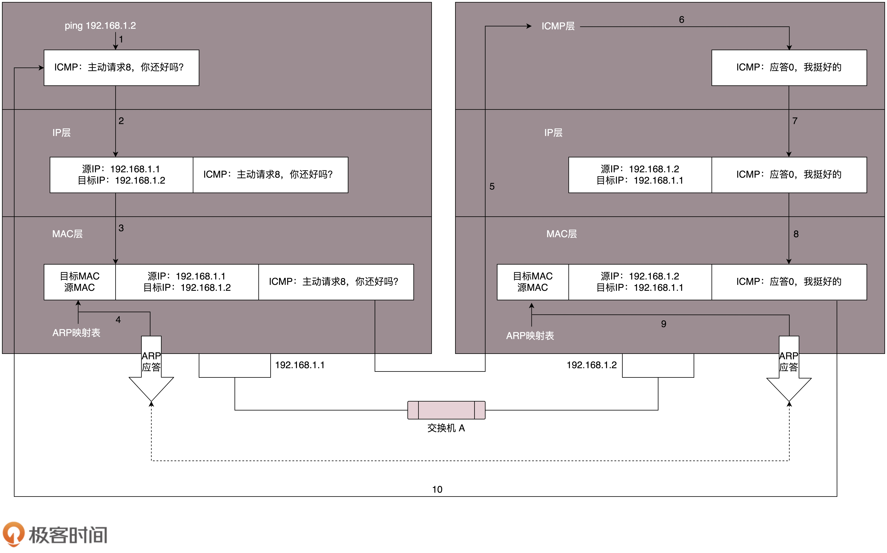

## 简单总结：数据包是如何传递的？

### 外网

##### 当本机A向一个目标机B发起请求时，会发生什么

1. 首先将包需求内容写入应用层，然后根据协议
2. 在传输层包装，启用TCP或者UDP协议，并将端口号写在包中
3. 然后在IP层写入目标IP地址，
4. 在MAC层写入局域网网关（路由）地址
5. 到达网关后，网关通过路由表，将去目标最近的路由的MAC地址写入，并传输到这个路由。
6. 到达这个路由时，路由看到MAC地址是自己的，会将这个包捞起来，在根据目标IP，填写下个路由MAC地址，并发给他
7. 直到送到目标网关的MAC地址。
8. 目标网关MAC地址捞起来这个包，发现IP是自己内网中的包。于是根据ARP协议，寻找到内网中的设备MAC地址
9. 网关通过交换机，直接将包发到对应MAC地址
10. 路由器定点发送到对应设备的MAC地址（直接向对应设备的网线传输包）
11. 对应设备网关捞起来，发现是自己的MAC地址，又是自己的IP地址。
12. 于是到了传输层，执行对应的TCP/UDP协议，
13. 然后根据包内的端口号，将包的内容送到绑定端口的应用

### 内网

##### 当内网中，本机A向一个目标机B发起请求时，会发生什么？

>注：交换机和路由是两回事
>
>https://www.zhihu.com/question/41496681

1. 数据包发到网卡
2. 网卡发现目标IP是同一个网段内，网卡会检查ARP缓存表，如果没有则发起ARP广播
3. 包直接通过交换机，发送到对应地址


# 协议总览

## 各层网络协议总览


### 以快递来理解整个流程

很像发快递的过程（http，应用层)，

1. 你向顺丰下单(第一次请求),顺丰接单(应答),
2. 你向手机小伙联系(回应应答)，
3. 你将消息放进盒子里(开始封装请求，会话层)，
4. 快递员封装一层盒子贴上快递单带回网店(传输层），
5. 到快递点检查是否区域快件（网络层），
6. 将快件交给运输车（链路层），
7. 各个快递转运中心（物理层），
8. 快件到达收件市转运中心（物理层），
9. 转运输车（链路层），
10. 到达区域分发（网络层），
11. 网点派送（传输层），
12. 快递员方面签收（会话层），
13. 拆开检查（表示层），
14. 收到快递（应用层）。

### IP地址和MAC地址

IP地址是计算机网络的寻址地址，有定位功能

MAC 是唯一标示，无定位功能，在子网中用来定位设备。

### 每层对应的标示

传输层对应端口号

网络层对应IP地址，**IP地址代表**

链路层对应MAC地址，代表设备身份


### 一个HTTP请求的接收和响应

一个网络包被解析的时候，

1. 链路层：先查看mac地址是否为相符合，
2. 网络层：查看IP地址是否相符，
3. 传输层：根据端口号，发送到对应端口的监听应用

当返还响应时

1. 传输层：打包请求头，TCP或者是UDP，包头包含端口号
2. 网络层：加上IP地址
3. 传输层：加上目标mac地址，或者网关MAC地址


**`只要是在网络上跑的包，都是完整的。可以有下层没上层，绝对不可能有上层没下层。`**

### 什么是二层设备，什么是三层设备？

什么叫二层设备?就是只把 MAC 头摘下来，看看到底是丢弃、转发，还是自己留着。那什么叫三层设备呢？就是把 MAC 头摘下来之后，再把 IP 头摘下来，看看到底是丢弃、转发，还是自己留着。


## 从ifconfig学习网络中的那些地址

### 简单总结

IP 是地址，有定位功能；IP 地址是一个网卡在网络世界的通讯地址，相当于我们现实世界的门牌号。

MAC 是身份证，无定位功能；

CIDR 可以用来判断是不是本地人；

IP 分公有的 IP 和私有的 IP。


### 网卡

eth0, lo都各自代表一个网卡

大部分的网卡都会有一个 IP 地址

### 五类IP地址和无类型域间选路（CIDR）

> 背景知识

##### 什么是网络号？

网络号代表网络中的一个子网地址

##### 什么是主机号？

主机号代表主机在子网中的地址


#### 5类IP地址


#### CIDR

CIDR是将IP一分为二的地址表达形式。

例如10.100.122.2/24，24代表前24位为网络号，后8位为主机号。

##### 广播地址

一般为主机号二进制全为1的地址

##### 子网掩码

子网掩码是用来获取子网IP的掩码。将子网掩码和 IP 地址按位计算 AND，就可得到网络号

##### 网关地址`(TODO)`

##### CIDR中的子网`(TODO)`

### 公有IP和私有IP

### MAC地址

MAC地址是唯一标示，类似与身份证。

### 网络设备的状态标识

是干什么的？这个叫做 net_device flags，网络设备的状态标识。UP 表示网卡处于启动的状态；BROADCAST 表示这个网卡有广播地址，可以发送广播包；MULTICAST 表示网卡可以发送多播包；LOWER_UP 表示 L1 是启动的，也即网线插着呢。MTU1500 是指什么意思呢？是哪一层的概念呢？最大传输单元 MTU 为 1500，这是以太网的默认值。

## DHCP和PXE

### 既然ifconfig可以自定义网卡IP地址，那么将本机的IP设置为16.158.23.6后，再给192.168.1.6发送数据包，192.168.1.6可以收到么？为什么？

不可以，因为操作系统发现目标的IP地址和本机不在同一个网段，会直接将包发送到路由网关，于是包就不见了。

#### 正常的内网中传输

1. 数据包被封装好之后，操作系统根据网段，确认目的地是否和本机在同一个网段中，
2. 如果在同一个网段，那么会通过ARP协议，获取到内网中，目的地的MAC地址
3. 不经过路由，直接通过交换机，直接把包送到目的地。

### 假如将配置网关IP配置为192.168.1.6呢，又会是怎么样？

不能进行操作，因为网关和网卡要在同一个网段中。

### 动态主机配置协议(==DHCP协议==)

#### 什么是DHCP？

DHCP是自动分配**IP地址**给加入网络设备的协议，`协议运行在应用层`。

#### 为什么要有DHCP协议？

很多设备是动态加入的，比如笔记本，如果没有DHCP，那么每台设备加入网络都需要管理员手动配置IP地址。

#### DHCP的流程是怎么样的？

内网中部署DHCP服务器，并分配一段IP地址，DHCP服务器会通过DHCP协议，动态分配IP给新加入网络的成员。

##### 简单来说， 固定IP的服务器类似于买房，是固定的。而DHCP获得的IP类似于租房，需要根据协议动态更新。

#### DHCP的具体工作流程是怎么样的？

1. 新机器对0.0.0.0发送广播包，
   1. 包内应用层包含DHCP请求和自身的MAC地址，
   2. 网络层源IP为0.0.0.0，目标IP为广播IP，255.255.255.255
   3. MAC层源包含自身的MAC地址，目标MAC地址为广播MAC地址。

2. DHCP服务器广播回应

   

3. 新成员再次广播

   

4. DHCP服务器再次广播回应

   

### PXE预启动执行环境

#### 什么是PXE？

是指集群子服务器启动时，自动获取操作系统，并自动安装操作系统。

#### 为什么使用PXE？

服务器集群可能有成百上千台服务器，有这个需求。

#### PXE是怎么自动安装操作系统的？

将PXE客户端装入BOOT中，启动时，自动请求PXE服务器，完成流程并安装操作系统


# 物理层到网络层

## 物理层(LAN级别)

两台电脑在物理层可以通过网线直连，早期需要将接入和输出的针脚交换。现在网卡可以自动适配。

多个电脑可以通过HUB集线器，广播数据。（集线器会将输入的数据，复制到所有其他接入的端口）。

## 链路层（MAC层）

### 什么是MAC层？

MAC 的全称是 Medium Access Control，即媒体访问控制。

### 为什么使用MAC层？

MAC层可以用来控制在往媒体上发数据的时候，谁先发、谁后发的问题。防止发生混乱。

#### MAC层如何解决发送顺序问题？

- 方式一：分多个车道。每个车一个车道，你走你的，我走我的。这在计算机网络里叫作信道划分；
- 方式二：今天单号出行，明天双号出行，轮着来。这在计算机网络里叫作轮流协议；
- 方式三：不管三七二十一，有事儿先出门，发现特堵，就回去。错过高峰再出。我们叫作随机接入协议。著名的以太网，用的就是这个方式。

#### MAC地址的作用

在用集线器（HUB）的时候，所有的包都会被复制发送到其他的端口，那么MAC地址可以检测当前收到的包是不是发给自己的。

### MAC层的`ARP协议`

#### 什么是ARP协议？

ARP协议是用来在内网中通过IP地址，获取MAC地址的协议。

#### 为什么使用ARP协议？

在内网中，只有知道MAC地址，数据包才能被正常接收。

#### ARP协议的流程是怎么样的？

不知道目标IP的时候，先查看当前的ARP缓存，如果没有对应IP到MAC的映射，则通过广播到网络中所有的地址，获取到目标的MAC地址，并加入缓存，设置时效。

## MAC层的交换机

### 什么是交换机？

交换机会将包的MAC头拿出来，根据转发表，发送到对应网口的设备。如果转发表中不包含这个设备，则广播给所有设备。交换机会通过发送者的IP和MAC地址，自动将映射关系记录到转发表中，并完成转发。

### 交换机的拓扑结构

#### 为什么交换机网络会生成拓扑结构？

当内网中存在多个设备的时候，就需要多个交换机去组建本地网络。

#### 拓扑网络中的交换机是如何工作的？


1. 交换机会记录每个设备的位置
2. 比如是在左边还是在右边
3. 当交换机B收到机器1向机器3发送请求
4. 交换机会忽略这个请求，因为它知道机器3在左侧。

#### 什么是环路问题？


1. 初始阶段，交换机还没有保存路由表
2. 机器 1 向机器 2 发送请求
3. 交换机A和交换机B收到请求，都将机器1记录到左侧，并都向右侧广播
4. 交换机A收到交换机B关于机器1的广播，将路由表中的机器一改写到右侧，并再次向左侧广播
5. 交换机B收到交换机A关于机器1的广播，将路由表中的机器一改写到右侧，并再次向左侧广播
6. 交换机A收到交换机B关于机器1的广播，将路由表中的机器一改写到左侧，并再次向右侧广播
7. 交换机B收到交换机A关于机器1的广播，将路由表中的机器一改写到左侧，并再次向右侧广播
8. 。。。无限循环


### STP协议

#### STP是什么？

在交换机网络中生成最小生成树，交换机之间的沟通以高优先级为主。

#### 为什么需要STP协议？

STP协议解决了环路问题

#### STP协议有什么问题？

1. 在根节点离线，网络内部重新选举，创建最小生成树，期间造成网络部分不可用。
2. 不适用于大规模的网络，生成最小生成树太耗时，且网络不稳定，会经常处于选举状态。

##### 两种节点

- Root Bridge，也就是根交换机。这个比较容易理解，可以比喻为“掌门”交换机，是某棵树的老大，是掌门，最大的大哥。
- Designated Bridges，有的翻译为指定交换机。这个比较难理解，可以想像成一个“小弟”，对于树来说，就是一棵树的树枝。所谓“指定”的意思是，我拜谁做大哥，其他交换机通过这个交换机到达根交换机，也就相当于拜他做了大哥。这里注意是树枝，不是叶子，因为叶子往往是主机。

##### 主从一致协议

- Bridge Protocol Data Units （BPDU） ，网桥协议数据单元。可以比喻为“相互比较实力”的协议。行走江湖，比的就是武功，拼的就是实力。当两个交换机碰见的时候，也就是相连的时候，就需要互相比一比内力了。BPDU 只有掌门能发，已经隶属于某个掌门的交换机只能传达掌门的指示。

##### 主从比较单位

- Priority Vector，优先级向量。可以比喻为实力 （值越小越牛）。实力是啥？就是一组 ID 数目，[Root Bridge ID, Root Path Cost, Bridge ID, and Port ID]。为什么这样设计呢？这是因为要看怎么来比实力。先看 Root Bridge ID。拿出老大的 ID 看看，发现掌门一样，那就是师兄弟；再比 Root Path Cost，也即我距离我的老大的距离，也就是拿和掌门关系比，看同一个门派内谁和老大关系铁；最后比 Bridge ID，比我自己的 ID，拿自己的本事比。

### 虚拟局域网（VLAN）

#### 广播隐私和安全问题

每个设备隶属于不同的部门，将信息广播给所有设备，会有机密泄漏的可能

#### 什么是VLAN？

VLAN在设备中创造虚拟隔离，在子网中创建，使对应分组内的人才可以收到广播。

#### 为什么使用VLAN？

解决广播隐私和安全问题

#### VLAN是如何实现的？


在每个包头，添加VLAN的信息，那么交换机就知道这个包属于哪个分组，并发送到对应分组。


## ICMP协议和ping命令（IP层）

### IP层数据包结构


#### TTL代表生存时间，即，多少次路由Jump后，路由将它丢弃

#### ICMP包和IP包的关系

ICMP包会被放到IP包的可选项部分。


### ICMP协议

#### 什么是ICMP协议？

ICMP 全称 Internet Control Message Protocol，就是互联网控制报文协议，运行在`网络层`。ICMP是用来辅助IP协议，使程序了解网络状态而设计的，现在是IP包的一部分。

#### 为什么使用ICMP协议？

互联网中情况复杂，数据包可能会因为各种情况发送失败。如，被丢弃，目的地端口号不正确等。ICMP被提出是为了解决这中问题的。


#### ICMP包结构


#### ICMP协议的报文类型

##### 查询报文类型

主动请求为8，主动请求的响应为0。

##### 差错报文类型

1. 终点不可达，类型为3
   1. 网络不可达：主公，找不到地方呀？
   2. 主机不可达：主公，找到地方没这个人呀？
   3. 协议不可达：主公，找到地方，找到人，口号没对上，人家天王盖地虎，我说 12345！
   4. 端口不可达：主公，找到地方，找到人，对了口号，事儿没对上，我去送粮草，人家说他们在等救兵。
   5. 需要进行分片但设置了不分片位：主公，走到一半，山路狭窄，想换小车，但是您的将令，严禁换小车，就没办法送到了。

2. 源站抑制，类型为4
3. 时间超时，类型为5
4. 路由重定向，类型为6

#### ICMP协议的简单流程



##### 正常流程

1. 源服务器创建ICMP请求，类型为8
2. 目标服务器返回ICMP请求，类型为0

##### 错误流程（终点不可达）

如果是端口错误，目标地址的路由会返回ICMP包，目的地是源地址，ICMP类型是3

##### 错误流程（超时）

在转发途中，TTL降低为0，此时的路由会将包丢弃，并返回原地址ICMP包，类型为4.

### ICMP的应用

#### Ping

#### traceroute

Traceroute 的第一个作用就是故意设置特殊的 TTL，来追踪去往目的地时沿途经过的路由器。

Traceroute 还有一个作用是故意设置不分片，从而确定路径的 MTU。

## 网关(Gateway)

> 完整的MAC头和IP头


##### 什么是网关？

网关是 电信中使用的网络节点，它将具有不同传输协议的两个网络连接在一起。网关充当网络的入口和出口点，因为所有数据在路由之前必须经过网关或与网关通信。

网关一般是一个三层转发设备（将MAC头和IP头都取出来，根据内容转发的设备），一般为路由器。

##### 为什么使用网关？

网卡在收到应用发出的包时，会通过CIDR和子网掩码去检查网段。

如果在局域网中，则使用ARP协议获取目标MAC地址。

如果不在同一网段，则发送给网关，网关根据协议，使用路由算法转发。

##### 常用的网关有哪些？

常用的网关有两种，转发网关和NAT网关，他们的区别在于，NAT网关会对IP包中的地址进行修改，而转发网关不会。

#### 转发网关

转发网关在转发过程中，根据路由协议，获取到目标IP的MAC地址（或者前往目标IP的下一个路由的MAC地址）。需要注意的是，仅改变MAC头的MAC地址，不改变IP头的IP地址。

#### NAT网关

与转发网关不同的是，NAT网关会修改IP头的地址。

具体的流程是

1. **源网关收到包**

   源 MAC：服务器 A 的 MAC

   目标 MAC：192.168.1.1 这个网口的 MAC

   源 IP：192.168.1.101

   目标 IP：192.168.56.2

2. **在源网关时，修改源IP地址为公网地址，发出的包。**

   源 MAC：192.168.56.1 的 MAC 地址

   目标 MAC：192.168.56.2 的 MAC 地址

   源 IP：192.168.56.1

   目标 IP：192.168.56.2

3. **在目标网关时，会修改目标服务器的IP地址**

   源 MAC：192.168.1.1 的 MAC 地址

   目标 MAC：192.168.1.101 的 MAC 地址

   源 IP：192.168.56.1

   目标 IP：192.168.1.101

## 路由协议

### 静态路由


通过配置静态路由表，实现不同目标IP发送到不同运营商，

### 动态路由

#### 背景知识

> Bellman-Ford 算法
>
> ```python
>    # 初始化图
>    for each vertex v in vertices:
>       if v is source then distance[v] := 0:
>        	predecessor[v] := null
>       else:
>         distance[v] := infinity
> 
> 
>    # 对每条边重复
>    for i from 1 to size(vertices)-1:
>        for each edge (u, v) with weight w in edges:
>            if distance[u] + w < distance[v]:
>               distance[v] := distance[u] + w
>               predecessor[v] := u
> 
>    # 检查是否存在负回路，即永远降低cost的负回路
>    for each edge (u, v) with weight w in edges:
>        if distance[u] + w < distance[v]:
>            error "图包含负权重回路"
> ```
>
> 由于最小路径不会超过节点数目，所以只需循环节点数目-1次。

#### 距离矢量路由算法

距离矢量路由算法是基于最短路径的Bellman-Ford 算法，路由表获取全局中所有路由的距离信息，并根据next Hop的信息转发。

缺点：

1. 消耗大
2. 更新速度慢，每次添加新路由要全局广播
3. 收敛慢，路由节点断开连接后，造成loop空转


#### 链路状态路由算法

链路状态路由（link state routing）是基于 Dijkstra 算法。

1. ##### 基于链路状态路由算法的 OSPF

   OSPF（Open Shortest Path First，开放式最短路径优先）就是这样一个基于链路状态路由协议，广泛应用在数据中心中的协议。由于主要用在数据中心内部，用于路由决策，因而称为内部网关协议（Interior Gateway Protocol，简称 IGP）。

2. ##### **基于距离矢量路由算法的 BGP**

   外网路由协议（Border Gateway Protocol，简称 BGP）。允许网络的节点AS（Autonomous System）自定义Policy。

   1. Stub AS：对外只有一个连接。这类 AS 不会传输其他 AS 的包。例如，个人或者小公司的网络。
   2. Multihomed AS：可能有多个连接连到其他的 AS，但是大多拒绝帮其他的 AS 传输包。例如一些大公司的网络。
   3. Transit AS：有多个连接连到其他的 AS，并且可以帮助其他的 AS 传输包。例如主干网。

   BGP 又分为两类，eBGP 和 iBGP。自治系统间，边界路由器之间使用 eBGP 广播路由。内部网络也需要访问其他的自治系统。边界路由器如何将 BGP 学习到的路由导入到内部网络呢？就是通过运行 iBGP，使得内部的路由器能够找到到达外网目的地的最好的边界路由器。

### 思考题

1. **路由协议要在路由器之间交换信息，这些信息的交换还需要走路由吗？不是死锁了吗？**

   路由器之间的协议交互全部用的为组播报文，组播报文走的为专门的组播路由协议。

2. **路由器之间信息的交换使用什么协议呢？报文格式是什么样呢？**

   路由器之间的协议交互采用的组播报文，根据RFC的规定，部分组播地址为专用的地址，用来传输路由信息。

# 传输层协议

>##### TCP和UDP有哪些区别？
>
>- TCP 是面向连接的，UDP 是面向无连接的。
>
>  - ##### 什么是建立连接？
>
>    所谓的建立连接，是为了在客户端和服务端维护连接，而建立一定的数据结构来维护双方交互的状态，用这样的数据结构来保证所谓的面向连接的特性。
>
>- TCP 是一个有状态服务，UDP 则是无状态服务。
>  - TCP 提供可靠交付。通过 TCP 连接传输的数据，无差错、不丢失、不重复、并且按序到达。而 UDP 继承了 IP 包的特性，不保证不丢失，不保证按顺序到达。
>  - TCP 是面向字节流的。而 UDP 继承了 IP 的特性，基于数据报的，一个一个地发，一个一个地收。
>  - TCP 是可以有拥塞控制的。UDP 根据应用命令发送数据包。
>
>比喻：TCP更好的比喻是在码头上增加了记录人员，核查人员和督导人员，至于IP层和数据链路层，它没有任何改造。

## UDP协议

### UDP包头结构


### UDP的三大使用场景

1. 需要资源少，在网络情况比较好的内网，或者对于丢包不敏感的应用.
2. 不需要一对一沟通，建立连接，而是可以广播的应用。
   1. DHCP 就是一种广播的形式，就是基于 UDP 协议的。
   2. 组播的场景
3. 需要处理速度快，时延低，可以容忍少数丢包，但是要求即便网络拥塞，也毫不退缩，一往无前的时候。
   1. 应用需要有自己的连接策略，可靠保证，时延要求，使用 UDP，然后再应用层实现。

### UDP的实际应用场景

1. #### 网页或者 APP 的访问

   - **为什么在这个场景下使用UDP自定义协议？**
     - 主要是时延方面的考量，TCP协议有以下缺点
     - 1. 建立一次连接需要的时间会比较长
       2. TCP 断开重连很耗时
       3. TCP的典型应用场景HTTP协议，严格要求包的顺序，增大时延。在多个数据通道共享同一个连接的情况下，无关联应用的数据由于包的顺序要求，无法分发到不同的应用端口，导致影响并发。
   - QUIC（全称 Quick UDP Internet Connections，快速 UDP 互联网连接）是 Google 提出的一种基于 UDP 改进的通信协议，其目的是降低网络通信的延迟，提供更好的用户互动体验。QUIC 在应用层上，会自己实现快速连接建立、减少重传时延，自适应拥塞控制。

2. #### 流媒体的协议

   - **为什么在这个场景下使用UDP自定义协议？**
     - 直播实时性较强，过期包作用不大。
     - 连续丢包影响大。自定义时，可以在网络状况差时，选择性丢包。
     - TCP重试机制不利于保证低时延。

3. #### 实时性游戏

   - **为什么在这个场景下使用UDP自定义协议？**
     - 1. 在异步IO之前，UDP提供高并发能力。
       2. TCP强顺序特性，影响低时延。

4. #### IOT

   - **为什么在这个场景下使用UDP自定义协议？**
     - IOT设备资源少，TCP要求配置高。
     - 物联网要求实时性强。

5. #### 移动通信领域

### 思考题

1. 都说 TCP 是面向连接的，在计算机看来，怎么样才算一个连接呢？

   计算机会在内核中维护一个数据结构，以及状态机，去保证tcp是连接的

2. 你知道 TCP 的连接是如何建立，又是如何关闭的吗？

## TCP协议

> https://cloud.tencent.com/developer/article/1687824 彻底弄懂TCP协议：从三次握手说起`TODO`

##### TCP协议有什么特征？

1. 保证顺序
2. 保证不丢包
3. 连接维护
4. 流量控制
5. 拥塞控制

##### TCP协议是如何保证这些特征的？

1. 保证顺序
   1. 通过SEQ序号，保证数据包在数据流中的相对位置
2. 保证不丢包
   1. 通过ACK确认序号，反馈客户端收到最新的数据包序号，允许服务端比对效验，重发未收到的数据包
3. 连接维护
   1. 通过三次握手，确认连接的有效性
   2. 通过四次挥手，保证数据传输后连接断开
   3. 通过SEQ的生成机制，隔离延迟包对连接的影响
4. 流量控制
5. 拥塞控制

##### TCP是如何保证可靠性的？

通过序列号和累计应答机制

### TCP包头


1. 端口
2. 序号(Sequence Number)
   - 是发送端说明当前包的序列位置
     - 在SYN时，作为数据包起始位置
   - 用来解决乱序问题
3. 确认序号(Acknowledgment Number)
   - 是接收端反馈已经收到最新包的位置
   - 用来反馈传输进度，解决不丢包问题
4. 状态位
   1. SYN 是发起一个连接
   2. ACK 是回复
   3. RST 是重新连接
   4. FIN 是结束连接等
5. 窗口大小
   1. 提供流量控制和拥塞控制

### TCP的三次握手（开始传输）

##### 三次握手的目的是什么

三次握手是用来确认**通信双方数据原点的序列号，**相当于同步两端的数据时钟起始位置。

- TCP可以确认双方`数据原点的序列号`
  - ==面试错误点==：比方说：服务器收到客户端发起的2次TCP开始请求，服务器不知道哪一个是新的，那么服务器都将回应给客户端，客户端根据返回的ACK序号，确定正确的TCP连接，返回二次握手。
  - `todo`序列号是如何生成的？
- 根据规则生成的序列号可以保证不同时刻开始的连接，使用不同的序列号。
  1. 可以保证建立连接的过程不会收到延迟包序号的影响。
  2. 可以保证新连接的数据传输不会收到延迟包序号的影响
     - 因为序号差距很大，而TCP是强顺序协议

#### TCP三次握手的过程

1. 客户端发送SYN请求到服务器端，
   1. 设置状态位为SYN
   2. 携带序号Sequence Number = x
      - x为**客户端**接收**服务器**的数据包序列开始的位置。
2. 服务器收到请求后，响应SYN请求到客户端
   1. 设置状态位为SYN, ACK
   2. 携带序号Sequence Number = y
      - y为**服务器**接收**客户端**的数据包序列开始的位置。
   3. 携带确认序号Acknowledge Number = x+1
      - 确认已经收到请求的序列号
3. 客户端响应服务器端，建立连接
   1. 设置状态位为SYN, ACK
   2. 携带Sequence Number=x+1
      - x+1当前包在数据流中的位置
   3. 携带确认序号Acknowledge Number = y+1
      - 确认已经收到请求的序列号


#### 一些思考题：

##### TCP协议如何探测客户端下线？

1. 使用keepalive机制，要求定期发送探活包。
2. 服务端使用策略主动断开不活跃客户端。

##### 为什么不是两次握手？

两次握手无法确认建立连接的有效性。丢包，延迟转发包都可能错误开启连接。

分为两种情况，发送一次或多次

1. 场景一，传输过程中丢包，服务器未收到请求，没有建立连接。
2. 场景二，之前的数据连接结束，服务器突然收到延迟包（上一次开始连接的数据包），开启了新会话。

##### 为什么不是四次握手？

四次挥手中，ACK和SEQ的步骤可以被合并。

##### 为什么Sequence Number不从1开始？

SEQ的生成机制可以保证，两个应用在不同时间点建立的连接，不会收到先前连接延迟包的影响

##### ACK为什么➕1？

ACK加一，代表ACK+1前面的内容已经收到了。

### TCP的四次挥手（结束传输）

#### TCP四次挥手的过程

1. 客户端发送第一次挥手
   - 设置状态位为FIN
   - seq为p
   - **客户端进入FIN_WAIT_1**，此时开始不再处理和发送应用层用户的数据。 
2. 客户端发送第二次挥手
   - 设置状态位为ACK
   - ack为p+1，确认客户端到服务器传输关闭完成
   - **服务器进入CLOSE_WAIT状态**
   - **客户端进入FIN_WAIT_2**，此时只接收服务器传输数据。
3. 服务器发送第三次挥手
   - 设置状态位为FIN，ACK
   - seq为q
   - ack为p+1，请求服务器到客户端传输关闭完成
   - **客户端进入ClOSE_WAIT状态**，并等待2MSL
     - MSL 是 Maximum Segment Lifetime，报文最大生存时间，它是任何报文在网络上存在的最长时间，超过这个时间报文将被丢弃。
4. 客户端发送第四次挥手
   - 设置状态位为FIN，ACK
   - ack为q+1，确认服务器到客户端传输关闭完成


#### 场景题：

1. ##### 第一次挥手后，服务端收到直接下线怎么办?

   通过配置tcp_orphan_retries的最大重试数目，0不重试

2. ##### 第二次挥手后，客户端收到直接下线怎么办?

   在LINUX中配置FIN_WAIT2等待超时，超时自动关闭

3. ##### 第二次挥手后，服务端已离线怎么办?

   在TIME_WAIT状态下，等待超过2MSL后自动关闭

4. ##### TIME_WAIT为什么是2MSL？

   2MSL的时间足够长，允许服务器发现发出的第三次挥手没有得到反馈，会重新发送请求。

5. ##### 如果TIME_WAIT超时后接收到最后一个ACK，客户端会做出什么反应？

   客户端返回RST，要求重新建立连接。

#### 一些思考题：

##### 为什么需要四次挥手？两次不可以吗？

##### 为什么不是三次挥手？可以变为三次挥手吗？

### TCP 状态机


### TCP的传输过程

#### 累计应答

接收端发送ACK携带Ack number，代表这个序列号前的部分都已经被接收到了。

#### 确认与重发机制

##### 顺序问题与丢包问题

在发送端来看，1、2、3 已经发送并确认；4、5、6、7、8、9 都是发送了还没确认；10、11、12 是还没发出的；13、14、15 是接收方没有空间，不准备发的。

在接收端来看，1、2、3、4、5 是已经完成 ACK，但是没读取的；6、7 是等待接收的；8、9 是已经接收，但是没有 ACK 的。

发送端和接收端当前的状态如下：

- 1、2、3 没有问题，双方达成了一致。
- 4、5 接收方说 ACK 了，但是发送方还没收到，有可能丢了，有可能在路上。
- 6、7、8、9 肯定都发了，但是 8、9 已经到了，但是 6、7 没到，出现了乱序，缓存着但是没办法 ACK。

假设 4 的确认到了，不幸的是，5 的 ACK 丢了，6、7 的数据包丢了，这该怎么办呢？

##### 解决方法1：超时重传

###### 如何选择超时重传的时间？

自适应重传算法（Adaptive Retransmission Algorithm）。通过采样计算RTT（ *round-trip time* ）和其波动范围，计算超时。

##### 解决方法2：快速重传

##### 解决方法3：Selective Acknowledgment （SACK）

#### 流量控制

##### 什么是流量控制？

TCP协议提供流量控制，允许接收方根据缓存空间，控制发送方发送频率的机制。

##### 为什么使用流量控制？

双方在通信的时候，发送方的速率与接收方的速率是不一定相等，

- 如果发送方的发送速率太快，会导致接收方处理不过来，这时候接收方只能把处理不过来的数据存在缓存区里（失序的数据包也会被存放在缓存区里）。
- 如果缓存区满了发送方还在疯狂着发送数据，接收方只能把收到的数据包丢掉，大量的丢包会极大着浪费网络资源。

因此，我们需要控制发送方的发送速率，让接收方与发送方处于一种动态平衡。

##### 流量控制解决了什么问题？

流量控制的提出，解决了接收端和发送端的沟通问题，使TCP的流量控制成为双向协商，发送端可以控制发送频率，接收端可以通过控制窗口大小，间接使发送端控制发送频率。

如果没有流量控制，

1. 发送端发送速度过快，接收端缓存被占满，不得不丢包，导致重传的问题。且导致网络计算资源的内耗和浪费。
2. 发送端发送速度过慢，传输管道允许，接收端也允许，则造成时间上的浪费。

##### TCP流量控制是如何实现的？

通过**滑动窗口**协议实现的。滑动窗口协议是**传输层进行流控**的一种措施，**`接收方`通过`通告发送方`自己的窗口大小**，从而控制发送方的发送速度，从而达到防止发送方发送速度过快而导致自己被淹没的目的。

TCP滑动窗口分为

1. 接受窗口
2. 发送窗口

##### 发送端窗口


- LastByteAcked：代表发送端已经收到接收端ACK的包
- LastByteSend：代表发送端已经发送出去的包的ID
- AdvertisedWindows：代表未发送，但是接收端缓存仍然可以承载的包数目，红框为窗口。

##### 接收端窗口


- MaxRcvBuffer：最大缓存的量；
- LastByteRead 之后是已经接收了，但是还没被应用层读取的；
- NextByteExpected 是第一部分和第二部分的分界线。

##### 滑动窗口的具体流程

`todo`

###### 场景一：窗口滑动


1. 当接收端返回ACK=5到发送端，AdvertisedWindow窗口不变
2. 这时，发送端的窗口滑动，ID=13的包会被允许发送

###### 场景二：接收端处理速度慢，降低窗口大小


1. 发送端可以通过返回ACK的值时，降低AdvertisedWindow窗口大小
2. 限制发送端的传输数目。
3. 当窗口大小为0时，发送端会定时发送探活包，确认网络的可使用性。

#### 拥塞控制

##### 什么是拥塞问题？

发送端发送频率过快，超过了传输中路由的处理能力，导致丢包的问题。

##### 拥塞控制解决了什么问题？

拥塞控制允许TCP协议获取到当前连接中，传输过程路由的处理能力。根据这个方法，计算出传输速率，并调节发送速度。这样可以，在最大化利用处理能力的同时，减少错误估计导致的资源内耗。

##### 如果没有拥塞控制会怎么样？

如果没有拥塞控制，TCP协议无法知道传输路径的处理能力，那么会出现两种情况。

1. 传输速度过快，导致大量丢包，大量重传，最终影响TCP传输的可靠性。
2. 传输速度过慢，导致没有充分利用网络资源，最终影响TCP传输的效率。

##### 拥塞问题有什么特征？

1. 包丢失
2. 超时重传

两个问题都会导致计算资源开销变大。

##### 拥塞控制机制

##### 慢启动机制

发送报文大小以指数方式增长，cwnd = 1，2，4，8

##### 拥塞避免

当发送报文大小超过ssthresh，则降低传输速率的增加值，变为每次增加1/cwnd。

##### 超时恢复

当遇到超时恢复的情况时，TCP认为网络状况很不好，会将cwnd设置为1，并将ssthread设置为cwnd/2，这样会导致严重的顿卡。

##### 快恢复

当收到快速重传的包时，TCP认为当前丢包不严重，将ssthread设为cwnd，cwnd设置为当前cwnd/2。

##### TCP BBR 拥塞算法


###### TCP BBR 拥塞算法解决了什么问题？

第一个问题是丢包并不代表着通道满了，也可能是管子本来就漏水。例如公网上带宽不满也会丢包，这个时候就认为拥塞了，退缩了，其实是不对的。

第二个问题是 TCP 的拥塞控制要等到将中间设备都填充满了，才发生丢包，从而降低速度，这时候已经晚了。其实 TCP 只要填满管道就可以了，不应该接着填，直到连缓存也填满。

## Socket套接字

> [操作系统 I/O 全流程详解](https://juejin.cn/post/6844903824180641805)
>
> [TCP/IP的底层队列](https://zhuanlan.zhihu.com/p/59400622)
>
> [epoll 的本质是什么？](https://my.oschina.net/u/4299156/blog/3233158)
>
> [监听套接字与已连接套接字](https://blog.csdn.net/lihao21/article/details/64951446)
>
> [TCP: can two different sockets share a port?](https://stackoverflow.com/questions/11129212/tcp-can-two-different-sockets-share-a-port)
>
> [I/O多路复用技术（multiplexing）是什么？](https://www.zhihu.com/question/28594409/answer/52763082)

### 什么是Socket？

*socket 的原意是“插座”，在计算机通信领域，socket 被翻译为“套接字”，它是计算机之间进行通信的一种约定或一种方式。通过 socket 这种约定，一台计算机可以接收其他计算机的数据，也可以向其他计算机发送数据。它的类似于网线，一头插在服务器，一头插在客户端。*

### Linux中的Socket有哪些

在linux中，Socket分为3种

- 主动型Socket
  - 主动型Socket是Linux调用Socket默认创建的Socket类型，它通常用于客户端向服务器发起请求所使用的Socket
- 监听型Socket
  - 当在Linux创建中Socket后，调用socket.listen()函数时，linux内核会将主动型socket转化为监听型socket。
- 已连接Socket
  - 当监听型Socket.accept()成功建立起一个连接后，会返回对应连接的已连接Socket。已连接Socket将被用于后续和该客户端的连接请求。

当Linux Kernel收到数据包时，会使用get_sock从sock_array的哈希表中匹配已连接Socket，如果不存在已连接Socket，才会请求监听型Socket，检查是否为建立连接的请求。


### 同步I/O的过程

1. 客户端使用主动性Socket发起连接请求到服务器
2. 三次握手建立TCP连接
3. 服务器的监听型Socket收到请求，创建一个已连接Socket。这个已连接Socket将和客户端的Socket绑定，用于后续的连接请求。
4. 服务器调用socket.read()，这时由于没有数据，该线程会被阻塞
5. 每当客户端发送信息到服务器端口，会调用get_sock找到对应已连接的Socket进行传输。
6. 网卡接收到数据`???待确认`，写入缓冲区并超过一部分水平时，就会回调*ep_poll_callback*发出就绪信号。
7. 在收到就绪信号后，使用Socket.read()方法解除阻塞状态
8. 从Socket缓冲区中获取数据


### 进程阻塞为什么不占用 CPU 资源？`todo: https://my.oschina.net/u/4299156/blog/3233158`

#### 阻塞的线程是如何被唤醒的？

每一个epoll对象都有一个独立的eventpoll结构体，用于存放通过epoll_ctl方法向epoll对象中添加进来的事件。

这些事件都会挂载在红黑树中，如此，重复添加的事件就可以通过红黑树而高效的识别出来(红黑树的插入时间效率是lgn，其中n为树的高度)。

而所有添加到epoll中的事件都会与设备(网卡)驱动程序建立回调关系，也就是说，当相应的事件发生时会调用这个回调方法。这个回调方法在内核中叫**ep_poll_callback**,它会将发生的事件添加到rdlist双链表中。

- **ep_poll_callback**函数核心功能是将被目标fd的就绪事件到来时，将fd对应的epitem实例添加到就绪队列。当应用调用epoll_wait()时，内核会将就绪队列中的事件报告给应用。
- epoll_wait()：主要工作是执行ep_poll()方法
  - wait->func的唤醒函数为default_wake_function()，并将等待队列项加入ep->wq
  - freezable_schedule_hrtimeout_range()：出让CPU，进入睡眠状态

#### 服务器Socket的数据结构


#### 服务器端如何使用同一个端口建立多个连接？或者是，服务器的80端口可以与多个客户端建立连接，它是如何做到的？

对于TCP连接，操作系统通过四元数组 4-tuple: (local-IP, local-port, remote-IP, remote-port)来确定连接的Socket。

- 当Linux Kernel收到数据包时，会使用get_sock从sock_array的哈希表中匹配已连接Socket，如果不存在已连接Socket，才会请求监听型Socket，检查是否为建立连接的请求。

这也意味着，在服务器端，一个端口可以与很多不同的连接源建立TCP连接。

### 服务器如何管理这么多端口？

#### Select

#### poll

#### `epoll`

> https://zhuanlan.zhihu.com/p/56486633

##### Epoll的方法调用

epoll 监听的 fd（file descriptor）集合是常驻内核的，它有 3 个**系统调用** （*epoll_create*, *epoll_wait*, *epoll_ctl*），通过 *epoll_wait* 可以多次监听同一个 fd 集合，只返回可读写那部分

- epoll_create，只是在内核初始化一下数据结构然后返回个 fd
- epoll_ctl，epoll的事件注册函数，它不同于select()是在监听事件时告诉内核要监听什么类型的事件，而是在这里先注册要监听的事件类型。
  - 第一个参数是epoll_create()的返回值。
  - 第二个参数表示动作，用三个宏来表示：
    - EPOLL_CTL_ADD：注册新的fd到epfd中；
    - EPOLL_CTL_MOD：修改已经注册的fd的监听事件；
    - EPOLL_CTL_DEL：从epfd中删除一个fd；
  - 支持添加移除 fd，我们只看添加的情况。*epoll_ctl* 的主要操作在 *ep_insert*, 它做了以下事情：
    1. 初始化一个 *epitem*，里面包含 fd，监听的事件，就绪链表，关联的 epoll_fd 等信息
    2. 调用 *ep_item_poll(epitem, ep_ptable_queue_proc[[1]])*。*ep_item_poll* 会调用 *vfs_poll*， *vfs_poll* 会调用上面说的 *file->f_op->poll* 将 *ep_poll_callback[[2]]* 注册到 waitqueue
    3. 调用 *ep_rbtree_insert(eventpoll, epitem)* 将 *epitem* 插入 evenpoll 对象的红黑树，方便后续查找
- *epoll_wait*，主要工作是执行ep_poll()方法
  - wait->func的唤醒函数为default_wake_function()，并将等待队列项加入ep->wq
  - freezable_schedule_hrtimeout_range()：出让CPU，进入睡眠状态

##### Epoll的回调函数

- ep_poll_callback()：
  - 而所有添加到epoll中的事件都会与设备(网卡)驱动程序建立回调关系，也就是说，当相应的事件发生时，网卡驱动会调用这个回调方法。这个回调方法在内核中叫**ep_poll_callback**,它会**将发生的事件添加到rdlist双链表中**。
  - 目标fd的就绪事件到来时，将epi->rdllink加入ep->rdllist的队列，导致rdlist不空，从而进程被唤醒，epoll_wait得以继续执行。

### 对每个连接使用一个线程进行处理，会有什么问题？

在服务器需要有大量连接的场景下，使用一个线程处理一个socket，会造成大量的浪费和并发量的瓶颈。

- 一方面线程的创建阻塞和销毁都会占用很多的资源
- 另一方面，线程是很宝贵的资源，一个服务器能够创建的线程数目是有限的，能承载的并发量也是有限的。

### 多路复用的思路是什么？

与其创建一个线程处理一个Socket，然后被阻塞，等待数据到来后再被唤醒。不如让一个线程对应多个Socket，哪个被唤醒了，就处理哪个请求，提高一个线程的利用率。

# 应用层协议

## HTTP协议

## HTTPS协议

> ##### 对称加密
>
> ##### 非对称加密

#### 数字证书

由权威机构发布证书(Certificate)，包含公匙，证书所有者，发布机构和有效期。

#### HTTP协议


## SSL/TLS协议

首先，使用TCP协议建立连接

### 第一次握手 ClientHello

明文发送以下信息到服务器

1. 支持的协议版本，比如TLS 1.0版。
2.  一个客户端生成的随机数，稍后用于生成"对话密钥"。
3.  支持的加密方法，比如RSA公钥加密。
4.  支持的压缩方法。

### 第二次握手 ServerHello

服务器回复客户端请求

1. 确认使用的加密通信协议版本，比如TLS 1.0版本。如果浏览器与服务器支持的版本不一致，服务器关闭加密通信。
2. 一个服务器生成的随机数，稍后用于生成"对话密钥"。
3. 确认使用的加密方法，比如RSA公钥加密。
4. 服务器证书。

### 客户端验证证书

第二次握手和第三次握手期间，客户端会向CA验证证书。

### 第三次握手 客户端回应

客户端就会从证书中取出服务器的公钥。然后，将下面三项信息由公匙加密后，发送给客户端。

1.  一个随机数。该随机数用服务器公钥加密，防止被窃听。
2.  编码改变通知，表示随后的信息都将用双方商定的加密方法和密钥发送。
3.  客户端握手结束通知，表示客户端的握手阶段已经结束。这一项同时也是前面发送的所有内容的hash值，用来供服务器校验。

