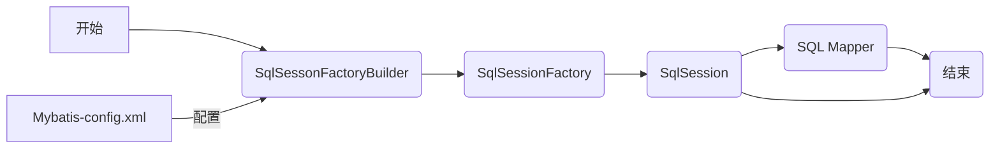
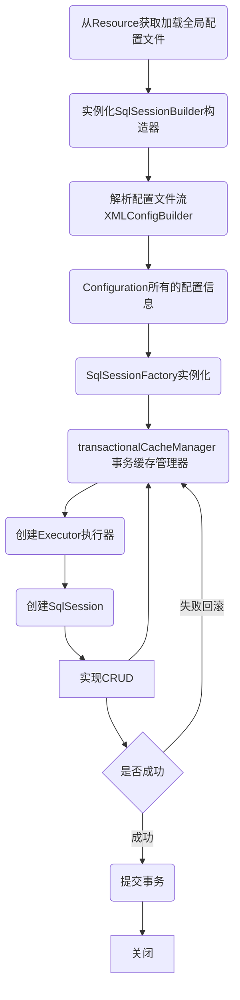

# Mybatis

## 入门

### 1. Mybatis的三个Object

1. SqlSessionFactoryBuilder
2. SqlSessionFactory
3. SqlSession

### 2. Mybatis配置文件

```xml
<?xml version="1.0" encoding="UTF-8" ?>
<!DOCTYPE configuration
        PUBLIC "-//mybatis.org//DTD Config 3.0//EN"
        "http://mybatis.org/dtd/mybatis-3-config.dtd">
<configuration>
    <environments default="development">
        <environment id="development">
            <transactionManager type="JDBC"/>
            <dataSource type="POOLED">
                <property name="driver" value="com.mysql.jdbc.Driver"/>
                <property name="url" value="jdbc:mysql://localhost:3306/mybatis?useSSL=true&amp;useUnicode=true&amp;characterEncoding=UTF-8"/>
                <property name="username" value="root"/>
                <property name="password" value="Jarvis1673"/>
            </dataSource>
        </environment>
    </environments>

    <mappers>
        <mapper resource="org/mybatis/example/BlogMapper.xml"/>
    </mappers>
</configuration>
```

Mapper用来注册sql的方法，有两种途径。

```xml
<mapper resource="org/mybatis/example/BlogMapper.xml"/>		//1. 通过xml和接口配置导入
<mapper class="com.zhiwei.mapper.UserMapper"/> 						//2. 通过注解在接口上直接导入	
<mapper resource="org/mybatis/example/*Mapper.xml"/>			//3. 通过通配符引入多个文件


```

### 3. MyBatis配置流程

```java
String resource = "org/mybatis/example/mybatis-config.xml";
InputStream inputStream = Resources.getResourceAsStream(resource);
SqlSessionFactory sqlSessionFactory = new SqlSessionFactoryBuilder().build(inputStream);
```


1. SqlSessionFactoryBuilder根据xml或者java代码创建SqlSessionFactory。
2. SqlSessionFactory创建SqlSession。
3. SqlSession执行sql代码。

### 4. 创造mybatis静态类

```java
public class MybatisUtils {
    private static SqlSessionFactory sqlSessionFactory;
    static {
        try {
            String resource = "org/mybatis/example/mybatis-config.xml";
            InputStream inputStream = Resources.getResourceAsStream(resource);
            sqlSessionFactory = new SqlSessionFactoryBuilder().build(inputStream);
        } catch(IOException e) {
            e.printStackTrace();
        }
    }

    public static SqlSession getSqlSession(){
        return sqlSessionFactory.openSession();
    }
}

```

原因：创建Factory的成本比较大，降低创建成本

### 5. Mybatis Sql命令配置

```xml
<?xml version="1.0" encoding="UTF-8" ?>
<!DOCTYPE mapper
        PUBLIC "-//mybatis.org//DTD Mapper 3.0//EN"
        "http://mybatis.org/dtd/mybatis-3-mapper.dtd">
<mapper namespace="com.zhiwei.mapper.UserMapper">
    <select id="getUserList" resultType="com.zhiwei.entities.User">
        select * from user
    </select>
</mapper>
```

```java 
public interface UserMapper {
    List<User> getUserList();
}

```

UserMapper.xml是UserMapper的实现类。

几个细节：

1. mapper 的namespace需要链接到对应接口。 
2. mapper内部的select/update等的id需要和接口的方法相同。
3. mapper需要在mybatis-config.xml中注册。 

### xml配置文件详解

#### 1. namespace

namespace中的包名要与mapper接口的包名一致。

#### 2. select/insert/update/delete

- id：对应namespace中的方法名。

- resultType：Sql语句执行的返回值。
- parameterType：参数类型。

#### 3.执行结束需提交事务

### 6. Mybatis的在这个项目中的启动流程

1. 在java类加载的时候通过静态代码块类，读取mybatis-config.xml，调用创建sqlSessionFactory。
2. mybatis-config.xml中 注册了mapper的位置和namespace的对应接口，通过反射创建对应impl类，返回类型在returnType中被定义。


## 配置问题

### Maven约定大于配置导致xml不能被导出

#### 解决方案

```xml
    <build>
        <resources>
            <resource>
                <directory>src/main/resources</directory>
                <includes>
                    <include>**/*.properties</include>
                    <include>**/*.xml</include>
                </includes>
                <filtering>true</filtering>
            </resource>
            <resource>
                <directory>src/main/java</directory>
                <includes>
                    <include>**/*.properties</include>
                    <include>**/*.xml</include>
                </includes>
                <filtering>true</filtering>
            </resource>
        </resources>
    </build>
```


### 常见问题

1. 配置文件没有注册

2. 绑定接口错误。
3. 方法名不对应。
4. 返回类型不对。
5. Maven资源导出问题。


## Map和模糊查询

野路子：

假设，我们的实体类，或者数据库中的表，字段或者参数过多，或者==表子段不确定（多数据源）==，应当考虑map！

- Map传递参数，直接在sql中取出。

- 对象传递参数，直接在sql中去对象的属性。

- 只要有一个基本类型，可以在sql中直接取到。 

- Map还可以用来接收结果。

```java
List<User> userList = mapper.getUserLike("%李%");
```


## Mybatis属性配置

### 配置类型

MyBatis 的配置文件包含了会深深影响 MyBatis 行为的设置和属性信息。 配置文档的顶层结构如下：

- configuration（配置）
  - [properties（属性）](https://mybatis.org/mybatis-3/zh/configuration.html#properties)
  - [settings（设置）](https://mybatis.org/mybatis-3/zh/configuration.html#settings)
  - [typeAliases（类型别名）](https://mybatis.org/mybatis-3/zh/configuration.html#typeAliases)
  - [typeHandlers（类型处理器）](https://mybatis.org/mybatis-3/zh/configuration.html#typeHandlers)
  - [objectFactory（对象工厂）](https://mybatis.org/mybatis-3/zh/configuration.html#objectFactory)
  - [plugins（插件）](https://mybatis.org/mybatis-3/zh/configuration.html#plugins)
  - environments（环境配置）
    - environment（环境变量）
      - transactionManager（事务管理器）
      - dataSource（数据源）
  - [databaseIdProvider（数据库厂商标识）](https://mybatis.org/mybatis-3/zh/configuration.html#databaseIdProvider)
  - [mappers（映射器）](https://mybatis.org/mybatis-3/zh/configuration.html#mappers)

### 属性（properties）

我们可以通过properties属性实现配置文件。这些属性可以在外部进行配置，并可以进行动态替换。你既可以在典型的 Java 属性文件中配置这些属性，也可以在 properties 元素的子元素中设置。例如通过resources中的**db.properties**去配置。

例：

第一步，创建**db.properties**.：

```properties
driver=com.mysql.jdbc.Driver
url=jdbc:mysql://localhost:3306/mybatis?useSSL=true&amp;useUnicode=true&amp;characterEncoding=UTF-8
username=root
password=123456
```

第二步，在核心文件mybatis-config.xml中引入：

```xml
<!--引入外部配置文件-->
<properties resource="db.properties"/>

<!--也可以使用-->
<properties resource="db.properties">
  <property></property>
</properties>
```

内部Property优先级高于外部文件。

#### xml顺序问题：


properties要按照以上顺序。

### 环境变量

MyBatis 可以配置成适应多种环境，但每个 SqlSessionFactory **实例**只能选择一种环境。 如果你想连接两个数据库，就需要创建两个 SqlSessionFactory 实例。e.g. Mysql和Oracle的环境变量不一样

### 事务管理器

JDBC/ Managed

### 数据源

- UNPOOLED

- POOLED
- JDNI

### 别名

```xml
<!--记得按顺序-->
<typeAliases>
  <typeAlias alias="Author" type="domain.blog.Author"/>
</typeAliases>

<typeAliases>
  <package name="domain.blog"/>
</typeAliases>
```

package在这里，会扫描实体类的包，将使用包后的部分首字母小写作为别名。

```java
@Alias("author")
public class Author {
    ...
}
```

### Mybatis设置

#### 重要的部分：

- cacheEnabled
- LazyLoadingEnabled
- useGeneratedKeys
- mapUnderscoreToCamelCase  转换last_name到lastName （Underscore大小写不敏感）
- logImpl指定日志实现

### 映射器

```xml
<!-- 使用相对于类路径的资源引用 -->
<mappers>
  <mapper resource="org/mybatis/builder/AuthorMapper.xml"/>
  <mapper resource="org/mybatis/builder/BlogMapper.xml"/>
  <mapper resource="org/mybatis/builder/PostMapper.xml"/>
</mappers>
<!-- 使用完全限定资源定位符（URL） -->
<mappers>
  <mapper url="file:///var/mappers/AuthorMapper.xml"/>
  <mapper url="file:///var/mappers/BlogMapper.xml"/>
  <mapper url="file:///var/mappers/PostMapper.xml"/>
</mappers>
<!-- 使用映射器接口实现类的完全限定类名 --> <!-- 接口必须和xml在一个包下，且名称必须一样 -->
<mappers>
  <mapper class="org.mybatis.builder.AuthorMapper"/>
  <mapper class="org.mybatis.builder.BlogMapper"/>
  <mapper class="org.mybatis.builder.PostMapper"/>
</mappers>
<!-- 将包内的映射器接口实现全部注册为映射器 --> <!--package的规则和class一样-->
<mappers>
  <package name="org.mybatis.builder"/>
</mappers>
```


## 生命周期和作用域

生命周期和作用域至关重要，因为错误使用会导致非常严重的**并发问题**。　



##### SqlSessionFactory

- 类似于数据库连接池（数据库连接工厂）。

- 他的最佳作用域时应用作用域，创造需要消耗很多资源，最简单的实现是**单例模式**。

##### SqlSession

- 连接到连接池的一个请求。

- 线程不安全。

- 关闭非常重要，没有关闭会导致内存泄漏。

  ```mermaid
  flowchart LR
  SqlSessionFactory --> SqlSession1
  SqlSessionFactory --> SqlSession2
  SqlSessionFactory --> SqlSession3
  SqlSession3	--> Mapper1
  SqlSession3 --> Mapper2
  SqlSession3 --> Mapper3
  
  
  ```

  

这里面的每一个mapper代表一个具体的业务(注册在mybatis-config.xml中)。

## ResultMap

### 设计思想

对于简单的语句根本不需要配置显式的结果映射，而对应复杂一点的语句，只需要描述他们的关系就行了。

### 一个场景：解决属性名和字段名不一致的问题 

即实体的属性名和数据库方法不匹配。e.g. user的属性是password， 而数据库中是pwd。

原因：select的值和entity的属性不匹配，查出来后，entity方法setPwd不存在。

#### 暴力解法

```xml
<select id="getUserById" parameterType="int" resultType="com.zhiwei.entities.User">
	select id, name, pwd as password from user where id = #{id}
</select>

```

#### ResultMap方法

```xml
<resultMap id="UserMap" type="User">
    <!--column是表的字段，property是entity的属性-->
    <result column="id" property="id"/>
</resultMap>

<select id="getUserById" parameterType="int" resultMap="UserMap">
    select * from user where id = #{id}
</select>
```

#### ResultMap的隐式匹配

类型别名是你的好帮手。使用它们，你就可以不用输入类的全限定名了。比如：

```xml
<!-- mybatis-config.xml 中 -->
<typeAlias type="com.someapp.model.User" alias="User"/>

<!-- SQL 映射 XML 中 -->
<select id="selectUsers" resultType="User">
  select id, username, hashedPassword
  from some_table
  where id = #{id}
</select>
```

在这些情况下，MyBatis 会在幕后自动创建一个 `ResultMap`，再根据属性名来映射列到 JavaBean 的属性上。如果列名和属性名不能匹配上，可以在 SELECT 语句中设置列别名（这是一个基本的 SQL 特性）来完成匹配。比如：

```xml
<select id="selectUsers" resultType="User">
  select
    user_id             as "id",
    user_name           as "userName",
    hashed_password     as "hashedPassword"
  from some_table
  where id = #{id}
</select>
```

## 如何引入外部文件配置 mybatis.xml

第一步，创建**db.properties**.：

```properties
driver=com.mysql.jdbc.Driver
url=jdbc:mysql://localhost:3306/mybatis?useSSL=true&amp;useUnicode=true&amp;characterEncoding=UTF-8
username=root
password=123456
```

第二步，在核心文件mybatis-config.xml中引入：

```xml
<!--引入外部配置文件-->
<properties resource="db.properties"/>

<!--也可以使用-->
<properties resource="db.properties">
  <property></property>
</properties>
```

内部Property优先级高于外部文件。

## 日志工厂

常见日志工厂:SLF4J | **LOG4J** | LOG4J2 | JDK_LOGGING | COMMONS_LOGGING | **STDOUT_LOGGING** | NO_LOGGING


### LOG4J

log4j.properties

```properties
#将等级为DEBUG的日志信息输出到console和file这两个目的地，console和file的定义在下面的代码
log4j.rootLogger=DEBUG,console,file

#控制台输出的相关设置
log4j.appender.console = org.apache.log4j.ConsoleAppender
log4j.appender.console.Target = System.out
log4j.appender.console.Threshold=DEBUG
log4j.appender.console.layout = org.apache.log4j.PatternLayout
log4j.appender.console.layout.ConversionPattern=【%c】-%m%n

#文件输出的相关设置
log4j.appender.file = org.apache.log4j.RollingFileAppender
log4j.appender.file.File=./log/kuang.log
log4j.appender.file.MaxFileSize=10mb
log4j.appender.file.Threshold=DEBUG
log4j.appender.file.layout=org.apache.log4j.PatternLayout
log4j.appender.file.layout.ConversionPattern=【%p】【%d{yy-MM-dd}】【%c】%m%n

#日志输出级别
log4j.logger.org.mybatis=DEBUG
log4j.logger.java.sql=DEBUG
log4j.logger.java.sql.Statement=DEBUG
log4j.logger.java.sql.ResultSet=DEBUG
log4j.logger.java.sql.PreparedStatement=DEBUG
```

## 使用limit分页

1. 接口

   ```java
   List<User> getUserByLimit(Map<String, Integer> map);
   ```

2. mapper.xml

   ``` xml
   <select id="getUserByLimit" parameterType="map" resultMap="UserMap">
     select * from mybatis.user limit #{startIndex}, #{pageSize}
   </select>
   ```

### 另一个选择：RowBounds

## 注释开发

1. 接口定义

```java
@Select("select * from user")
List<User> getUsers();


// 多个参数的命名规范, @Param{string}指定参数在sql中的名称
@Select("select * from user where age = #{age} and job = #{job}")
List<User> getUsersByJobAndAge(@Param{"age"} int age, @Param{"job"} String job);

@Insert("insert into user(id, name, pwd) values (#{id}, #{name}, #{password})")
int addUser(User user);

@Update("update user set name=#{name}, pwd=#{password} where id = #{id}")
int updateUser(User user);

@Delete("delete from user where id = #{uid}")
int deleteUser(@Param("uid") int id);
```

2. Mapper绑定接口

```xml
<mappers>
  <mapper class="com.zhiwei.dao.UserMapper"/>
<mappers>
```

3. openSession实现自动commit

```java
public static SqlSession getSqlSession(){
    return sqlSessionFactory.openSession(true);
}
```

### @Param()注解

- 基本类型需要加上
- 引用类型不需要加
- 如果只有一个基本类型可以忽略
- Sql引用的事@Param中定义的属性名

##### 原理简析：

通过反射找到方法并绑定。


## SelSession创建流程 



## 外键引入(多对一和一对多)

### 运行环境

##### 表的格式为：

```sql
CREATE TABLE `teacher` (
  `id` INT(10) NOT NULL,
  `name` VARCHAR(30) DEFAULT NULL,
  PRIMARY KEY (`id`)
) ENGINE=INNODB DEFAULT CHARSET=utf8


CREATE TABLE `student` (
  `id` INT(10) NOT NULL,
  `name` VARCHAR(30) DEFAULT NULL,
  `tid` INT(10) DEFAULT NULL,
  PRIMARY KEY (`id`),
  KEY `fktid` (`tid`),
  CONSTRAINT `fktid` FOREIGN KEY (`tid`) REFERENCES `teacher` (`id`)
  ) ENGINE=INNODB DEFAULT CHARSET=utf8
```


外键引入是指以下情况：

```java
public class Teacher {
    private int id;
    private String name;
}

public class Student {
    private int id;
    private String name;
    private Teacher teacher;
}
```

即，Student实例包含指向Teacher实例的外键。

### 多对一处理

查询所有学生和学生对应老师的信息。对应sql语句为:

```sql
select s.id, s.name, t.name from Student s, Teacher t where s.tid = t.id;
```

#### 按照==关联==嵌套处理(子查询)

```xml
<mapper namespace="com.zhiwei.mapper.StudentMapper">
    <resultMap id="StudentTeacher" type="Student">
        <result property="id" column="id"/>
        <result property="name" column="name"/>
        <!-- 复杂对象单独处理
            对象: association
            集合: collection
        -->
        <association property="teacher" column="tid" javaType="Teacher" select="getTeacher"/>
    </resultMap>

    <select id="getStudent" resultMap="StudentTeacher">
        select * from student
    </select>

    <select id="getTeacher" resultType="Teacher">
        select * from teacher where id = #{id}
    </select>

</mapper>
```

#### 按照==结果==嵌套处理

```xml
    <resultMap id="StudentTeacher2" type="Student">
        <result property="id" column="id"/>
        <result property="name" column="name"/>
        <!-- 不嵌套可以直接自动赋值 -->
        <association property="teacher" javaType="Teacher">
            <result property="name" column="name"/>
            <result property="tid" column="tid"/>
        </association>
    </resultMap>

    <select id="getStudent2" resultMap="StudentTeacher2">
        select s.id, s.name, t.name from Student s, Teacher t where s.tid = t.id;
    </select>
```

**思考：**按照结果嵌套处理直接使用sql语句获取结果，速度更快。

### 一对多

查询所有学生和学生对应老师的信息。对应sql语句为:

```sql
select t.name tname, t.id tid, s.name sname, s.id sid
from student as s, teacher as t
where s.tid=t.id and tid=1;
```

#### 按照==关联==嵌套处理(子查询)

```xml
    <resultMap id="TeacherMap2" type="Teacher">
        <collection property="students" javaType="ArrayList" ofType="Student" select="getStudentByTeacherId" column="id"/>

    </resultMap>
    
    <select id="getTeacher2" resultMap="TeacherMap2">
        select * from teacher where id = #{id}
    </select>
    
    <select id="getStudentByTeacherId" resultType="Student">
        select * from student where tid = #{id}
    </select>
```

#### 按照==结果==嵌套处理

```xml
    <resultMap id="TeacherMap" type="Teacher">
        <result property="id" column="tid"/>
        <result property="name" column="tname"/>
        <!--
        对象：association 集合：collection
        对于集合的范型，使用:ofType
        -->
        <collection property="students" ofType="Student">
            <result property="id" column="sid"/>
            <result property="name" column="sname"/>
            <result property="tid" column="tid"/>
        </collection>
    </resultMap>


    <select id="getTeacher" resultMap="TeacherMap">
        select t.name tname, t.id tid, s.name sname, s.id sid
        from student as s, teacher as t
        where s.tid=t.id and tid=#{id};
    </select>

```

### javaType和ofType

1. javaType	用来指定实例中的属性类型

   ofType		用来指定集合/范型中的属性类型

## 类型处理器（typeHandlers）

MyBatis 在设置预处理语句（PreparedStatement）中的参数或从结果集中取出一个值时， 都会用类型处理器将获取到的值以合适的方式转换成 Java 类型。

- 可以通过定义类型处理器，并在application.properties中加载出来，那么mybatis就知道如何处理这种类型

## 动态SQL

> **根据不同的条件生成不同的SQL语句**
>
> 学习链接：https://mybatis.org/mybatis-3/zh/dynamic-sql.html 

### 动态SQL解决了什么问题？

1. 动态SQL解决了拼接不同SQL语句的痛苦
2. 提升了Sql的执行效率。参考：https://www.cnblogs.com/sdflysha/p/20191221-why-dynamic-sql.html


##### 静态SQL：

如果入参中UserName不为null，添加对userName的模糊搜索，如果userRole不为null，添加对userRole的模糊搜索。

```java
StringBuffer sql = new StringBuffer();
sql.append("select count(1) as count from sbms_user u, sbms_role r where u.userRole = r.id");
List<Object> params = new ArrayList<>();

if (!StringUtil.isNullorEmtpy(UserName)) {
		sql.append(" and u.userName like ?")
    list.add("%"+username+"%");
}
if(userRole > 0) {
 		sql.append(" and u.userRule like ?")
    list.add("%"+username+"%"); 
}
```

### if

内容为 findActiveBlogLike可选传入多个参数。

当入参中title不为null时，添加对titile的模糊搜索。当入参中author不为null时，添加对author的模糊搜索。

```xml
<select id="findActiveBlogLike"
     resultType="Blog">
  SELECT * FROM BLOG WHERE state = ‘ACTIVE’
  <if test="title != null">
    AND title like #{title}
  </if>
  <if test="author != null and author.name != null">
    AND author_name like #{author.name}
  </if>
</select>
```

### choose、when、otherwise

choose，when，otherwise相当于switch，只能执行其中的一项

### trim、where、set

- trim可以在不同标签前去自定义前缀后缀的设定

### foreach

动态 SQL 的另一个常见使用场景是对集合进行遍历（尤其是在构建 IN 条件语句的时候）。比如：

```xml
<select id="selectPostIn" resultType="domain.blog.Post">
  SELECT *
  FROM POST P
  WHERE ID in
  <foreach item="item" index="index" collection="list"
      open="(" separator="," close=")">
        #{item}
  </foreach>
</select>
```

*foreach* 元素的功能非常强大，它允许你指定一个集合，声明可以在元素体内使用的集合项（item）和索引（index）变量。它也允许你指定开头与结尾的字符串以及集合项迭代之间的分隔符。这个元素也不会错误地添加多余的分隔符，看它多智能！


####  解决的问题：

```sql
select * from user where 1=1 and (id=1 or id=2 or id=3)
```

**where 1=1**是用来方便and拼接

#### foreach解决上述问题

```xml
<select id="queryBlogForEach" resultType="blog">
  SELECT *
  FROM User
  <where>
    <foreach item="id" collection="idList" open="(" separator="or" close=")">
          id=#{id}
    </foreach>
  </where>
</select>
```


## SQL片段

将部分公共部分sql抽离出来，在使用的地方使用include标签引用出来。

### 声明：

```xml
<sql id="sql_fragment">
  <if test="title != null">
    AND title like #{title}
  </if>
</sql>
```

### 引用：

```xml
<select id="findActiveBlogLike"
     resultType="Blog">
  SELECT * FROM BLOG WHERE state = ‘ACTIVE’
	<where>
    <include refid="sql_fragment"/>
  </where>
</select>
```

 ###  注意

- 最好基于单表编写sql片段


## 缓存

> 1. 什么是缓存?
>
> 2. 为什么使用缓存？

1. 缓存是存在内存中的临时数据，通常是频繁查询并且是不易改变的数据。放入内存中可以提高查询效率，解决高并发的数据库瓶颈。

2. 减少和数据库的交互，减少系统开销，提升系统效率。

### Mybatis 缓存

Mybatis包含一级缓存和二级缓存。

- 本地缓存是一级缓存(per SqlSession)
- 全局缓存是二级缓存。在一个mapper.xml中全局生效。
- 默认情况下，只开启一级缓存（SqlSession级别的缓存，也称为本地缓存）。
- 二级缓存需要手动开启和配置，属于namespace级别的缓存。
- 为提高扩展性，Mybatis定义了缓存Cache接口，可以通过实现Cache接口自定义二级缓存。


### 一级缓存


#### 缓存规则

- 只在一个sqlSession中有效
- 所有select将会被缓存
- insert，update，delete将刷新缓存，哪怕不是同一行，缓存也会被刷新
- LRU也会刷新缓存
- 缓存不会定时被刷新

#### 手动清除缓存

```java
sqlSession.clearCache();
```

### 二级缓存

#### 如何开启二级缓存？

mybatis-config.xml

```xml
<settings>
  <setting name="cacheEnabled" value="true"/>
</settings>
```

 在mapper.xml中

```xml
<cache />
```

#### 二级缓存规则

- 当一个sqlSession会话关闭时，内容会被保存到二级缓存中，再次开启会话会生效。

### 自定义缓存，可以将Redis作为缓存配置到mysql

```xml
<cache type="com.domain.something.MyCustomCache">
  <property name="cacheFile" value="/tmp/my-custom-cache.tmp"/>
</cache>
```

## Mybatis Generator

## MyBatis PageHelper

